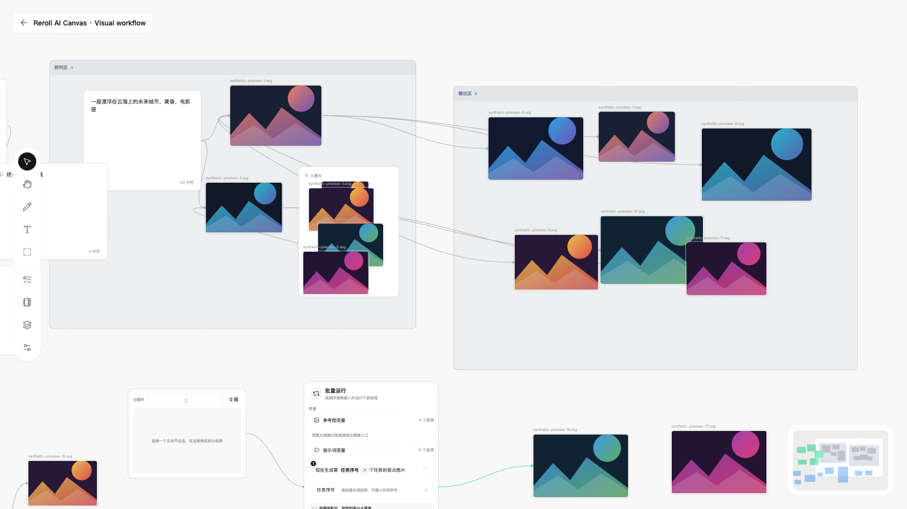

# Reroll AI Canvas

A local-first AI canvas for image and video generation, visual workflows,
asset management, and small-team collaboration.

面向图片与视频生成的本地优先 AI 无限画布工作台，支持可视化工作流、素材管理与小团队协作。



> [!NOTE]
> Reroll AI Canvas 采用带非商业限制的源码公开许可（source-available），不是 OSI 定义的开源软件。使用、分发或二次开发前请阅读 [LICENSE](LICENSE)。

> [!IMPORTANT]
> 本项目基于 [hero8152/Infinite-Canvas](https://github.com/hero8152/Infinite-Canvas) 修改开发，原作者为 [hero8152](https://github.com/hero8152)。
> 感谢原作者公开完整项目，提供了无限画布、模型调用、素材管理及创作工具的核心基础。本仓库是独立维护的非官方衍生版本，不代表原项目作者立场；原项目的作者信息、版权声明和许可要求均予以保留。

## 这个版本为什么存在

原项目已经提供了丰富的 AI 生成能力。本版本没有试图替代原项目，而是基于自己的工作习惯，把重点放在小团队协作、接近 Figma 的画布交互，以及 API 优先的生成流程上。

| 方向 | 原项目 | 本项目 |
| --- | --- | --- |
| 使用方式 | 更适合单机、单人创作 | 增加多账号、画布权限与小规模实时协作 |
| 画布交互 | 功能丰富的 AI 无限画布 | 重整为更接近 Figma 的指针、抓手、框选、多选、右键菜单和 Frame 体验 |
| 模型接入 | 同时覆盖 API、ModelScope、即梦 CLI 与本地 ComfyUI | 保留原有兼容能力，但产品方向更偏向统一的 API 调用和模型管理 |
| 数据流转 | 以当前设备内的数据和配置为主 | 增加可迁移工作区，以及密码加密的 API 设置导入/导出 |
| 启动维护 | 各平台使用独立脚本 | 增加统一的跨平台环境检查、依赖安装和启动入口 |

## 主要新增与改动

### 1. 多账号、权限与画布分享

- 内置本地账号系统，支持管理员、设计师和访客角色。
- 支持账号申请、管理员审核、密码重置、账号禁用及删除。
- 画布具有所有者和可见性设置，可区分私有画布与共享画布。
- 可生成随时能够撤销的只读分享链接；匿名访问者不能进入编辑通道。
- 账号、会话和全局角色保存在稳定的 Instance State SQLite 数据库中；切换 Workspace 不会退出登录或改变角色，密码与分享令牌不以明文保存。

### 2. Smart Canvas 实时协作

- 多名有权限的用户可以同时编辑同一张 Smart Canvas。
- 使用服务端权威的 Canvas Revision 和结构化 Mutation 同步，而不是让后保存的完整快照覆盖其他人的修改。
- 支持操作幂等、删除优先、冲突顺序收敛，以及短暂断线后的自动追平和待同步操作恢复。
- 普通节点、Connection、Smart Group（编组）、Frame（分区）、生成状态和生成结果均已接入共享画布协议。
- 单 Node 的 `x/y` 移动在服务端和浏览器接收侧使用严格白名单快速通道；不符合条件的操作自动回到完整校验路径，不改变 Revision、Undo、权限、事件或 WebSocket 协议。

当前版本定位为小团队协作：**同一 Smart Canvas 以 10 名实时协作者作为产品体验和验收目标**，它不是服务端单独执行的唯一人数门禁。服务端的实际硬限制是**同一 Smart Canvas 默认最多 20 条实时客户端连接**，可在项目 `.env` 中通过 `INFINITE_CANVAS_REALTIME_CONNECTION_LIMIT` 调整；它不是全站在线人数上限，每个浏览器标签页或设备会分别占用一条连接，因此同一协作者可能占用多条。隔离正式基线已经通过 10 人容量与性能 Gate；已有大型画布上的“9 个机器人 + 1 位人工”正确性也已通过，但端到端 P95/P99 仍未达到正式 Gate，因此不应承诺超过 10 人或长期持续高负载。当前仍不支持多 Worker、多实例和跨服务器的分布式协作；实时光标、成员在线状态、评论、跟随视角和完整版本历史也不在当前范围内。

单 Node 移动快速通道的实现边界、前后端设计、自动化证据和真实大画布收尾结果见
[当前实现与验收参考](docs/current/canvas-mutation-single-node-move-fast-path.md)，
机器可读性能证据见
[performance evidence](docs/current/canvas-mutation-single-node-move-fast-path-performance-evidence.json)。

### 3. 更接近 Figma 的交互与 UI

- 区分指针与抓手工具，支持按住 `Space` 临时切换抓手。
- 指针模式下支持框选、单选、多选、拖动选区和常用键盘快捷键。
- 增加基于目标和选区状态的右键菜单，集中提供复制、创建副本、粘贴、删除、分组和媒体操作。
- 使用 Smart Group（编组）管理显式成员关系，使用 Frame（分区）组织空间区域，减少内容归属与空间整理的语义混淆。
- 对工作台、设置页和画布样式进行了统一整理，并建立共享 Design Tokens、亮色/暗色主题与更一致的组件状态。
- 16 个仍在产品中的原生页面入口已经接入同一套原子 Design Tokens；原 T29 GPT Chat 页面已按产品决定删除，不再计入入口数量。

#### Smart Canvas 远景简化与图片资源

- Canvas Viewport 缩小到默认 23% 以下时自动进入远景简化模式，放大到 28% 以上恢复细节；用户可在 10%–100% 范围内调整进入阈值。
- 远景以结构导航为主：图片使用轻量预览，视频和音频不挂载播放器，生成、提示词和 Smart Group（编组）使用静态占位；Frame（分区）与编组名称保持屏幕可读。
- Canvas 图片按实际显示尺寸自适应使用 512/1024/2048 预览。放大查看与 Image Studio 直接读取原图，原图失败时不会请求 2048 代理图继续编辑。
- 失效模型只在打开 Prompt Authoring 时主动提示，浏览、缩放、选择和导入媒体不会弹出无关检查。
- 生成、文本、图片格、音频和视频占位复用公共 Empty State 组件，并在真实 Smart Canvas 页面完成视觉验收。

完整设计、边界和验收记录见
[Smart Canvas 远景简化、媒体资源与按需校验规格](docs/archive/2026-08-20-smart-canvas-viewport-lod-and-image-resource-spec.md)。

### 4. API 优先，但不移除 ComfyUI

本项目更倾向于通过 API 连接图像、视频和 LLM 模型，并集中管理平台、协议、密钥与可用模型。当前继续兼容原项目已有的 OpenAI 兼容协议、异步协议、Gemini、火山引擎、ModelScope、RunningHub、即梦 CLI 及局域网 ComfyUI。

本地 ComfyUI 仍可使用，但它不再是本项目唯一或优先的工作流方向。

#### 当前生成链路

Smart Canvas 从前端提交、Generation Run 去重与恢复、供应商适配、结果落盘、画幅物化，
到权限校验和画布写回的完整当前流程，见
[`docs/current/generation-pipeline.md`](docs/current/generation-pipeline.md)。文档同时说明
Gemini/Antigravity CLI 的“本次会话 + 本次图片名”结果隔离、临时目录，以及 APIMART、即梦、RunningHub、
ModelScope、ComfyUI、视频和文字任务目前分别经过哪些入口。

#### 图片模型画幅与分辨率能力

Smart Canvas 图片模型的画幅与 Resolution Tier 以
[`resources/image-model-capabilities.json`](resources/image-model-capabilities.json)
作为运行时唯一数据来源。前端不维护逐模型的画幅或分辨率硬编码；它会通过后端能力
API 按 `provider_id + model_id` 精确读取该文件，并动态渲染当前模型可选的画幅与
`1K / 2K / 4K` 等档位。多模型批量生成也以这些能力的交集为准。

以后新增模型、模型版本升级或供应商路由变化时，只需在这个文件中新增或更新对应的
模型条目。每条记录应维护：

- `provider_id` 与精确 `model_id`；
- `aspect_ratios`；
- `resolution_tiers` 与 `default_resolution_tier`；
- 最近确认日期 `confirmed_at`。

同名模型通过不同供应商调用时必须分别记录，不能根据模型名称共享未经验证的能力。
能力未知时，系统使用保守的通用回退，不应把 `21:9`、`9:21` 等扩展画幅直接加入
全局前端列表。

正式更新能力表前，应先分析已有生成历史，再只对缺少证据的组合进行真实 API 探测。
验证证据保存在 [`resources/image-capability-audits/`](resources/image-capability-audits/)，
判定规则与完整维护流程见
[`docs/current/smart-canvas-image-output-capabilities.md`](docs/current/smart-canvas-image-output-capabilities.md)。
能力表决定产品实际展示的选项；审计文件用于说明这些选项为什么可以开放。

### 5. 跨设备工作区与配置迁移

- 可把画布数据和素材迁移到用户指定目录，也可连接已有工作区目录。
- 工作区内容与安装状态分离；迁移工作区时复制内容 `data` 和 `assets`，账号、会话、全局角色、设备密钥、启动器状态和本机路径设置都保留在当前安装。
- 非 CLI 的 API 平台设置可导出为密码加密包，并在其他设备合并导入。
- API 设置包使用带认证的加密方式，文件中不写入导出密码；CLI 登录状态不会进入导出包。

### 6. 工程与稳定性改进

- 将体量较大的 Smart Canvas 逻辑拆分为交互、选择、持久化、容器、生成和恢复等模块。
- 加强生成任务的幂等控制，避免网络重试导致重复提交或重复计费。
- 生成任务、Pending Node 和迟到结果增加一致性保护，避免已经删除的节点被异步结果“复活”。
- 增加统一跨平台启动器，自动完成 Python 环境选择、依赖检查、缺失依赖安装、服务启动和浏览器打开。
- 为账号、权限、画布同步、断线恢复、生成流程、UI 交互和工作区迁移补充了自动化测试。

## 继承的核心能力

本项目继续保留并维护原项目的主要创作能力，包括：

- 图像、视频和 LLM 模型调用；
- 图片扩展、360° 全景预览截图、视频帧抽取和循环节点；
- 节点连线、提示词节点、编组、分区、批量处理和生成级联；
- 工作流管理和生成历史；
- 本地及局域网 ComfyUI 工作流调用。

## 快速开始

无需预先安装 Python。统一启动器会在首次运行时按需下载 Reroll
专用的 Python 3.12 环境，创建项目虚拟环境、检查并安装缺少的依赖，然后
启动服务和打开浏览器。专用环境保存在当前用户的应用数据目录中，不会安装、
升级或覆盖系统 Python；后续启动会直接复用。

### Windows 10/11

双击 `启动服务-Windows.bat`。

### macOS

首次使用时右键打开 `启动服务-macOS.command`，以后可以直接双击。

### 多人协作性能测试（macOS）

服务启动后，可在 Finder 中双击
`admin-tools/多人协作性能测试-macOS.command`。它会运行默认的
“9 个画布机器人 + 1 位人工参与者”验收：机器人连续操作 Smart Canvas，人工在
同一画布观察、操作，并可完成一次真实生成。机器人自身不会调用 AI 生成，也不会
修改 Provider 设置。

双击后按提示选择端口（默认 `3001`）、管理员账号、Canvas ID 和测试轮数（默认
120 轮，约 2 分钟）。Canvas ID 留空会新建测试画布；填写浏览器地址中 `id=` 后的
值则复用已有画布。准备完成后浏览器会自动打开该画布，只有人工按 Enter，9 个
机器人才会开始操作。测试报告保存在 `/private/tmp/ic-live-acceptance`。

只预览参数、不连接服务：

```bash
./admin-tools/多人协作性能测试-macOS.command --dry-run
```

详细的判定标准、清理边界和报告说明见
[`docs/current/controlled-cutover-and-live-acceptance.md`](docs/current/controlled-cutover-and-live-acceptance.md)。

### 历史 Workspace 停服迁移到 SQLite

历史 Workspace 的正式切换必须先完全停止服务，再运行
`scripts/storage/migrate_workspace_sqlite_authority.py migrate`。命令要求绝对 Workspace 路径、
稳定 migration ID、绝对报告目录和 `--confirm-service-stopped`；失败可用同一 migration ID
安全重试。首次切换会保留来源的 SHA-256 恢复副本和三个 generation JSON 的精确归档，
早期已发布 SQLite 双库但仍保留 Generation JSON 的 Workspace 也由同一命令原地补齐 Global
History / Publication Receipt；旧 Run 中尚未落盘的内嵌输入会按内容摘要写入迁移专属的
Managed Media 目录并留下审计记录。`rollback` 会按来源类型恢复旧 JSON authority 或旧 SQLite
数据库与 manifest，并归档由迁移创建的输入媒体。完整可复制命令、
验收 Gate 和回滚步骤见
[`docs/current/controlled-cutover-and-live-acceptance.md`](docs/current/controlled-cutover-and-live-acceptance.md)。
若人工确认某条旧 History 的 Managed Media 已永久丢失，可用显式 History ID 加二次确认参数
将它列入 operator quarantine；原始 JSON 仍会精确归档，未列出的缺失记录继续阻止迁移。

### 安装 GPT Image 2 helper（Codex CLI 生图）

Codex CLI 生图还需要本地 `gpt-image-2-skill` helper。仓库提供了
Windows 和 macOS 一键安装脚本：

- Windows 10/11：双击 `安装GPT-Image-2助手-Windows.bat`。
- macOS：首次右键打开 `安装GPT-Image-2助手-macOS.command`。

全新安装会使用当前项目已验证的 `gpt-image-2-skill 0.7.3`，并在执行前校验
上游 Release 安装器的 SHA-256。安装后会自动检查 PATH、Codex/OpenAI
认证和服务端连通性；验证过程不会生成图片。安装器来自第三方开源项目
[`Wangnov/gpt-image-2-skill`](https://github.com/Wangnov/gpt-image-2-skill)，不是 OpenAI
官方组件。

仅检查现有安装：

```bash
# Windows
安装GPT-Image-2助手-Windows.bat check

# macOS
./安装GPT-Image-2助手-macOS.command check
```

### Linux 或终端

```bash
bash 启动服务-macOS.command
```

首次启动需要联网下载环境和依赖。如果自动下载暂时不可用，而系统中已有
Python 3.12，启动器会自动将它作为离线兜底。直接运行
`python3 backend/launcher.py` 仍然受支持，但要求调用者已经提供 Python 3.12。

默认访问地址是 `http://127.0.0.1:3000/`。如果 3000 已被其他程序占用，
启动器会自动尝试 3001、3002 等后续端口，并打开最终选中的地址。同一源码目录
重复启动时会复用自己的现有服务；其他源码目录运行的 Reroll 会被视为
另一个独立服务。也可以通过
`INFINITE_CANVAS_PORT` 环境变量修改首选端口。

环境检查与依赖修复：

启动器优先使用带精确版本和文件哈希的 `requirements.lock.txt`；
`requirements.txt` 只保存直接依赖与允许的版本范围。修改直接依赖后，应重新生成并评审锁文件。

```bash
# Windows
启动服务-Windows.bat check
启动服务-Windows.bat install --force

# macOS
./启动服务-macOS.command check
./启动服务-macOS.command install --force

# Linux
bash 启动服务-macOS.command check
bash 启动服务-macOS.command install --force
```

如果 Workspace 位于 OneDrive，且你已经确认另一台设备上的服务正常关闭，但本机仍因
尚未同步删除的 `occupation.json` 拒绝启动，可以显式接管这一次残留状态：

```bash
# Windows 命令提示符
启动服务-Windows.bat --takeover-workspace

# macOS / Linux 终端
./启动服务-macOS.command --takeover-workspace
```

该参数只用于替换其他设备残留的工作区占用记录；默认启动仍会拒绝接管。只有确认原
设备服务已经停止后才能使用，否则两台服务可能同时写入同一 Workspace。本机仍被活动
进程持有的文件锁不会被该参数绕过。

项目代码与运行数据采用明确边界。Python 后端统一位于 `backend/`；画布和素材位于
用户选择的 Workspace；账号与会话位于同一设备共享的稳定 Instance State；API Key、
Workspace 选择和启动器状态按源码目录隔离在 Device State；媒体预览和可下载模型
同样按源码目录隔离在操作系统缓存目录。产品边界、技术栈、代码结构与功能覆盖见
[项目地图](docs/PROJECT-MAP.md)，具体存储和旧数据迁移见
[存储路径与旧数据迁移](docs/current/storage-layout-and-migration.md)。

## 首次登录与安全提醒

首次启动时，浏览器会进入首次设置页面。你需要创建管理员账号，并明确选择一个工作区父目录；只有完成选择后，程序才会在其中创建 `data` 和 `assets`。程序不会在源码目录中创建默认工作区，也不会在原工作区不可用时静默回退。

服务默认只监听 `127.0.0.1`。如需局域网访问，在项目 `.env` 中设置
`INFINITE_CANVAS_HOST=0.0.0.0`；统一启动器会读取该设备本地配置并显示局域网地址。
公网部署还应配置 HTTPS 反向代理、安全 Cookie 和明确的访问边界。当前协作服务按单个 Uvicorn Worker 设计，请不要使用多个 Worker 启动。

默认最多允许 40 个启用账号和待审核申请，可通过环境变量 `AUTH_MAX_ACCOUNTS` 调整；这个数量是账号配额，不代表已经通过同等规模的并发或压力验证。

Smart Canvas 本地引用每次最多选择 20 个 TXT、图片、视频或音频文件。单文件默认上限为 500MB，由 `.env` 中的 `INFINITE_CANVAS_MAX_UPLOAD_BYTES` 控制；修改后必须重启服务。TXT 另外执行生成安全限制：单文件文本快照最多 1MB、一次生成合并最多 2MB，超出时会保留引用并在生成前明确提示，不会静默截断。

Smart Canvas 节点包 JSON / ZIP 的压缩文件默认上限为 500MB，由 `.env` 中的 `INFINITE_CANVAS_MAX_WORKFLOW_ARCHIVE_BYTES` 控制；修改后必须重启服务，前端会自动读取服务端当前值。ZIP 解压后的总体积默认最多 500MB，并保留文件数量和异常压缩包保护。

Smart Matting 默认同时处理 2 个抠图任务；其他任务继续按 FIFO 顺序排队。这个默认值来自当前 48GB 测试设备上的标准 2K 容量测试，不代表所有设备都适合相同数值。管理员可先双击 `admin-tools/抠图并行容量测试-macOS.command` 测量本机，再通过 `.env` 中的 `MATTING_MAX_CONCURRENCY` 调整；修改后必须重启服务。指标、Gate 和已验证结果见[智能抠图性能与容量](docs/current/smart-matting-performance.md)。

账号、Workspace、备份和分享的数据边界见
[Workspace 数据边界 ADR](docs/adr/0001-workspace-data-boundary.md)；
当前权限规格缺口与实现/测试入口见[项目地图 F02](docs/PROJECT-MAP.md#功能规格注册表)。
全部文档状态见[产品知识库](docs/README.md)。

## 文档入口

- [产品知识库](docs/README.md)：按角色进入产品地图、系统地图、功能规格与生命周期资料。
- [项目地图](docs/PROJECT-MAP.md)：查看产品边界、技术栈、系统结构、功能覆盖和代码阅读入口。
- [UI 设计与交互指南](docs/current/ui-design-guidelines.md)：面向 UI、交互、产品、开发与 AI 的界面规则和验收清单。
- [生成链路](docs/current/generation-pipeline.md)：Generation Run、供应商适配、结果写回与恢复。
- [工作区资产库与本地引用](docs/current/workspace-asset-library.md)：素材发布、发现、管理、TXT 引用与容量边界。
- [实时协作性能与容量](docs/current/realtime-collaboration-performance.md)：10 人产品目标、20 条可配置连接上限、性能 Gate 与已知风险。
- [智能抠图性能与容量](docs/current/smart-matting-performance.md)：本机并行容量测试、默认并行数与调优边界。
- [Smart Canvas 远景简化与图片资源](docs/archive/2026-08-20-smart-canvas-viewport-lod-and-image-resource-spec.md)：本次功能的完整规格、实现范围和验收记录。
- [多人单 Node 移动快速通道](docs/current/canvas-mutation-single-node-move-fast-path.md)：独立的多人协作性能实现与验收参考，不属于本次远景展示优化。

## 已知边界

- 产品以桌面浏览器为目标，不承诺手机端或其他移动端布局适配。
- 面向可信的小团队和单服务实例，不是成熟的互联网多租户 SaaS。
- 同一 Smart Canvas 以 10 名实时协作者作为产品体验和验收目标，并不另设唯一人数门禁；服务端默认硬限制为每个 Smart Canvas 最多 20 条实时客户端连接，可通过 `INFINITE_CANVAS_REALTIME_CONNECTION_LIMIT` 调整，不是全站在线人数限制。隔离正式基线已通过，真实大型既有画布仍未达到正式端到端延迟 Gate；也尚未验证超过 10 人或长期持续负载。
- 不支持多 Worker、多实例或跨服务器协作。
- 暂无实时光标、在线成员列表、评论和完整版本历史。
- 工作区目录可以借助 OneDrive 等同步工具跨设备保存，但本项目不负责第三方同步服务产生的文件冲突。
- API 可用性、模型能力、计费与内容规则取决于各上游服务商。

## 原项目与作者资源

- 原项目：[hero8152/Infinite-Canvas](https://github.com/hero8152/Infinite-Canvas)
- 原作者 GitHub：[hero8152](https://github.com/hero8152)
- 原作者 Bilibili：[78652351](https://space.bilibili.com/78652351)
- 原项目视频教程：[YouTube](https://youtu.be/r_y_9ALr7fg)
- 原项目配套 Chrome 插件：[Chrome Web Store](https://chromewebstore.google.com/detail/ajfhnbklbmpfaaookhfakohabnpmlcic)

如果问题只出现在本衍生版本中，请优先在本仓库反馈，避免给原作者增加与其代码无关的排查负担。

## 许可与二次开发

本项目沿用仓库中的 [LICENSE](LICENSE) 及原项目声明：

- 禁止将项目修改、封装后作为商业产品；商业使用须取得相应授权。
- 基于本项目二次开发的软件必须继续公开源码并注明来源作者。
- 二次开发时应同时保留原作者 `hero8152`、原项目链接，以及本衍生版本的修改来源。

这是一份带有非商业限制的源码公开许可，不是 MIT、Apache-2.0 等标准
OSI 开源许可证；不得仅因为仓库设为 Public 就推断获得了商业使用权。
随仓库分发的第三方代码、字体、图标和服务标识继续适用各自条款，详见
[第三方声明](THIRD_PARTY_NOTICES.md)。许可解释以 [LICENSE](LICENSE) 和
原项目权利人的说明为准。
