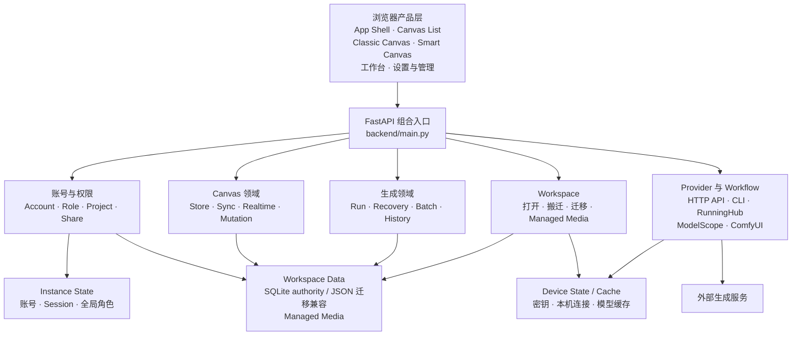
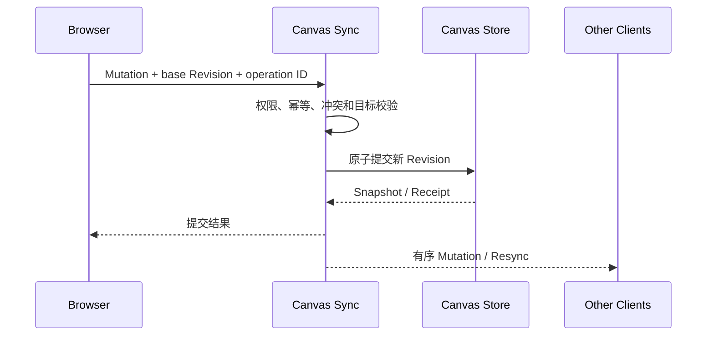

# Reroll AI Canvas 项目地图

> Status: Baseline  
> Last verified: 2026-09-04
> Audience: 产品、UI、交互、前端、后端、测试与发布

本页是项目的单一总地图：产品边界、技术栈、系统结构、代码责任和功能覆盖都从这里进入。具体行为由 `current/` 中的 Current 规格定义；正在开发的行为位于 `active/`。

## 一页摘要

Reroll AI Canvas 是面向可信小团队的本地优先 AI 视觉创作工作台。用户在 Canvas 中组织媒体、提示词和生成逻辑，通过多种 Provider 生成图片、视频或文本，并把结果保存回可搬迁的 Workspace。

- 产品以桌面浏览器为目标，不承诺移动端布局。
- 默认运行形态是本地单服务、单 Uvicorn Worker，不是多实例 SaaS。
- 同一 Smart Canvas 以 10 名 Realtime Collaborator 作为产品体验与验收目标；当前不另设唯一人数门禁。
- Realtime Connection Limit 按单个 Smart Canvas 统计：默认最多 20 条 Realtime Client Connection，可通过 `INFINITE_CANVAS_REALTIME_CONNECTION_LIMIT` 调整；它不是全站在线人数限制。
- API 优先，同时兼容 CLI、RunningHub、ModelScope 和局域网 ComfyUI。
- Workspace Data 可以搬迁；账号与会话、设备秘密和可再生缓存属于不同边界。
- 生成结果只有在权限、目标 Node 和 Operation ID 仍有效时才能写回。

标准领域词及禁止使用的同义词见 [`CONTEXT.md`](../CONTEXT.md)。

## 用户和权限

| 参与者 | 主要能力 | 关键限制 |
| --- | --- | --- |
| Administrator | 初始化实例、管理账号、Project、Provider 和 Workspace | 全局角色属于 Instance State；私有 Canvas 仍受所有者规则约束 |
| Designer | 使用获授权 Project、编辑 Canvas、执行 Generation Run | Project Access Grant 按 Workspace 隔离 |
| Guest Account | 登录受限入口 | 不能进入编辑和管理通道 |
| Anonymous Share Visitor | 通过可撤销 Share Link 查看 Canvas | 只读；不是 Guest Account，也没有登录会话 |
| Local Operator | 启动、停止、恢复或搬迁本机服务 | 设备级操作不等于产品账号权限 |

## 核心用户旅程

1. 启动器准备 Python 环境、启动并持续监督本地服务；监督关系断开时后端安全退出。
2. 首次使用者选择 Workspace 并创建 Administrator。
3. Administrator 配置 Provider、Model、Project 和账号权限。
4. Designer 从 Canvas List 进入 Classic Canvas 或 Smart Canvas。
5. Designer 导入 Managed Media、编写 Prompt、连接 Node 并执行 Generation Run。
6. Generation Run 经过 Provider、Recovery 和 Target Guard，把 Generation Output 写回 Node。
7. 多名 Realtime Collaborator 通过 Canvas Mutation、Revision 和 Sync 收敛同一 Smart Canvas。
8. Local Operator 可以移动 Workspace、备份或迁移旧数据；Instance State 和 Device State 不随内容移动。

## 系统结构



## 技术栈

| 层 | 当前技术 | 约束 |
| --- | --- | --- |
| 服务端 | Python 3.12、FastAPI、Uvicorn、Pydantic | 单进程、单 Worker；`backend/main.py` 是组合与兼容入口，不应继续吸收领域规则 |
| 浏览器端 | 原生 HTML/CSS/JavaScript、Web Components | 无业务构建步骤；页面只使用项目拥有的 `ic-*` 接口和 `--ui-*` Token |
| UI 内核 | Reroll UI + 内置 Web Awesome/Lucide adapter | Vendor 不能泄漏到业务页面或公共合同 |
| 持久化 | SQLite、JSON、文件系统 Managed Media | 权威来源由 Workspace composition 和 storage authority 决定，不按文件更新时间猜测 |
| 实时协作 | FastAPI WebSocket、Canvas Revision、结构化 Mutation | 连接上限按 Smart Canvas 统计；Selection、Viewport 和手势预览不进入共享文档 |
| Provider | HTTP API、CLI、RunningHub、ModelScope、ComfyUI | 差异收敛到 Provider adapter 和统一 Generation Run 状态 |
| 测试 | Python `unittest`、FastAPI TestClient、Node/Playwright browser smoke | 优先验证用户可观察行为、HTTP/WebSocket 合同和最高公共接缝 |

## 四类数据边界

| 边界 | 包含 | 不包含 |
| --- | --- | --- |
| Workspace Data | Canvas、Project、Managed Media、生成历史、工作流、提示词库、共享非秘密 Generation Settings | 账号、Session、API Key、本机 Provider 地址、缓存 |
| Instance State | Account、密码验证记录、Session、全局 Role、Workspace-scoped Project Access Grant、Model Capability Evidence / Draft / Review / Published 投影 | 可搬迁内容、设备秘密和缓存 |
| Device State | API Key、Token、CLI Session、本机 Provider 地址、硬件选择、当前 Workspace 路径 | Workspace Data、账号身份、可再生缓存 |
| Device Cache | 预览和可重新下载的运行模型 | 用户唯一内容、长期设置和身份 |

权威决定见 [Workspace 数据边界 ADR](adr/0001-workspace-data-boundary.md)，具体路径和迁移见[存储路径与旧数据迁移](current/storage-layout-and-migration.md)。

## 代码责任地图

```text
backend/
├── launcher.py                 安装、环境检查、端口选择、启动与恢复
├── main.py                     FastAPI 组合根和仍待迁出的兼容路由
└── infinite_canvas/
    ├── auth_system.py          Account、Session、Role、Share、Project Grant
    ├── canvas_permissions.py   Project 与 Canvas 可见性规则
    ├── canvas_store.py         Canvas SQLite 权威存储和投影
    ├── canvas_sync.py          Canvas 命令、Revision、Mutation、冲突、通知与统一 Generation History 接口
    ├── cli_updates.py          本机 CLI 版本适配、启动检查与只读提醒去重
    ├── canvas_realtime.py      Smart Canvas Mutation 语义和历史
    ├── connection_manager.py   实时连接、发送队列、连接硬上限
    ├── realtime_presence.py    账号级短暂成员/指针状态、协议、批处理与 TTL
    ├── generation_runs.py      Generation Run 生命周期、结果物化编排、幂等和恢复
    ├── generation_run_store.py SQLite Run、Global History 与发布回执权威
    ├── generation_publication.py JSON / SQLite History 与通知发布接缝
    ├── model_capabilities.py   跨图片、视频和文字的 Model Capability Catalog、Revision 与生成前校验
    ├── model_capability_matrix.py 按稳定 Model ID 聚合现有模型、产品选项与跨平台原子应用
    ├── model_capability_discovery.py 模型拉取快照的能力资料提取与差异草稿
    ├── model_capability_workbench.py Evidence、Draft、Review、原子 Publish 与失败回滚
    ├── image_capabilities.py   图片 Model Operation、画幅、清晰度、参考输入与输出边界
    ├── video_capabilities.py   视频命令、参考输入、时长、画幅与路由能力合同
    ├── sqlite_migration.py     历史 Workspace staging 导入与完整性 Gate
    ├── sqlite_publication_upgrade.py 早期 SQLite authority 的 Phase 2 补迁与精确回滚
    ├── offline_sqlite_migration.py 停服切换、恢复重试和回滚
    ├── local_image_processor.py 确定性本地图片处理与 Provider 执行器委托
    ├── depth_processor.py      固定清单、Device Cache、ONNX 相对深度推理与 PNG 输出
    ├── matting_service.py      Smart Matting 模型、并行预测、串行 Alpha 精修与原子 PNG 输出
    ├── matting_capacity.py     Smart Matting 本机容量指标、Gate 与报告格式
    ├── batch_generation.py     Batch Generation 计划和调度
    ├── asset_library.py        工作区素材发布目录、搜索、容量与管理权限
    ├── prompt_library.py       Prompt Library JSON、封面、内容摘要复用与旧布局迁移
    ├── bootstrap.py            启动组合、恢复分流和可重试的新 Workspace 创建提交
    ├── workspace.py            Workspace 身份、目录、候选创建和搬迁
    ├── instance_state.py       稳定实例账号域
    ├── device_state.py         设备秘密和本机配置
    ├── design_tokens.py        全局颜色 Token 的解析、校验、Revision 与原子保存
    └── providers/              Provider 端口、适配和实现

static/
├── 产品 *.html                 16 个产品页面
├── ui-component-library.html  管理员直接访问的 UI 组件验收样板间（非产品导航）
├── js/infinite-canvas-ui/      公共 ic-* 接口、稳定家族入口、Canvas Node 家族与 Classic/Smart Canvas Commit Lane
│   ├── actions/                Button、Icon Button、Button Group 的实现与家族样式所有者
│   ├── text-entry/             Input、Textarea、Form Field 的实现与家族样式所有者
│   ├── selection-adjustment/   Choice、Select、Slider、Number、Color 控件实现与家族样式所有者
│   ├── dialog/                 Dialog、Confirmation Dialog 的实现与家族样式所有者
│   ├── ai-processor-dialog/    AI Processor Dialog 的生产样式所有者
│   ├── navigation-command/     Navigation / Command 各公开控件及 Shadow DOM 样式所有者
│   ├── canvas-navigation/      Smart Minimap 的投影、语义图层、视口遮罩与导航事件所有者
│   └── nodes/                  Canvas Node 公共外壳、角色与展示状态接口
├── js/ui-component-library/    组件样板间、设计参数草稿与即时预览
├── js/workspace-move.js         Workspace 搬家维护页的进度同步、等待任务与完成入口
├── js/canvas-list-presence.js   画布卡片在线成员的批量查询、生命周期、头像与只读成员弹层
├── js/smart-canvas/            Smart Canvas 交互、生成、媒体与确定性 Lighting Intent / Reference 模块
│   ├── image-metadata.js       原图尺寸成对校验、精确与有界近似的宽高比展示计算
│   ├── multi-input.js          多来源资格、Group 归一化、稳定视觉顺序和目标连接规划
│   ├── multi-input-controller.js 选择快照、公共 Quick Add 与一次性 Mutation 的页面协调
│   ├── model-capabilities.js 统一能力查询、缓存、Revision 与提交前校验
│   ├── image-capabilities.js 图片 Composer 的能力投影与设置协调
│   ├── video-capabilities.js 视频 Composer 的命令与参考输入协调
│   └── connection-layer.js     Connection 索引、SVG 增量物化与事件委托
├── css/design-tokens.css       中央视觉 Token
└── vendor/                     固定版本的第三方浏览器资源

resources/workflows/            随版本发布的内置 Workflow
tests/                          领域、HTTP/WebSocket、页面和浏览器合同
```

### 关键模块规则

- 新领域规则进入 `backend/infinite_canvas/` 的所属模块；只有组合多个现有能力时才修改 `backend/main.py`。
- Provider 差异进入 `backend/infinite_canvas/providers/` 的 adapter；Generation Run 编排不得按平台散落分支。
- `model_capabilities.py` 是跨媒体能力身份、状态、Revision 和提交前校验的统一边界；`model_capability_matrix.py` 把当前环境按稳定 Model ID 聚合成产品能力表，隐藏 Provider 路由与内部合同 JSON，把模型详情中的一次人工选择原子应用到所有关联平台；外部研究包导入已移除；Reroll 不内置 AI 搜索或填表执行器。`model_capability_discovery.py` 仅在 API 设置主动拉取模型时复用发现快照，把明确字段写成 Evidence 与 Draft；不提供独立来源检查、调度或来源缓存；`model_capability_workbench.py` 拥有 Evidence、审计记录与原子 Publish，只有 Published 投影能改变运行目录。图片、视频、文字专用结构留在各自合同中。前端能力模块只负责展示与预检，不能取代服务端权威，也不能在目录中加入价格或消耗字段。参见 [ADR-0009](adr/0009-unified-model-capability-catalog.md)。
- API Settings Package 的收集、加密、校验和原子合并属于独立模块；`main.py` 只组合入口。
- 全局颜色 Token 的可编辑接口、Revision 冲突检查和原子 CSS 保存属于 `design_tokens.py`；`main.py` 只组合管理员路由，浏览器不提交任意 CSS 文本。
- Smart Canvas 的入口仍是 `static/js/smart-canvas.js`，新业务逻辑应进入 `static/js/smart-canvas/` 的职责模块；`connection-layer.js` 统一拥有 Connection 的 Node ID/邻接索引、SVG 物化、按 Node 增量几何刷新与事件委托，页面宿主只提供当前状态和选择/断开回调；公共 Node 外壳接口位于 `static/js/infinite-canvas-ui/nodes.js`。Smart Minimap 的 SVG、投影、视口外遮罩与 Pointer / Keyboard 导航属于公共 `canvas-navigation/`，页面适配器只提供轻量节点语义和当前 Viewport。`/ui-component-library#nodes` 直接嵌入生产 Smart Canvas 的临时验收会话，按十行展示 22 个角色状态实例；`node-review-fixture.js` 只提供本地 Node、生产 Text Annotation 标签与模型数据，不维护第二套 Node 页面或交互。
- 公共 UI 家族通过稳定入口暴露 `ic-*` 类；已迁移家族的行为和专属样式进入对应家族目录，Theme Adapter 只承担通用引擎变量翻译。参见 [ADR-0002](adr/0002-ui-family-module-ownership.md)。
- Workspace Asset Library 的发布幂等、容量、搜索和管理权限属于 `asset_library.py`；`main.py` 只组合来源 Canvas 校验与 HTTP 路由。
- Prompt Library 的 JSON、专属封面导入/解析和旧布局迁移属于 `prompt_library.py`；`main.py` 只组合规范化、权限与 HTTP 路由。权威 JSON 与封面位于同一个 `data/prompt-libraries/` 目录，详见 [ADR-0007](adr/0007-prompt-library-directory-owns-cover-media.md)。
- 新生产 Python 文件必须加入 `backend/infinite_canvas/artifacts.py`，避免更新包漏文件。
- 内置且只随版本变化的资源进入 `resources/` 或 `static/`；用户创建的内容进入 Workspace。

## 关键运行链路

### Canvas Mutation 与实时协作



Realtime Connection Limit 默认是同一 Smart Canvas 最多 20 条 Realtime Client Connection。它按活动连接统计，不按唯一 Account 或 Realtime Collaborator 统计；`INFINITE_CANVAS_REALTIME_CONNECTION_LIMIT` 必须是大于 0 的整数，修改后重启服务生效。

### Generation Run

Prompt Authoring → Generation Settings → Generation Run → Provider → Completed/Pending/Queued/Failed → Recovery → Target Guard → Generation Output → Node/History。完整合同见[生成链路](current/generation-pipeline.md)。

### Workspace 打开、恢复创建或搬迁

打开或搬迁使用只读检查、确认、维护、校验、切换与受控重启。已保存 Workspace 永久不可用时，
本机用户还可以明确选择空目录创建新 Workspace：先建立 identity 与 SQLite authority，最后才
替换本机选择；失败时原选择、Instance 账号和 Session 保持不变。该流程不会自动建立空白替代。

## 功能规格注册表

覆盖状态描述文档成熟度，不代表功能是否存在：`current` 已有 Current 参考；`partial` 有资料但未收束；`active` 仍在实施或验收；`gap` 主要依靠代码和测试推断；`drift` 已确认冲突。

| ID | 功能域 | 覆盖 | 当前入口或首要缺口 |
| --- | --- | --- | --- |
| F01 | 启动、初始化与 Application Runtime | `partial` | [ADR-0008](adr/0008-lan-access-by-default.md)与[本机与局域网访问](current/local-network-access.md)定义默认监听、仅本机覆盖与重启/失败恢复；Runtime/Bootstrap 仍缺完整端到端 Current 规格 |
| F02 | Account、Role、Project 权限与 Share | `partial` | [Canvas 分享只读内容完整性](current/canvas-share-read-only-content-parity.md)已有 Current；`auth_system.py`、`canvas_permissions.py` 仍缺完整 Current 权限矩阵 |
| F03 | Workspace 与四类数据边界 | `current` | [ADR-0001](adr/0001-workspace-data-boundary.md)、[ADR-0006](adr/0006-explicit-workspace-creation-during-recovery.md)、[存储与迁移](current/storage-layout-and-migration.md)；恢复阶段可显式创建新 Workspace，#179 Phase 1/2 与历史停服迁移已交付，其余升级恢复 Gate 仍见 Active Spec |
| F04 | Project、Canvas List、Trash 与内容管理 | `gap` | `canvas_list_index.py`、`canvas_store.py`；缺完整状态与权限规格 |
| F05 | Smart Canvas 创作与交互 | `partial` | Image Studio 在宫格后提供“深度图”直接动作，关闭编辑器后在来源附近创建保持来源 Selection 的 Pending Node，并原位完成相对深度图；十种 Node 角色已统一通过公共 `ic-canvas-node` 外壳渲染；`/ui-component-library#nodes` 以十行稳定状态实例直接运行生产画布的拖动、选择、Resize、Quick Add、Connection、浮动工具栏与模型选择器，Image Node 行同时验收 Image、Empty、Video 与 Audio 媒体数据，Generation Node 行验收参考图片与视频生成，仅以临时会话隔离持久化和协作反馈；[UI 设计与交互指南](current/ui-design-guidelines.md)定义媒体 Composer 资格；[批量运行节点](current/smart-canvas-batch-run-node.md)、[创建副本 Connection 继承规则](current/smart-canvas-duplicate-connection-inheritance.md)、[Node 自动避让](current/smart-canvas-node-auto-placement.md)、[选区整理](current/smart-canvas-selection-arrangement.md)、[连线与命中](current/smart-canvas-connection-quick-add-hit-priority.md)、[失败反馈](current/smart-canvas-generation-failure-feedback.md)、[预设处理器](current/smart-canvas-preset-ai-processors.md)已有 Current；[复制与粘贴的剪贴板优先级](active/2026-08-21-smart-canvas-clipboard-precedence.md)整体体验已确认，正式跨平台人工与真实环境 Gate 由 Issue #212 跟踪；[智能分层 Dialog 草稿与框选规格](active/2026-09-05-smart-canvas-layer-decomposition-dialog-spec.md)已实现随原图保存、双模式、预设和 bbox 编译，本地页面回归通过，真实 Provider / 触摸 / 双客户端 Gate 待验收；仍缺完整工具/容器/快捷键总规格 |
| F06 | Realtime Collaboration 与 Canvas Sync | `current` | [Canvas Sync 与 Canvas Updated Time](current/canvas-sync-implementation.md)已完成 Issue #102 的 Touch、no-op 与管理动作语义对齐；[性能与容量](current/realtime-collaboration-performance.md)、[单 Node 快速通道](current/canvas-mutation-single-node-move-fast-path.md)继续有效 |
| F07 | Prompt Authoring 与 Prompt Library | `active` | [提示词库的通用与当前画布范围](active/2026-08-21-prompt-library-common-and-canvas-scope.md)已实现；[ADR-0007](adr/0007-prompt-library-directory-owns-cover-media.md)与 Issue #225 将权威 JSON、封面和可回退旧布局迁移收拢到 `data/prompt-libraries/`；Issue #113 完成 Modal/Sidebar/Card 交互，Issue #117 以共享 Canvas Commit Lane、事务内语义 intent、模板版本保护及 HTTP/WebSocket Revision 去重修复当前画布保存竞态；Issue #124 对齐范围命名、范围计数、组件库小号搜索组合与空范围表现；人工验收与真实旧 Workspace 向前兼容使用已完成，仍等待发布前备份回退演练，Prompt/Prompt Generation 身份与完整状态仍需统一 |
| F08 | Provider、Model 与 Generation Settings | `active` | [统一 CLI 版本检查与提醒](active/2026-09-04-cli-update-management.md)已实现启动异步检查、三适配器与管理员只读提醒，不提供 CLI 升级能力，真实平台响应仍待发布前 Gate；[统一模型能力目录](active/2026-09-04-model-capability-catalog.md)已用同一 Revision 约束图片、视频和文字，完成可用模型行内功能 Tag、按 Model ID 打开的模型详情 Dialog，以及随模型拉取执行的 Dreamina、Gemini API、APIMART 资料提取与差异草稿；独立来源检查、周期采集、来源缓存与外部能力数据导入已移除；Reroll 不内置 AI 搜索或填表；[图片输出能力](current/smart-canvas-image-output-capabilities.md)、[API Settings Package](current/api-settings-package.md)已有 Current；能力目录已实现但尚待合并后毕业为 Current |
| F09 | Generation Run、Recovery、Output 与 Cascade | `current` | [Generation Pipeline](current/generation-pipeline.md)、[ADR-0005](adr/0005-global-generation-publication-authority.md)；图片、视频与文字使用后台 task ID，Smart Canvas 通过画布级 active Run 接口恢复刷新时缺失的 Pending Node；包含确定性本地图片处理、进度持久化、无远端编号重启重跑与 `image-processor` Managed Media 发布，以及 APIMart Seedream 5.0 Pro 智能分层的同 task ID 恢复、Manifest、Managed Media 校验、专用 Layer Decomposition Node 交付与当前图层状态 PSD 导出；SQLite authority 下 Global History、Run lifecycle 与 Publication Receipt 同库且不接触三个 legacy JSON |
| F10 | Managed Media、Workspace Asset Library、Image Studio 与 Smart Matting | `partial` | [工作区资产库与本地引用](current/workspace-asset-library.md)、[Smart Matting 性能与容量](current/smart-matting-performance.md)、[ADR-0004](adr/0004-workspace-asset-library-publication-boundary.md)已定义发布目录、权限、TXT、生成校验与本机并行容量；Managed Media 垃圾回收、Image Studio 与 Smart Matting 的统一生命周期仍是后续缺口 |
| F11 | Batch Generation 与专用工作台 | `partial` | [结果画廊模型身份](current/batch-generation-result-gallery-model-identity.md)已统一为常驻 Provider 图标与生成时冻结的模型名称，并覆盖 Light/Dark、旧数据 fallback、下载与预览回归；`batch_generation.py` 和工作台测试覆盖其他现有行为，仍缺共享/特有行为总规格 |
| F12 | Workflow、RunningHub、ModelScope 与 ComfyUI | `partial` | Workflow 身份、导入导出、安全和恢复形态需统一 |
| F13 | UI 设计、主题与可访问组件 | `current` | [UI 设计与交互指南](current/ui-design-guidelines.md)、[Design Tokens](current/design-tokens.md)、管理员 `/ui-component-library#design-tokens` 全局颜色 Token 工作台与 `/ui-component-library#smart-canvas-dock` 智能画布工具栏 Block |
| F14 | 更新、回退、配置迁移与发布维护 | `partial` | `launcher.py`、更新路由和维护脚本；缺发布维护总规格 |
| F15 | 产品知识地图与功能规格体系 | `current` | 本页、[知识库入口](README.md)和[规格模板](FEATURE-SPEC-TEMPLATE.md) |

Issue [#21](https://github.com/lazyq666/reroll-ai-canvas/issues/21) 对应 F05 / F13 的图片分辨率与宽高比双 Badge。布局、固定画幅对比图标、比例识别容差、尺寸恢复及可访问说明统一由 [UI 设计与交互指南](current/ui-design-guidelines.md)定义；`image-metadata.js` 只负责尺寸与比例计算，页面负责显示，公共 `ic-icon` 负责图标。回归入口为 [比例与尺寸来源测试](../tests/smart_canvas_image_metadata.test.cjs)和[真实页面、双语及日志验收](../tests/issue_21_image_metadata_browser_app.cjs)。

F05 的[统一节点定位、排列间距与 Frame 扩容规格](active/2026-09-05-smart-canvas-unified-spatial-layout-spec.md)已在当前分支实施：明确落点与历史恢复接受重叠，唯一代码常量 G = 4rem（64 世界单位），固定间距整理、实际父节点与视口评分、原直接 Frame 单次扩容及空间归属。创建副本复用生成图片 / 视频的相对来源自动放置，以原对象整体右侧 G、垂直居中为初始偏好，并共用避让、视口及竞争重试。定位、整理与 Canvas Sync Current 已对齐；自动化及隔离真实页面验证见 Spec，产品体验复核与合并由 [Issue #40](https://github.com/lazyq666/reroll-ai-canvas/issues/40) 跟踪。

空间实现中 `node-geometry.js` 提供共享 G、线性偏移及纯 Frame 计算，`node-placement.js` 负责整组选位，`selection-arrangement.js` 保留排序与拓扑职责；Mutation 应用事务，Persistence 保存本次位置意图并重试。WebSocket 通过 `layout_gap` 协商版本，操作与 Node 数据的边界见 [ADR-0011](adr/0011-placement-intent-belongs-to-canvas-mutation.md)。

F05 的[灯光参考编辑器](current/smart-canvas-lighting-reference.md)已经毕业为 Current：它从 Image Node 浮动工具栏进入，以 Lighting Intent 确定性生成中英文 Prompt，通过一次 Canvas Mutation 创建下游图片 Generation Node、填充 Composer，并把参数保存在来源与新 Node 上供后续微调；不导出媒体或 JSON，也不创建 Generation Run。

Issue #22 的[多选快速连线与提示词生成快捷入口](active/2026-09-03-smart-canvas-multi-input-quick-add-spec.md)正在实施：公共选区 Quick Add、多选与提示词工具栏、按视觉顺序接入一个新建或已有生成节点及整体撤销已落地并通过隔离生产页面检查。状态为 `drift`：D22-01 的服务端语义前置条件尚待协议扩展决定，完整双端协作及人工验收 Gate 未完成；不能据此宣称 Issue 完成或将 Active 毕业为 Current。

Issue #28 的[Smart Group 可逆编组与成员还原](active/2026-09-04-smart-group-reversible-containment-spec.md)已本地实现并进入 Review：组内紧凑排列只属于派生的 Group Presentation，既有 Node 作为 Smart Group Node Member 保留身份、创作状态、Connection 与 Node Rest Geometry；直接媒体具有稳定成员身份，并在离开编组时才创建新 Image Node。跨类型成员顺序、唯一所有权、拖出/解组、复制重映射、空间与分享投影及 Realtime 权威校验已有自动化覆盖；真实双端协作、Keyboard / Focus、Reduced Motion 与发布前人工 Gate 尚未完成，因此规格仍保持 Active。

Issue #195 的[渐进式打开与节点骨架](active/2026-08-28-smart-canvas-progressive-opening.md)为 F05 / F06 增加授权 NDJSON Opening Stream：同一次 Canvas Sync 快照依次投影 Node 几何轮廓与完整文档；前端 Opening 模块拥有瞬时骨架和页面状态机，Canvas Persistence 仍是完整文档进入权威客户端状态的唯一边界。Windows 首帧、输入和回退发布验收由 Issue #214 跟踪，因此暂不毕业为 Current Authority。

Issue #196 的[实时在场状态、指针与账号头像](active/2026-08-29-smart-canvas-realtime-presence.md)正在为 F02 / F06 / F13 增加 Instance State `avatar_color_slot`、现有 Canvas WebSocket 上独立的内存 Presence 协议、成员组与 Pointer Overlay。该流不进入 Canvas Store、Revision、Operation Lock 或可靠 Mutation 队列；当前自动化、浏览器 smoke 以及 Issue #215 的无 Pointer baseline 与 30 分钟正式机器负载均已通过，双机 LAN 人工验收仍由 Issue #216 跟踪，详情见[验证与毕业记录](active/2026-08-29-smart-canvas-realtime-presence-verification.md)，因此尚未成为 Current Authority。

Issue #20 扩展上述[实时在场状态规格](active/2026-08-29-smart-canvas-realtime-presence.md)：连接有效时保留最后有效指针；新增只读 `POST /api/canvases/presence`，通过既有授权列表投影与内存成员状态，向画布卡片内容区右侧提供在线摘要。列表查询不加入编辑房间，不返回坐标，不写 Canvas 内容或更新时间。回归入口为 `tests/test_canvas_presence_http.py` 与 `tests/canvas_presence_browser_smoke.cjs`。

Issue #211 的[工作台品牌入场动画](active/2026-08-29-issue-211-studio-brand-entry-motion.md)为 F01 / F13 增加每个标签页首次已登录进入时的品牌呈现：透明流体 Logo 与 `word.svg` 收束到真实 App Shell 侧栏 wordmark；媒体失败、Reduced Motion 和窄屏均不阻断身份与路由初始化。该行为仍等待跨平台透明 VP9 Alpha 人工确认，Windows 由 Issue #213 跟踪，因此保持 Active。

Issue #23 的[分区大图下载](active/2026-09-03-smart-canvas-frame-image-export-spec.md)为 Implemented：单选分区可按原布局下载 1× / 2× PNG，包含图片、文字标注、画笔与分区背景，排除提示词卡片、连线和视频封面。`frame-image-export.js` 拥有只读快照的测量、原图绘制及资源清理，`frame-image-export-host.js` 集中负责生产布局快照、Dialog、任务生命周期与下载，对工具栏只公开打开入口；macOS 实际 PNG 回归通过，Windows 及复杂原图容量人工 Gate 仍待验证，因此保持 Active。

## 测试与验收入口

| 层级 | 验证内容 | 入口 |
| --- | --- | --- |
| 领域/存储 | 状态机、权限、幂等、迁移、恢复 | `tests/test_*.py` 中对应领域测试 |
| HTTP/WebSocket | 路由、授权、状态码、消息和连接上限 | FastAPI TestClient 与 WebSocket tests |
| 浏览器行为 | 用户旅程、键盘、焦点、错误和恢复 | `tests/*.cjs` browser smoke |
| UI 与可访问组件 | 真实页面行为、主题、Focus、公共组件接口和非产品验收样板间 | [UI 指南](current/ui-design-guidelines.md)、[选区整理](current/smart-canvas-selection-arrangement.md)、`static/js/infinite-canvas-ui/`、`/ui-component-library`、相邻浏览器测试 |
| 真实环境 | Provider、多人性能、Smart Matting 容量、搬迁/回退 | 对应 Current Reference 旁的运行记录或 JSON |

标准 Python 测试入口：

```bash
.venv/bin/python -m unittest discover
```

## 如何维护本页

出现以下变化时，同一提交更新本页：新增/删除产品页面、公共 API/WebSocket、Provider 类别、功能域、主要模块或 Current Spec。功能的完整状态机和实现细节不写进地图，应进入对应 Feature Spec、ADR 或代码测试。
