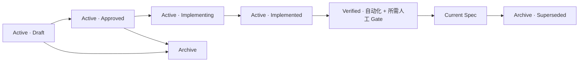

# Reroll 产品知识库

这里是产品、设计、交互、开发与测试共同使用的长期记忆入口。日常阅读只需要三个入口：

1. [`CONTEXT.md`](../CONTEXT.md)：统一领域词汇，避免同一个概念出现多种名称。
2. [`PROJECT-MAP.md`](PROJECT-MAP.md)：产品边界、技术栈、架构、代码责任和功能覆盖。
3. `active/` 或 `current/` 中对应功能的规格：前者用于开发，后者记录已验证的当前行为。

> Last organized: 2026-08-28
> Current state: 项目地图已合并；功能级 Current Specification 仍按 PROJECT-MAP 中的 `partial`、`active` 和 `gap` 逐项补齐。

## 按角色进入

| 角色 | 阅读顺序 | 重点 |
| --- | --- | --- |
| 产品经理 | [项目地图](PROJECT-MAP.md) → 对应 Feature Spec | 用户、范围、权限、非目标、状态与验收 |
| UI 设计师 | [UI 设计与交互指南](current/ui-design-guidelines.md) → 对应 Feature Spec | 页面层级、组件选择、主题、视觉状态和真实页面验收 |
| 交互设计师 | [领域词汇](../CONTEXT.md) → [项目地图](PROJECT-MAP.md) → 对应 Feature Spec | 用户任务、状态迁移、失败、恢复、键盘和权限 |
| 前端开发 | [项目地图](PROJECT-MAP.md#代码责任地图) → [UI 指南](current/ui-design-guidelines.md) → Feature Spec | 浏览器模块、公共组件、HTTP/WebSocket 和浏览器测试 |
| 后端开发 | [项目地图](PROJECT-MAP.md#系统结构) → [ADR](adr/) → Feature Spec | 领域模块、存储、权限、Provider 和集成测试 |
| 测试与发布 | [功能规格注册表](PROJECT-MAP.md#功能规格注册表) → 规格验收章节 | 最高公共测试接缝、人工 Gate 和发布边界 |

## 权威顺序

发生冲突时，不按文件日期猜测：

1. `CONTEXT.md` 只定义领域词汇。
2. `docs/adr/` 记录难以逆转、存在真实取舍的架构决定。
3. `docs/current/` 中标记为 Current 的规格或维护参考定义当前承诺。
4. `docs/active/` 是正在讨论、实施或等待验收的资料，不自动覆盖 Current。
5. `docs/archive/` 只解释历史，不能定义当前行为。
6. 代码和测试证明系统当前实际行为；若与已批准规格冲突，必须显式决定修代码还是修规格。

## 当前参考

- [公开项目身份与兼容边界](current/public-project-identity.md)
- [本机与局域网访问](current/local-network-access.md)
- [ModelScope 镜像发布维护](current/ModelScope镜像发布维护.md)
- [Workspace 数据边界 ADR](adr/0001-workspace-data-boundary.md)
- [UI 家族模块实现所有权 ADR](adr/0002-ui-family-module-ownership.md)
- [工作区资产库发布边界 ADR](adr/0004-workspace-asset-library-publication-boundary.md)
- [全局生成发布权威 ADR](adr/0005-global-generation-publication-authority.md)
- [恢复阶段显式创建 Workspace ADR](adr/0006-explicit-workspace-creation-during-recovery.md)
- [默认允许局域网访问 ADR](adr/0008-lan-access-by-default.md)
- [存储路径与旧数据迁移](current/storage-layout-and-migration.md)
- [工作区资产库与 Smart Canvas 本地引用](current/workspace-asset-library.md)
- [Generation Run 生成链路](current/generation-pipeline.md)
- [Canvas Mutation 单 Node 移动快速通道](current/canvas-mutation-single-node-move-fast-path.md)
- [Canvas Sync 实施合同](current/canvas-sync-implementation.md)
- [Smart Canvas 节点自动避让](current/smart-canvas-node-auto-placement.md)
- [Smart Canvas 编组与分区命名](current/smart-canvas-container-terminology.md)
- [Smart Canvas 选区整理](current/smart-canvas-selection-arrangement.md)
- [Smart Canvas 图片输出能力](current/smart-canvas-image-output-capabilities.md)
- [Smart Canvas 创建副本 Connection 继承规则](current/smart-canvas-duplicate-connection-inheritance.md)
- [Smart Canvas 灯光参考编辑器](current/smart-canvas-lighting-reference.md)
- [Canvas 分享只读内容完整性](current/canvas-share-read-only-content-parity.md)
- [停服切换与真实协作验收](current/controlled-cutover-and-live-acceptance.md)
- [Realtime Collaboration 性能与容量](current/realtime-collaboration-performance.md)
- [Smart Matting 性能与容量](current/smart-matting-performance.md)
- [UI 设计与交互指南](current/ui-design-guidelines.md)
- [Design Tokens](current/design-tokens.md)
- [Smart Canvas 生成失败反馈](current/smart-canvas-generation-failure-feedback.md)
- [Smart Canvas 连线与命中优先级](current/smart-canvas-connection-quick-add-hit-priority.md)
- [Smart Canvas 预设图片处理器](current/smart-canvas-preset-ai-processors.md)
- [Smart Canvas 批量运行节点](current/smart-canvas-batch-run-node.md)
- [Batch Generation 结果画廊模型身份](current/batch-generation-result-gallery-model-identity.md)
- [API Settings Package](current/api-settings-package.md)

## 生命周期

| 目录 | 用途 | 能否作为当前事实 |
| --- | --- | --- |
| [`active/`](active/) | 正在讨论、实施或等待验收的 Feature Spec | 不能仅凭目录判断；看文档 Status |
| [`current/`](current/) | 已交付、已核对的 Current Spec 和运行参考 | 可以 |
| [`adr/`](adr/) | 长期架构决定和理由 | Accepted ADR 可以 |
| [`archive/`](archive/) | 被替代、停止或只需追溯的资料 | 不可以 |

本项目不建立通用 `docs/evidence/`。自动化证据属于 `tests/`；必要的性能或现场记录与其所属 Current 文档放在一起。一次执行的报告不能自动成为产品规格。

## Feature Spec 最小合同

新功能使用[功能规格模板](FEATURE-SPEC-TEMPLATE.md)，至少写清：

- Status、Feature ID、Owners、Last verified 和适用版本；
- Problem、Goals、Non-goals、Actors 与权限；
- 用户旅程、UI 状态、失败/恢复和并发行为；
- Domain/State Model、数据归属和安全边界；
- API/WebSocket/Provider 合同；
- 自动化、浏览器、人工和真实环境验收；
- 相关 ADR、实现模块和回归邻居。

## 维护规则

- 一条长期事实只在一个权威位置定义，其他文档只链接。
- 新功能先写 Active Spec；完成实现不等于 Current，必须先通过风险相称的验证。
- Verified 后提炼稳定行为到 `current/`，原计划进入 `archive/` 或由 Git 历史保存。
- 公开 GitHub Issues 是需求、Bug、调查和开发任务面向贡献者的事实来源；维护者可另用私有项目看板，仓库不再维护重复 `roadmap.md`。
- 临时 Handoff 不作为长期文档类型。仍在进行的交接应放在当前 Issue/PR；稳定规则进入 Spec，提交和分支上下文留在 Git。
- 新增、删除或改名领域概念时更新 `CONTEXT.md`；实现和文件路径不得写入词汇定义。
- 新增/删除页面、公共 API/WebSocket、Provider 类别、主要模块或 Current Spec 时更新 `PROJECT-MAP.md`。
- 发现文档与代码不一致时标记 `drift`，通过最高外部测试接缝确认现状，再由承诺负责人决定目标行为。

## 当前计划在哪里

需求、Bug、调查和开发任务统一进入公开 GitHub Issues；维护者可在私有项目看板中按 `Todo → In Progress → Review → Done` 管理。`docs/active/` 只保存需要长期评审的功能规格，不保存任务板镜像、跨电脑分支指令或临时聊天交接。
