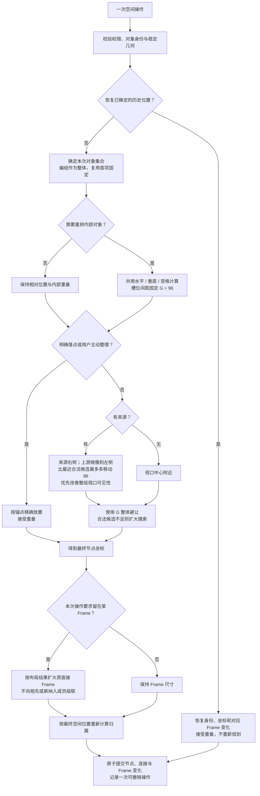
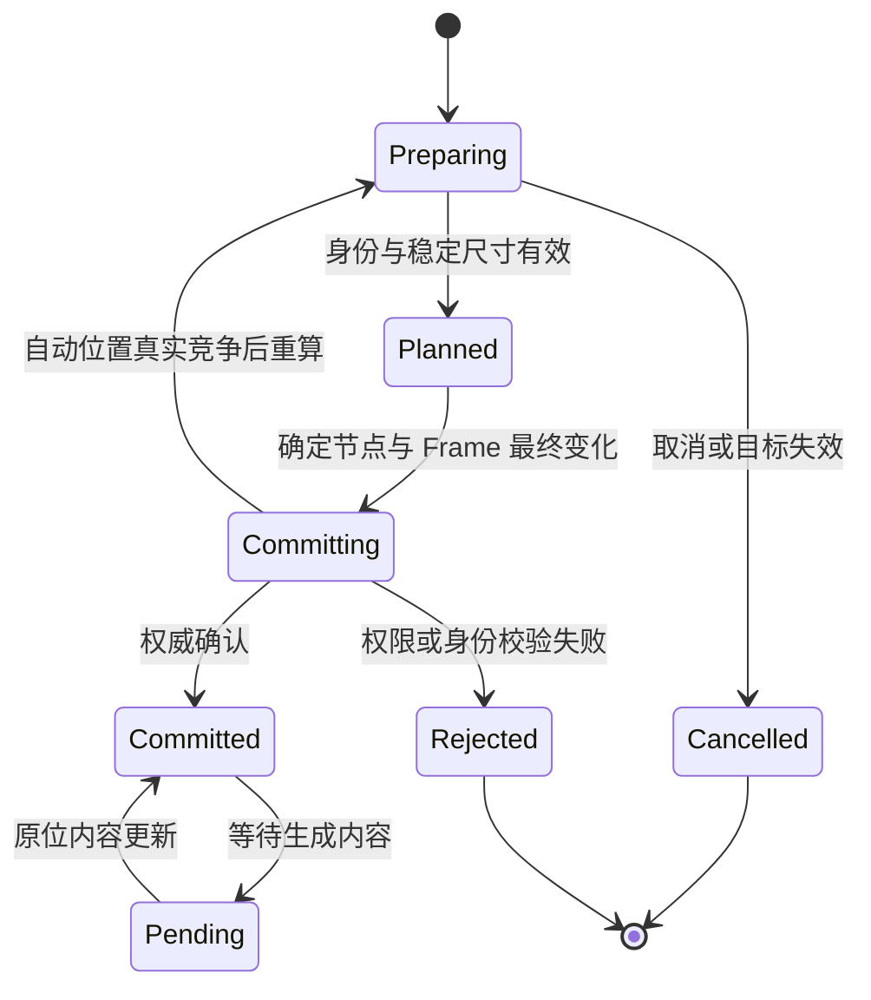

# Smart Canvas 统一节点定位、排列间距与 Frame 扩容

- **Status**：Draft；两轮共 12 项产品决定已确认，待完整规格审阅，尚未实施
- **Feature ID**：F05；关联 F06 / F09 / F13
- **Owners**：产品 / UI / 交互 / 前端 / 后端 / 测试
- **Last verified**：2026-09-05；完成当前文档、前后端代码及本轮讨论核对；目标行为尚未实现或验收
- **Applies to**：Smart Canvas 后续统一空间布局迭代；目标版本待实施时确定
- **Supersedes**：无。批准并交付后修订[节点自动避让](../current/smart-canvas-node-auto-placement.md)与[选区整理](../current/smart-canvas-selection-arrangement.md)；本 Draft 不把目标行为写成 Current 事实
- **Superseded by**：无
- **Related ADRs**：[Workspace 数据边界](../adr/0001-workspace-data-boundary.md)、[UI 家族所有权](../adr/0002-ui-family-module-ownership.md)、[编组成员权威](../adr/0010-smart-group-member-authority.md)
- **Domain terms**：Smart Canvas、Node、Connection、Frame、Smart Group、Group Presentation、Node Rest Geometry、Canvas Selection、Selection Arrangement、Canvas Viewport、Canvas Mutation、Canvas Sync、Generation Run、Generation Output、Pending Node

## 1. 一页摘要

统一画布新建节点、生成结果、复制粘贴、手动移动与主动整理所使用的空间计算：先确定本次操作对象和内部形状，再确定锚点，只有交给系统决定位置的操作才执行避让，最后按需要扩大 Frame，并一次提交全部变化。

本轮明确共识：

- 用户给出明确位置时接受重叠；系统保留其锚点，不自动移开新节点，也不挤走其他节点。
- 没有明确位置时，有来源就相对来源放置；生成结果位于父节点右侧、尽量接近父节点，同时尽量在视口内。没有来源才使用视口中心。
- 自动避让、同次多结果排列、不同次结果之间及选区整理统一使用代码中的唯一间距常量 **G = 96 世界单位**；不增加画布或全应用配置 UI。整理删除原外框空间均摊，槽位直接使用 G。
- Frame 根据节点布局结果扩容，不再先尝试塞入旧边框、失败后迁出整个集合；手动移出 Frame 仍允许离开。
- Frame 扩容后继续按空间位置重算成员归属，允许纳入原本在外的节点；这些节点的坐标保持不动。此项已由用户回答 Q1 明确确认。
- 合并重复计算与配置，保留明确位置、系统自动位置、用户主动重排这些不同的操作意图。
- 主动整理保留原选区锚点，接受与未选中节点重叠；为了改善视口可见性，自动来源放置最多比最近合法候选增加一个 G 的位移。
- 跨次结果对齐是软偏好，可以让位于父节点距离和视口；空生成节点复用为第一项时保留其身份与坐标，只给新增结果布局。
- 只扩大操作开始时的直接 Frame，不级联祖先，也不因新纳入成员再次扩容；归属同面积平局按稳定 Frame ID 决定。
- 历史 Undo/Redo 恢复精确坐标，即使与后来节点重叠；生成新增结果统一以实际父节点整体为来源，无外部父节点才以执行节点为来源。

两轮 Q1–Q12 均已由用户回答并合入正文；第 18 节无剩余产品决策。Draft 状态用于完整规格审阅，不表示运行代码已经改变。

**术语限定**：本文的“整批结果”仅指同一次 Generation Run 的多个输出节点作为空间集合，不新建领域中的 Generation Batch。代码 `generationBatch*` 的历史字段名不改变 [CONTEXT](../../CONTEXT.md) 中 Generation Batch“包含多个运行或任务的持久集合”的定义。

## 2. Problem Statement

同一用户意图在不同入口得到不同结果：拖线明确落点允许重叠，普通明确落点却被移开；自动新建让节点迁出 Frame，主动整理却扩大 Frame；普通节点、同批结果与选区整理又分别使用不同间距。多结果距离父节点过远或落在视口外时，用户难以理解来源关系和找到新内容。

当前主路径的普通可见边缘安全距离为横向 200、纵向 96，同批内部间距为 48，主动整理下限为 32；这些是不同代码层中的当前事实，不是本规格的新默认值。前后端均存在旧间距判断，不能只统一前端常量。

## 3. Goals / Non-goals

### Goals

- 相同位置意图、几何和布局上下文经过各创建入口时获得一致结果。
- 明确落点在正常提交、异步完成及协作过程中保持用户指定的位置；重叠本身不构成失败。
- 自动结果保持来源方向、紧邻关系和可发现性；多个结果保持已确定的内部顺序与布局。
- 所有适用的节点间距读取同一 G，Frame 随内容布局扩容，整次操作可以原子撤销。
- 逐项消融旧机制，以外部行为对照验证简化，而非叠加新的入口特例。

### Non-goals

- 不持续整理整张画布，不迁移历史重叠，不在修改 G、Pan/Zoom、重新打开时重排已有节点。
- 不改连线路由或 Provider 生成能力；布局算法不触发付费运行。
- 不将节点内部控件、媒体缩略图、Frame 标题的尺寸与节点间距混为一项。
- 不把 Group Presentation 写入成员 Node Rest Geometry，不改变编组成员身份权威。
- 不在本轮重设计树状拓扑、视觉宫格识别或参考输入顺序；公共间距改动需覆盖相邻回归。

## 4. Actors and permissions

| Actor | Preconditions | Can | Cannot |
| --- | --- | --- | --- |
| Administrator / Designer | 对当前 Canvas 有编辑权限 | 新建、移动、整理、由这些操作提交 Frame 扩容 | 绕过既有 Canvas 授权、来源身份和提交校验；在 UI 中修改代码常量 G |
| Guest Account / Anonymous Share Visitor | 既有只读访问条件成立 | 查看已有布局 | 提交坐标、间距或成员变更 |
| Realtime Collaborator | 独立的已授权编辑端 | 接收已提交坐标和 Frame 变化 | 用自己的视口重算对方位置、让对方视口自动跟随 |

失去权限、来源被删除或操作目标失效时，取消或按既有 Canvas Sync 规则拒绝整次意图；“接受重叠”只放宽空间碰撞，不放宽其他校验。

## 5. User stories

1. 我从输出端拖到指定位置，新节点左边缘中点应与松手点一致，即使那里已有节点。
2. 我点击生成，希望结果在父节点右侧附近，并尽量出现在当前可见区域。
3. 我在 Frame 内生成或整理内容，希望 Frame 扩大以容纳结果，其他节点留在原位。
4. 我复制或粘贴一个工作结构，希望其中相对坐标、连接及主动重叠不变。
5. 我使用不同排列入口时，希望统一间距表达相同的视觉距离。
6. 我在生成等待、失败、重试、刷新及协作期间，希望布局保持可预测，并能一次撤销完整操作。

## 6. User journey and interaction contract

### 6.1 入口归一化

“明确位置”必须来自真实用户操作或恢复记录，不能因为调用方需要填写坐标而把系统占位坐标伪装成用户落点。位置是点与锚定位置的组合，不限定所有入口使用节点中心。

| Entry | 位置依据 / 锚点 | 内部布局 | 外部避让与范围 |
| --- | --- | --- | --- |
| 输出 Quick Add 拖线到空白处并创建 | 松手点 = 新 Node 左边缘中点 | 单节点 | 精确位置；接受重叠；向左拖也保留落点 |
| 输入 Quick Add 拖线创建上游 | 松手点 = 新 Node 右边缘中点 | 单节点 | 与输出创建共用锚点换算，无独立避让例外 |
| 菜单指定位置创建、外部素材拖入 | 世界落点 = 节点中心，沿用各入口已可见的锚定方式 | 单节点或该入口已有集合 | 精确位置；接受重叠 |
| 在已有合法目标上结束连线 / 拖入媒体 | 已有目标身份 | 沿用连接 / 追加内容语义 | 不因存在坐标强行创建新 Node；沿用命中优先级 |
| 手动单选 / 多选移动、Resize | 指针抓取偏移 / 操作手柄 | 保留手势表达的几何关系 | 接受主动重叠；Frame 归属按 7.5 处理 |
| 点击单节点 Quick Add、来源编辑器输出 | 来源外框；下游右侧，上游左侧 | 单节点 | 自动避让；不把点击按钮屏幕坐标当落点 |
| 多选快捷创建一个生成目标 | 归一化来源整体外框 | 一个目标，保持已冻结输入顺序 | 有明确拖线落点则精确放置，否则相对整体来源 |
| 一次运行的多个结果 | 实际输入父节点的整体外框；无外部父节点才用执行节点 | 新增结果横向一行或纵向一列 | 新增集合整体规划；复用首项保留原坐标；方向冻结 |
| 复制、粘贴、导入 Node Package | 用户明确目标 / 有效指针位置，或无位置时视口中心 | 刚性集合，保持内部连接和重叠 | 有真实明确位置则接受重叠；否则整体自动避让 |
| 无来源、无落点的文件上传 / 外部剪贴板图片 | 当前视口中心 | 已确认尺寸的节点或集合 | 自动避让；不能虚构粘贴事件坐标 |
| 宫格 / 水平 / 垂直主动整理 | 原选区左上角 | 重新排列本次有效对象，槽位间距 G | 明确布局，允许覆盖外部节点，不整体自动移位 |
| 编组内新增 / 整理 | Group Presentation | 编组模块的成员顺序和内部展示 | 编组整体对外作为一个对象；不改成员还原几何 |
| 刷新、打开历史、异步内容完成 | 已持久化坐标 | 保持原布局 | 不重新规划；缺失 Pending 的补建及 Undo 并发见 7.7 |

### 6.2 统一流程

主流程已确认。明确点、主动整理和历史恢复都跳过外部避让；自动初始放置才进入候选搜索。

主动整理明确进入精确布局分支，保持原锚点；复用旧节点作为首项时，该节点是固定对象，只有本次新增对象进入自动整体选位。

### 6.3 状态、输入与反馈

- 准备中：尺寸未可靠取得时先获取尺寸；拖线沿用只显示引线的交互，不增加预测节点占地框。
- 规划中：计算暂存于本次意图，不能逐个保存中间位置。菜单取消、Escape、换画布或目标失效不留下节点或 Undo。
- 已提交 / Pending：展示已确定的位置；文字、图片、视频切换须保持明确锚定点，内部内容更新不推动其他节点。
- 失败 / 恢复中：真实几何或提交失败明确反馈并回退完整操作；显式重叠不是错误，不弹重叠确认。
- Pointer 与 Keyboard 激活同一动作使用同一位置规则；无 Pointer 坐标的 Keyboard 自动创建使用来源或视口。
- Light/Dark 不改变几何；窄屏与缩放只改变可见范围，不改变世界单位 G。触摸及 Reduced Motion 沿用已有手势和动效合同。
- 受影响的验证错误、动态提示和可访问名称须同时提供中文、英文并通过共享 i18n；Spec 本身不是运行时产品文案。

## 7. Functional rules

### 7.1 操作对象与锚定

**R01（已确认）**：一次操作先确定对象集合，再计算整体空间形状。复制、粘贴、导入、多选移动保持内部相对坐标、已有重叠及连接关系，只整体平移。用户主动整理可以重排所选对象；普通自动新增不移动其他既有节点，空生成节点复用时也保持其原坐标。

**R02（已确认）**：统一点锚定公式为 `整体左上角 = 世界点 − 锚点在整体内的偏移`。左边缘中点偏移 `(0,H/2)`，右边缘中点为 `(W,H/2)`，中心为 `(W/2,H/2)`；手动移动使用抓取点偏移。不同节点类型、屏幕缩放和最终稳定尺寸都通过同一公式转换。

**R03（已确认）**：真实明确落点直接确定位置，不执行碰撞移位、不强制回到来源右侧、不因位于 Frame 外而拉回；自动 G 约束不能纠正手动重叠。后续自动节点仍把这些功能节点的实际几何视为障碍。

### 7.2 自动来源与视口

**R04（Q12 已确认）**：无明确点时，有来源优先相对来源，无来源才使用当前视口中心。单来源使用来源外框，多选共同创建使用归一化来源整体外框。对执行节点 A 生成的新增结果，使用本次实际输入父节点的整体外框，不只取第一条上游，也不把历史 `generationBatchSourceNodeId` 的首项身份当成唯一父节点；没有外部父节点才以 A 为来源。例：`P → A`，A 原位复用并新增 B/C，则以 P 为来源规划 B/C，A 作为固定障碍。多个实际父节点先归一化、去重并把编组成员投影为外部编组整体；来源解析沿用有效 Connection / 输入关系权威，不改变连线及引用顺序。

**R05（已确认）**：生成结果在父节点右侧，以满足间距 G 的相邻位置为首选。上游创建镜像到左侧。方向与自动不重叠为硬约束，接近父节点及视口可见性为优化目标；不能为了可见而改到父节点左侧。精确落点优先于这些自动条件。

**R06（Q2 已确认）**：为了改善可见性，最多比最近合法候选多移动一个 G。统一评分定义如下：

1. 首选整体左上角为 `P0`：下游 `x = 来源右边缘 + G`、`y = 来源上边缘`；上游 `x = 来源左边缘 − G − 整体宽度`、同样顶部对齐。这里距离表达相对首选位置的位移。
2. 在满足方向、G 和对象身份约束的确定性候选集合中，以欧氏距离 `d(P,P0)` 得到最小值 `dmin`，仅允许 `d ≤ dmin + G` 的候选参与可见性选择。不能只返回首个找到的位置而遗漏该范围内的可见候选。
3. 范围内优先整体完整可见，再比较 `整体外接矩形与视口交集面积 / 整体外接矩形面积`，比例越大越优；再比较 d，越小越优。相同时才考虑跨次起点对齐、来源对齐，最后以坐标及稳定身份打破平局。G 是已有常量，不为视口额外引入距离参数。
4. 使用操作发起时的 Canvas Viewport 快照；后续 Pan/Zoom、结果返回和其他编辑端视口不重新排布。视口容不下完整结果集合时允许超出，不缩小 Node 或拆散新增集合。

**R07（保留既有边界）**：只有本地用户直接发起的创建可按既有 reveal 规则做必要的最小平移；后台完成、远端创建不移动本地视口。不通过缩放视口伪装“布局已在视口内”。来源几何在提交前变动时按最新有效几何校验，明确点与本次视口快照保持；来源失效不静默退回视口中心创建。

### 7.3 唯一节点间距 G

**R08（已确认）**：G 表示世界坐标中的节点可见边缘 / 排列槽位之间的最小距离，不是屏幕像素，也不是每侧分别添加后形成 `2G` 的边距。自动避让、同次结果内部、不同次结果外部、水平 / 垂直 / 宫格及共享该基础的树状排列都读取同一值。

**R09（已确认）**：新旧对象的安全区计算只计一次 G。可以内部采用单边扩张 G 或双边各 G/2，但可观察结果一致；水平方向与垂直方向无独立业务间距。碰撞采用确定性的矩形间隔模型；节点尺寸不同不改变 G 的含义。

**R10（Q4 / Q10 已确认）**：G 固定为 **96 世界单位**，只存在于代码的统一常量定义，不新增 Canvas 字段、个人偏好、环境变量或设置 UI。前后端从同一权威定义读取 / 构建，不能再各自手写一个值。未来版本修改 G 只影响随后主动触发的布局，不重排旧坐标、不改变已创建 Pending Node。常量应保持有限正数。Quick Add 热区尺寸继续由 UI 定义，不用动态测得的热区反向改变 G。

**R11（Q3 已确认）**：删除原选区外框的剩余空间均摊，排列槽位直接使用 G，形成紧凑布局，不维持旧选区宽高。不同尺寸节点在目标槽位内居中，槽位间距相同不保证任意相邻可见边缘恰好都为 G。自动外部碰撞仍可能使整个新增集合与障碍的实际间距大于 G。

**R12（保留职责）**：Frame 标题尺寸、容器内边距、节点内部控件及 Group Presentation 的缩略图排版不另定义“节点间距”。本轮不把这些展示尺寸自动改成 G。Quick Add 热区与间距变化的命中冲突要通过公共命中仲裁及真实页面验证，不能偷偷补回另一套横向放置常量。

### 7.4 排列与整批结果

**R13（保留既有行为）**：水平按原 `x → y → ID` 排序；垂直按原 `y → x → ID` 排序。宫格优先保留可信视觉行列与槽位，重复槽位或中间空洞时回退为 `ceil(sqrt(n))` 列、按原 `y → x → ID` 填充。保持原选区左上锚点及槽位内居中，间距计算由 R11 替换。八节点原有一行仍可能保持一行；不在统一间距时悄悄移除宫格识别。

视觉行列仍使用既有边缘 / 中心跨度容差 `max(16 世界单位, 最小对应尺寸 / 2)`，槽位必须唯一、从左到右逐行连续填充，只有最后一行可以不满。这里 16 是识别容差，不是节点间距，不能随 G 从 32 改为 96 而扩大识别范围。

**R14（Q5 已确认并保留既有边界）**：排除 Frame 槽位，将选中的编组成员归并为编组整体后，有效对象少于两个则不整理。宫格 / 水平 / 垂直不读连接拓扑；树状拓扑继续由现有职责拥有，不因共用排列基础改变输入连接或来源顺序。主动整理保留原布局锚点，接受覆盖未选中对象，不再对整个整理结果执行外部避让；G 约束本次排列内部。

**R15（Q7 已确认）**：同次全新多结果先排出稳定形状，横向一行、纵向一列，使用 G，然后整体寻找位置并评估视口可见性。默认横向，创建时冻结实际方向；切换设置只影响未来运行。空生成节点复用为第一项时，保持其 ID 与原坐标，把它的最终稳定占地当作障碍；仅将新增结果组成集合进行上述规划。这是整次结果连续排列的明确例外，不是移动已有节点的例外。一次运行、稳定槽位身份及一次撤销不改变。复制、粘贴、导入的刚性集合不被强制套用横纵排列。

**R16（Q6 已确认）**：同来源后续横向结果向下续行、纵向结果向右续列，只提供候选和软对齐偏好，不再锁定旧批次 x / y 起点。父节点距离和视口按 R06 优先；旧批次远离父节点时，新结果允许返回父节点附近的合法位置。每批内部稳定顺序、一次创建和一次撤销保持；旧结果不移动。

### 7.5 Frame 与编组

**R17（已确认）**：自动选位不以旧 Frame 矩形作为必须塞入的区域，也不因原空间不足迁出整批。先按来源 / 用户点、方向、G 与其他功能节点得到位置，再扩大本次需要保留的 Frame；只扩不缩，Frame 尺寸与节点变化同一事务。Frame 本体不作为实心障碍，外部实际功能节点继续作为自动避让障碍。

**R18（Q8 已确认）**：自动来源全在同一个直接 Frame 时使用该 Frame；明确创建按实际落点命中的 Frame；同一 Frame 内主动整理可扩容。手动拖出允许离开，原 Frame 不追着扩张。跨直接 Frame 的来源以 Canvas 为范围，即使存在共同祖先，也不自动选择祖先或合并两个 Frame。扩容上下文采用操作开始时的直接 Frame，最终归属则按 R19 重算；空间归属变化不保证该 Frame 永远保有某一结果。

**R19（Q1 / Q11 已确认）**：扩容后以最终节点中心重算空间归属；多个 Frame 命中时选面积最小者，相同面积按稳定 Frame ID 的字符序打破平局，不使用 UI 语言排序或旧归属优先。可以纳入原本在外的节点或改变重叠 Frame 中节点归属，但不得移动这些节点的坐标。编组成员不单独参与，其编组整体参与。Frame 不是显式内容所有者，不为维持原归属添加隐藏的成员锁。Frame 自身参与祖先归属计算时继续要求父 Frame 面积严格更大，避免等面积互相包含。

**R20（Q8 已确认）**：仅以原直接 Frame 外框与本次操作成员的最终占地计算一次只扩不缩的并集，沿用 Frame 内容留白和标题尺寸。只扩大该直接 Frame，不向原祖先链级联。随后重算一次空间归属；新纳入的节点不触发第二次扩容，也不因为祖先归属变化重新运行本次布局。子 Frame 可以超出祖先外框，最终归属仍由空间规则决定。这为“布局 → 扩容 → 归属”提供明确终点。

**R21（保留 ADR-0010）**：Smart Group 作为整体参与外部布局，整组移动时成员还原几何统一平移；创建 / 移入 / 内部整理 / Resize 只改变派生展示与允许的成员顺序，不能把缩略槽位写回成员真实宽高。解组恢复已有 Node 身份与还原几何，直接媒体脱离编组成为新 Image Node 的路径需使用对应位置意图。

### 7.6 障碍、合法性与失败

**R22（保留既有边界）**：自动外部避让使用其他普通功能节点和编组整体的稳定数据几何；编组内部成员不重复计障碍；Connection、文本标注、画笔标注不是自动障碍。手动集合内部的既有重叠可以保留。

**R23（已确认）**：有效有限几何下持续扩展自动搜索，不以固定轮数后的重叠位置兜底。世界可用范围不受 `.world` CSS 尺寸裁剪。无效坐标、尺寸、来源或身份可明确拒绝；失败不留下半个集合、部分连接或仅完成的 Frame 扩容。

### 7.7 异步、恢复、撤销与协作

**R24（保留并强化）**：首次放置前确定稳定外部尺寸；媒体可靠尺寸未取得时不以错误占地完成放置。Pending 成功、失败、重试、内容更新原位作用于相同身份；普通打开与刷新保留历史坐标。确实缺失 Pending Node 的恢复补建必须区分恢复已知坐标和真正需要新规划，继续遵守最新 [Generation Pipeline](../current/generation-pipeline.md)，不沿用旧文档“没有 detached recovery”的历史判断。

**R25（已确认的明确创建合同）**：明确落点接受重叠必须贯穿客户端、服务端、并发重试与重载后的操作意图。服务器不能仅因较新节点占用了明确落点而把该创建降级为自动避让。位置模式属于本次操作，不能仅存在浏览器临时 ID 集合，也不能把“曾手动拖过”永久当成该 Node 以后所有动作的模式。

**R26（保留自动竞争语义）**：并发自动创建在同一空位冲突时，已确认节点不动，后提交的新集合基于最新障碍重新规划；复用的既有首项继续固定，只重算新增集合。重试不能逐个拆分提交；相同 Operation ID 不重复创建。

**R27（Q9 已确认）**：Undo/Redo 恢复该操作已确定的身份、坐标、连接及 Frame 变化，不重新计算布局；即使后来的协作者占用恢复坐标，也接受几何重叠。此规则覆盖最初自动创建、明确创建和删除后的恢复，不依赖原 Node 的瞬态 exact 标记。只对自动初始创建的真实并发竞争重算，不对已知历史坐标重算。对他人修改的撤销冲突仍由既有协作保护处理，接受几何重叠不代表覆盖他人内容。

## 8. Domain and state model

一次空间操作表达对象集合、位置依据、内部是否重排、来源关系和需要保留的 Frame 上下文。共享计算并不消除创建、移动、Selection Arrangement 和内容交付在领域中的区别。

明确位置在重试中仍为明确位置；协作拒绝与整个操作撤销不能改变其语义。Pending 不拥有第二套布局算法。画布中的结果 Node、Operation ID 与 Generation Run 身份继续沿用既有权威。

## 9. Data and persistence

| Data | Authority | Boundary | Migration / recovery |
| --- | --- | --- | --- |
| 最终 Node 坐标、稳定尺寸、Connection、Frame 几何与空间成员投影 | Canvas / Canvas Mutation | Workspace Data | 同一操作原子保存，历史坐标不迁移 |
| G | 单一代码常量权威 | 随应用版本发布，不属于 Canvas / 用户配置 | 新版本采用统一定义，旧坐标不迁移；跨版本提交需一致性校验 |
| 本次位置意图、使用的 G 与多结果方向 | 本次布局 / 运行操作 | 重试、协作及恢复所需边界由协议设计确定 | 不按后来的设置或新的 Pointer 位置猜测已开始意图 |
| Viewport 与 Canvas Selection | 当前编辑端 | 本地暂态 | 视口快照用于本次候选评分，不成为他人的共享相机 |
| Node Rest Geometry / Group Presentation | Node / Smart Container | 按 ADR-0010 | 外部整体位移与内部展示分离 |

不新增媒体存储、秘密、跨 Workspace 引用或 Provider 凭证字段。位置意图的协议 / 历史表达必须在实现设计中核对幂等、删除后 Undo 和会话重载；不能仅为通过当前会话测试增加另一个瞬态标记。

## 10. API / WebSocket / Provider contracts

- 沿用 Canvas 授权和原子 Mutation；新坐标、相关 Connection、Frame 扩容及成员投影一次提交。
- 前端自动规划与服务端竞争验证使用同一 G 及同一可观察碰撞定义。旧服务端横向 200 / 纵向 96 判断不能继续否决新规则下的合法操作。
- 明确位置与自动位置必须在权威提交 / 重试中可区分；如何扩展现有消息及操作历史由实现评审确定，本 Draft 不声称现有协议已经满足。
- 明确重叠不是 `placement_conflict`；身份失效、授权拒绝、非法几何与自动竞争仍须有可区分、可恢复的语义。
- 布局操作不发起新的 Provider 请求；生成前先按既有链路保存稳定占位与运行身份。
- 新旧客户端混用时必须防止旧客户端用旧常量、旧 Frame 策略或缺失模式覆盖新合同；兼容 / 升级门槛属于发布 Gate。

## 11. Security and privacy

所有写入继续执行 Canvas 权限和合法 Node / Connection 校验。接受重叠不允许非有限坐标、伪造节点身份、越权 Frame 变更或绕过运行目标保护。诊断使用已有脱敏反馈渠道；不把完整画布、媒体路径或配置秘密写入新的外部日志。

## 12. Performance and reliability constraints

- 基于内存稳定几何规划，不要求每个候选读取 DOM 或发起持久化；Pointer 移动不反复执行全图自动搜索。
- 多对象先计算完整计划，批准后一次修改；大集合不得因为性能退化被拆批、漏节点或静默叠放。
- 同一输入上下文产生确定性结果；坐标取整不能把满足 G 的结果变成实际违反 G 的结果。
- 视口只是评分上下文，不通过不断平移视口与重新布局形成反馈循环。
- Frame 扩容与归属重算按 R20 一次结束，不向祖先或新纳入成员继续扩张。此处不新增未经测量的节点数量或时延承诺。

## 13. Design system contract

沿用现有 Quick Add、`ic-smart-node-toolbar`、选区及菜单。世界几何与算法属于 Smart Canvas；组件只呈现状态和手势，不读取画布 Store 或计算布局。G 为代码常量，不增加设置入口。现有批次横纵方向设置保持，Keyboard / Focus、窄屏、Light/Dark 与双语布局需要回归。

统一 G 后必须复测相邻 Quick Add 热区、连接命中及 Frame 标题遮挡；目标是可操作且符合 G，不以恢复隐含方向间距作为补丁。主题 Token、UI 内部尺寸与节点世界距离继续各自归属，遵守 ADR-0002。

## 14. Implementation decisions

共享一个深 Module 所承担的几何、集合形状、锚点换算、自动候选与间距规则；公开 Interface 只表达用户意图及必要上下文。调用方不再知道搜索轮数、碰撞边距和排列私有策略。可在内部保留独立纯计算函数，不要求把所有现有文件机械合成一个文件。

Mutation 负责原子应用、Undo、渲染和保存；Viewport 负责坐标换算及 reveal；Smart Container 负责 Frame 投影和编组权威。共同计算不移动这些事务、相机和领域职责。

| 消融项 | 目标 | 验收与决策依赖 |
| --- | --- | --- |
| A01 普通明确落点与 Quick Add exact 的入口分叉 | 统一明确位置，保留锚点差异，全部接受重叠 | 已确认；覆盖各种创建、协作与类型切换 |
| A02 自动节点 / 同批 / 跨批 / 整理 / 服务端的间距常量 | 唯一 G = 96 和一致矩形间隔 | 已确认；前后端一起验证，无新增设置 |
| A03 自动创建的 Frame 内搜 / 外迁策略 | 节点先落位，原直接 Frame 后扩容一次 | 已确认；重算空间归属但不继续扩张 |
| A04 生成横纵排列与选区横纵排列的重复计算 | 共用内部排列基础 | 已确认；复用首项固定，只对新增集合布局 |
| A05 按旧选区空间均摊整理间距 | 删除，直接使用 G 紧凑排列 | Q3 已确认 |
| A06 跨次结果硬锁定上一批行列起点 | 降为候选偏好，服从父节点与视口目标 | Q6 已确认 |

逐项建立当前对照、执行已选目标行为，再移除旧机制。保留宫格识别、稳定内部顺序、刚性集合、明确位置及事务原子性；不得靠删除这些验收使消融通过。

## 15. Acceptance and testing

### Highest test seam

真实 Smart Canvas 页面通过 Pointer / Keyboard 触发创建、拖入、整理与 Frame 操作，读取最终坐标、归属和刷新结果；配合隔离 Workspace 的真实 Mutation / Persistence / HTTP / WebSocket 验证原子提交与协作。纯 Module 测试验证候选、间距和确定性，不能替代真实交互与双端 Gate。

### Automated acceptance

| ID | Scenario | Expected external behavior |
| --- | --- | --- |
| T01 | 左右 Quick Add 拖线，文字 / 图片 / 视频切换，落点已被占用 | 保持对应边缘中点，允许重叠，其他节点不动 |
| T02 | 菜单创建 / 外部媒体拖入与同锚点 Quick Add | 明确点语义一致，不再出现一种避让一种不避让 |
| T03 | 拖到已有合法端口或媒体目标 | 沿用连接 / 追加，不误新建；取消不留变更 |
| T04 | 来源右侧拥挤、父节点贴视口下边、父节点屏幕外 | 保持右侧与 G；在 dmin + 96 范围优先改善可见性，超过范围不跳远 |
| T05 | 多选来源、不同尺寸、跨 Frame / 同 Frame | 使用实际父节点整体外框；仅同一直接 Frame 可扩容，共同祖先不替代；输入顺序不变 |
| T06 | 无来源的上传 / 粘贴，Keyboard 创建 | 视口中心自动避让，不使用不存在的事件坐标 |
| T07 | 同次多结果横向 / 纵向，整批大于视口 | 内部顺序、G、方向快照一致，允许超出而不缩图 / 拆散 |
| T08 | 同来源续生成、旧批次远离父节点 | 新结果可打破旧起点对齐，返回父节点附近；原批次不移动，跨次间距使用 G |
| T09 | 空生成节点首次多图，有 / 无外部父节点 | 复用首项 ID 与坐标固定；只放置新增集合；有外部父节点用其整体，否则用执行节点 |
| T10 | 相同几何分别自动创建、生成、主动整理 | 共享 G = 96，前后端接受结果一致；整理不再按原外框均摊 |
| T11 | 水平 / 垂直顺序、可信四列两行、单行八节点、散点宫格 | 保留排序与宫格识别；只改变已选的间距机制 |
| T12 | 整理后撞到未选中节点 | 保留原整理锚点并接受重叠，不移动外部节点或整组选位 |
| T13 | 复制 / 粘贴 / 导入含重叠、Frame 与 Connection 的集合 | 保留所有相对布局与连接；明确点精确放置，自动位置整体避让 |
| T14 | Frame 内自动创建与主动整理超出旧边框 | Frame 扩大、不缩小、不外迁整批；其他节点坐标不变 |
| T15 | 扩大 Frame 圈住外部节点、多个 Frame 重叠 | 按节点中心和最小面积重算归属；全体变化同一事务 |
| T16 | 嵌套 Frame、共同祖先、等面积候选、连续纳入 | 只扩原直接 Frame 一次；不因祖先或新纳入成员继续扩容；等面积按稳定 ID |
| T17 | 手动移出 Frame / 明确落在其他 Frame | 允许离开，原 Frame 不追随扩大，精确坐标不变 |
| T18 | 编组整体排列、内部整理、Resize、移出 / 解组 | 外部整体与内部展示隔离，Node 身份和还原几何正确 |
| T19 | Pending 成功、失败、重试、刷新、缺失节点恢复 | 已有节点原位；实际缺失补建按已知恢复坐标 / 自动意图区分 |
| T20 | 两编辑端同时自动创建到同一位置 | 后提交的新集合按最新障碍整体重算，先提交节点不动 |
| T21 | 明确位置与远端新节点重叠，断线重连后提交 | 重叠本身不拒绝，不降级自动避让，Operation ID 幂等 |
| T22 | 创建 / 整理 / Frame 扩容 Undo/Redo，删除后恢复 | 始终恢复已知坐标并接受几何重叠；Frame 与归属一并恢复且保护他人内容 |
| T23 | 应用升级采用新 G、运行中改横纵方向、Pan/Zoom、远端创建 | 不重排已有节点、不改本地相机；没有 G 设置 UI；新动作使用版本定义 |
| T24 | 无权限、来源删除、非法几何、取消 | 完整拒绝或取消，无部分创建、连接、Frame 或 Undo 残留 |
| T25 | 窄屏、Light/Dark、中英文、Keyboard、Quick Add 热区相邻 | 不改变世界间距，状态 / 可访问名称正确，命中反馈一致 |

### Human acceptance

- 产品：确认父节点距离与视口权衡、紧凑程度、Frame 自动纳入和空生成节点首批体验。
- 交互：实际拖线和素材拖入重叠位置；同 Frame 扩容、跨 Frame 拖动、整批结果与一次撤销。
- UI：Light/Dark × Desktop/Narrow × 常用缩放；Quick Add 可点击范围、既有方向入口、焦点和文本适配。
- 协作：两个独立编辑端的自动竞争、明确重叠、Frame 扩容、撤销、断线与重载。

### Regression neighbors and verification record

纯几何 / 放置 / 排列、Canvas Mutation / Persistence / Sync、Generation Output / Recovery、Smart Container、Node Package / Clipboard、多输入 Quick Add、节点端口 / 命中与 i18n。当前回溯阶段的 53 项放置、排列、Mutation、架构与布局合同回归已通过；这是旧实现基线，不是本 Spec 目标验收。新合同的自动化、真实浏览器、人工与双端 Gate 均未执行。

本次文档验证：`.venv/bin/python -m unittest tests.test_documentation_knowledge_map` 的 7 项检查通过；本 Spec 本地链接、19 节模板结构、27 条规则及已回答问题清理检查通过，`git diff --check` 通过。两轮决定另经只读一致性复核，无新增产品冲突。

## 16. Rollout, migration and rollback

两轮产品决策已经完成；完整规格审阅确认后可标为 Approved，实施是后续任务。当前任务仅编写 Spec；不更新发布 VERSION，不改运行代码，不把 Draft 毕业为 Current。

旧 Canvas 坐标不迁移，不向旧文档补写 G 字段。G 随版本定义，新旧客户端的空间意图兼容与回退行为在协议设计中明确。只有新动作采用新合同。功能交付时按[完成文档规则](../agents/change-documentation.md)修订当前定位、选区整理、命中和必要的 Sync / 生成权威，核对 Issue 与对应 Gate。实际 Push 再执行项目发布版本和 UI 资产版本规则。

## 17. Traceability

| Kind | Reference |
| --- | --- |
| Product map | [F05](../PROJECT-MAP.md#功能规格注册表)，关联 F06 / F09 / F13 |
| Current authorities | [Node 自动避让](../current/smart-canvas-node-auto-placement.md)、[Selection Arrangement](../current/smart-canvas-selection-arrangement.md)、[命中优先级](../current/smart-canvas-connection-quick-add-hit-priority.md)、[Generation Pipeline](../current/generation-pipeline.md)、[Canvas Sync](../current/canvas-sync-implementation.md) |
| Active neighbors | [多输入 Quick Add](2026-09-03-smart-canvas-multi-input-quick-add-spec.md)、[编组可逆包含](2026-09-04-smart-group-reversible-containment-spec.md) |
| Geometry / layout seams | [node-geometry.js](../../static/js/smart-canvas/node-geometry.js)、[node-placement.js](../../static/js/smart-canvas/node-placement.js)、[selection-arrangement.js](../../static/js/smart-canvas/selection-arrangement.js) |
| Transactions / containers | [canvas-mutation.js](../../static/js/smart-canvas/canvas-mutation.js)、[canvas-persistence.js](../../static/js/smart-canvas/canvas-persistence.js)、[smart-container.js](../../static/js/smart-canvas/smart-container.js)、[canvas_realtime.py](../../backend/infinite_canvas/canvas_realtime.py) |
| Generation | [generation-run.js](../../static/js/smart-canvas/generation-run.js)、[generation-output.js](../../static/js/smart-canvas/generation-output.js)、[smart-canvas.js](../../static/js/smart-canvas.js) |
| Existing test seams | [放置](../../tests/test_smart_canvas_node_placement.py)、[排列](../../tests/test_smart_canvas_selection_arrangement.py)、[Mutation](../../tests/test_smart_canvas_canvas_mutation.py)、[真实页面布局 smoke](../../tests/issue_148_layout_browser_smoke.cjs)、[明确落点 smoke](../../tests/smart_canvas_reference_creation_placement_browser_smoke.cjs) |
| Issue | 已检索公开 open / closed Issues；[#34 优化树状整理](https://github.com/lazyq666/reroll-ai-canvas/issues/34)和 [#22 交互优化](https://github.com/lazyq666/reroll-ai-canvas/issues/22)为已关闭的相邻历史任务，不能冒称覆盖本次新合同。尚未建立本次实施 Issue；当前不重开或发布远端事项 |
| Authority discrepancies | 当前自动避让文档以 Generation Batch 描述一次运行的多输出，本文按 CONTEXT / 最新 Generation Pipeline 区分；旧文档的 Issue #148 当前无法在公开仓库解析，不据此推断发布状态 |

## 18. Open questions

当前没有未回答的产品问题。Q1–Q12 的决定已分别写入 R04、R06、R10–R11、R14–R16、R18–R20 与 R27，流程图及验收同步更新。

尚未完成的是完整规格审阅、后续实现设计和验收，不是悬而未决的产品推荐选项。未来若实现发现新的真实冲突，应先把具体场景和备选结果带回评审，不恢复已消融规则作为隐含 fallback。

## 19. Change log

| Date | Status | Change | Evidence / decision |
| --- | --- | --- | --- |
| 2026-09-05 | Draft | 汇总明确落点接受重叠、相对父节点及视口、统一 G、Frame 扩容与空间归属；记录消融、事务和完整验收范围 | 用户要求先形成 Spec，有冲突则 grill；未实施 |
| 2026-09-05 | Draft | 确认 Q1：Frame 扩容后按节点中心和最小面积重新归属，接受纳入外部节点但不移动其坐标 | 用户明确选择“按空间位置重新归属” |
| 2026-09-05 | Draft | 确认 Q2–Q7：视口最多多一个 G 位移、删除均摊、G 仅代码常量、整理允许外部重叠、软跨次对齐、复用首项固定 | 用户逐项回答第一轮问题；特别保留其“仅代码中的统一常量”选择，未采用画布设置建议 |
| 2026-09-05 | Draft | 确认 Q8–Q12：直接 Frame 单次扩容、历史坐标精确恢复、G = 96、等面积按稳定 ID、实际父节点整体来源 | 用户逐项回答第二轮问题；无剩余产品决策，尚未实施 |
