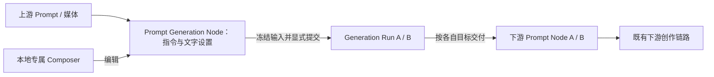

# Smart Canvas 提示词生成专属 Composer

- **Status**：Draft（需求展开与实现基线核对完成，尚未批准或实现）
- **Feature ID**：F07；关联 F05 / F06 / F08 / F09 / F13
- **Owners**：产品 / UI / 交互 / 前端 / 后端 / 测试
- **Last verified**：2026-09-06；已读取 Issue 正文、相关 Current / ADR 与当前工作树实现及测试；不代表目标行为已通过验收
- **Applies to**：[Issue #47](https://github.com/lazyq666/reroll-ai-canvas/issues/47)，目标发布版本在实施时确定
- **Supersedes**：无；本 Draft 不覆盖 Current。批准并交付后，替换 Prompt Generation Node 的节点内编辑与展开呈现，保留其领域身份与生成链路
- **Superseded by**：无
- **Related ADRs**：[Workspace 数据边界](../adr/0001-workspace-data-boundary.md)、[UI 家族所有权](../adr/0002-ui-family-module-ownership.md)、[生成发布权威](../adr/0005-global-generation-publication-authority.md)、[统一模型能力目录](../adr/0009-unified-model-capability-catalog.md)
- **Domain terms**：Smart Canvas、Prompt Authoring、Prompt Generation Node、Prompt Node、Connection、Reference Input Instance、Generation Settings、Generation Run、Generation Output、Pending Node、Canvas Mutation、Canvas Sync

## 1. 一页摘要

创作者通过原有入口创建或选中提示词生成节点后，在节点下方打开专属 Composer，完成查看引用、编写生成要求、选择文字模型和运行。它沿用图片 / 视频 Composer 的浮动布局、引用缩略图、提示词库、快捷选择器及展开编辑体验，但有独立的编辑目标、草稿和文字模型设置，不能切换为图片或视频生成。

画布上的 Prompt Generation Node 继续承担保存指令与设置、连接上游输入、关联下游结果的职责。节点主体变为简洁摘要，不再放置完整编辑器、模型选择器和运行按钮。每次生成仍创建独立的下游 Prompt Node；用户可以编辑生成文本，再接入图片、视频或其他既有链路。

Issue 明确的要求只有三项：提示词生成采用专属 Composer；与图片 / 视频生成区隔；功能入口保持不变且交互参考媒体 Composer。保留节点作为锚点、结果交付方式、具体布局与状态处理是本规格据现有产品提出的设计决定，不能视为用户已逐项批准。

## 2. Problem Statement

- 图片 / 视频在浮动 Composer 中编辑，提示词生成却把相似控件放进节点，用户需要学习两套编辑方式。
- 引用、上游文字、指令及模型控件共同撑大节点，影响画布阅读和连线。
- 若简单加入媒体 Composer 的第三个模式，文字指令、媒体提示词及两类模型设置容易串用，也无法满足“区隔开来”。
- 仅移动输入框无法覆盖模板插入、展开编辑、运行中继续编辑、刷新恢复与协作对账；这些行为必须成为同一合同。

### 2.1 已核对的实现基线

| 范围 | 当前工作树事实 | 本次目标 |
| --- | --- | --- |
| Node 身份 | Prompt 与 Prompt Generation 同属 `smart-prompt`，由 `llmEnabled` 区分 | 保留持久身份，不批量替换 Node |
| 指令编辑 | Prompt Generation 主体包含引用、上游文字、`ic-prompt-composer`、文字模型和运行按钮 | 完整编辑与运行控件移到节点外专属 Composer |
| 媒体 Composer | 由媒体生成资格控制，草稿使用媒体自己的字段 | 保留资格；增加独立的文字 Composer 路由 |
| 输出 | 创建下游文本 Pending Node，提交后台文字任务，完成后成为普通 Prompt Node | 沿用独立结果，不把指令改写成生成文本 |
| 连续运行 | 同一来源可同时有多个 Run，各自有输出 Node 与 Operation ID | 保留；只防止同一次提交被重复触发 |
| 反推提示词 | 专用 Dialog 选模板与模型，确认后创建并运行 Prompt Generation Node | 保留 Dialog 与确认执行时机；后续编辑进入新 Composer |
| 失败 | Current 要求持续失败反馈；文字执行函数仍存在移除失败目标并 Toast 的清理分支 | 对该分支做公共行为验证；不得把潜在缺口当作应照搬的目标 |

## 3. Goals / Non-goals

### Goals

- G1：原入口可发现、可操作，单选提示词生成节点即可打开专属 Composer。
- G2：文字与媒体 Composer 的用途、可见控件、草稿、模型与运行目标严格隔离。
- G3：引用、模板、字符计数、键盘和展开编辑遵循已有 Prompt Authoring 合同。
- G4：旧节点、连线、指令和生成结果无损；生成期间可继续修改并独立运行下一版。
- G5：失败、断网、刷新、删除和协作更新不会清空草稿、重复生成或把结果写给错误节点。

### Non-goals

- 不增加媒体 Composer 的“文字”模式，不增加全局工具、页面、快捷键或新 Node 类型。
- 不将普通 Prompt Node 或 Text Annotation Node 改为模型生成编辑器。
- 不设计聊天、多轮会话、流式逐字输出、文本结果画廊、批量提示词生成或自动循环改写。
- 不新增 Provider、模型能力、生成参数或自动提示词优化；模型约束沿用能力目录。
- 不改造反推提示词 Dialog、批量运行节点、Smart Cascade 或全局历史的产品流程。
- 不把 Composer 的打开位置、展开状态或焦点同步给其他协作者。

## 4. Actors and permissions

| Actor | 前提 | 允许 | 限制 |
| --- | --- | --- | --- |
| Administrator | 具备当前 Canvas 访问和编辑权限 | 编辑指令、引用与设置，执行生成，进入既有模型管理入口 | 提交与交付仍受 Canvas 授权及能力校验约束 |
| Designer | 获授权 Project 且可编辑当前 Canvas | 同上，但只选择已配置的可用模型 | 不获得 Provider 配置或能力目录管理权限 |
| Guest Account | 受限登录账号 | 沿用现有可访问页面 | 不能进入 Canvas 编辑或执行生成 |
| Anonymous Share Visitor | 有效 Share Link | 阅读允许公开的节点摘要和结果 | 不出现可编辑 Composer，也不能通过直接请求提交 |

权限变化必须在打开、保存、提交及结果交付边界检查。打开期间失去编辑权限时保留本地未确认内容供恢复或复制，禁用新提交，不显示“已保存”。

## 5. User stories

1. 从上游节点 Quick Add 创建提示词生成节点后，我能立即在 Composer 输入要求，无需再次双击节点。
2. 我在图片、视频、两个提示词生成节点之间切换时，每个对象都恢复自己的内容和模型。
3. 我能查看上游文字和媒体，使用 `@` 引用、`/` 插入模板，并展开编辑长指令。
4. 第一版还在生成时，我能修改指令或模型并提交第二版；两个结果分别保存。
5. 失败后我能看见原因，找回输入，再决定重试；刷新不能偷偷发起新任务。
6. 协作者移动节点或生成完成时，我正在输入的文字、光标和编辑目标不会被抢走。
7. 老画布中的提示词生成节点能直接继续使用，原有普通提示词仍可编辑和连接。

## 6. User journey and interaction contract

### 6.1 入口与退出

| 原入口 / 场景 | 目标行为 | 是否自动生成 |
| --- | --- | --- |
| 节点输出侧 Quick Add 的文字生成项；拖线到空白后的同类项 | 按原放置和连线规则创建 Prompt Generation Node，单选它并打开专属 Composer；创建完成后焦点进入指令输入框 | 否 |
| 现有 Prompt Generation Node 单选 | 显示该节点的 Composer；Pointer 单选不自动抢走键盘焦点 | 否 |
| 原编辑动作 / 双击指令摘要 | 将焦点移入该 Composer 的指令输入框 | 否 |
| 原浮动工具栏展开动作 | 打开同一文字 Composer 的展开编辑；取消原节点内编辑器的重复展开表面 | 否 |
| 原右键运行提示词命令 | 对该节点当前草稿执行与 Composer 相同的校验与提交 | 是，用户显式运行 |
| 反推提示词 Dialog 确认 | 保留选模板、模型和确认执行流程；创建的节点以后使用专属 Composer | 是，保留原确认语义 |
| 输入侧 Quick Add 新建普通提示词、空白菜单新建普通提示词、选择已生成文本结果 | 保持普通 Prompt Node 编辑方式 | 否 |

“入口不变”包括位置、菜单文案、来源资格、连线方向和点击 / 拖线时机。本次不恢复 Issue #22 已明确移除的 Prompt Generation Node 单节点“生成图片 / 视频”工具栏入口，也不扩展多选 Quick Add 的来源资格。

点击空白或切换到其他节点时，先收集当前编辑并交给 Canvas Sync，再隐藏或切换 Composer。进入多选时关闭两类 Composer，保留多选工具栏。关闭、取消选择及离开展开模式都不等于清空草稿或取消已经接受的 Run。

### 6.2 普通 Composer 与节点摘要

桌面 Composer 锚定选中节点下方，采用媒体 Composer 同一宽度、边距、视口跟随和避让规则；普通态最大宽度为现有 48rem，窄于可用空间时收缩。容器内从上到下为：

1. **身份行**：“提示词生成 / Generate prompt”和既有展开编辑动作。身份文字固定，不提供图片 / 视频切换。
2. **输入区**：媒体参考缩略图；上游引用文字以只读摘要呈现，可展开查看完整内容，不能误认为本节点可编辑指令。
3. **指令区**：多行指令编辑器及独立字符计数行；保持选区、粘贴、Mention 与模板快捷插入能力。
4. **操作行**：现有引用 / 提示词库入口、文字模型选择器和 Large Primary 运行图标按钮。所有动作都有可访问名称。

不显示图片 / 视频模式切换、画幅、分辨率、视频时长、帧率、首尾帧或图片输出数量。文字模型选择器按现有目录显示名称与 Provider 标识，不将媒体当前模型用作文字默认值。

节点主体保留标题、图标、连接端口、指令只读摘要和运行 / 失败状态。摘要采用本节点指令的前三行并省略溢出；完整指令在 Composer 中查看。空指令显示本地化空状态；有上游文字时可表达“使用上游文字”，不把上游全文复制为草稿。参考详情和编辑控件只保留一份，移出主体后不留下不可用按钮。

旧节点的显式位置与尺寸保留，不因首次打开 Composer 自动压缩、移动或触发 Frame 扩容。新建节点采用公共 Node 几何规则下的摘要布局，删除旧内嵌编辑器专用的固定大高度依赖。Composer 不参与 Node 碰撞、选区包围盒、Frame 包含关系或 Node Package 几何。

### 6.3 展开编辑

- 普通态与展开态是同一份草稿的两个布局，不创建第二份编辑状态或第二个可提交目标。
- 展开沿用媒体 Composer 的专注编辑交互，并满足公共模态层级、焦点限制和返回焦点规则；背景 Canvas 不接收输入。
- 上游文字、参考缩略图、指令、模型和运行操作在展开态仍可访问。长文本只在内容区滚动，运行操作保持可达。
- 收起恢复原节点的普通 Composer、草稿、光标和滚动位置；触发节点已删除时焦点返回 Canvas。
- 模型列表、`@` / `/` 选择器归属活动编辑表面；不得在后台保留另一套可交互浮层。

### 6.4 可观察状态

Composer 展示状态与后台 Run 状态正交：`running` 不等于编辑器禁用，也不要求 Composer 始终可见。

| 状态 | 用户看到 | 可用动作 / 恢复 |
| --- | --- | --- |
| closed | 无文字 Composer | 选择有效节点重新打开 |
| loading | 模型 / 能力或引用的局部加载状态；已保存指令可读可编辑 | 等待或重试相应资源，校验未完成不能运行 |
| empty | 指令占位、可用引用和模型 | 输入或插入模板；最终输入非空才可提交 |
| ready | 有效输入、模型及正常运行按钮 | 编辑、展开、切换目标、运行 |
| invalid / no-models | 明确的缺失文本、无模型、模型不可用或引用超限原因 | 保留全部输入，修正后运行 |
| submitting | 立即出现提交反馈，同一提交动作暂不可重复触发 | 编辑下一版或切换目标；此次请求使用已冻结输入 |
| running / queued | 对应下游 Pending Node 显示运行状态；来源汇总是否仍有任务运行 | 可继续编辑并主动提交新 Run |
| success | 对应下游普通 Prompt Node 显示完整可编辑结果 | 复制、连接、编辑结果或返回来源继续生成 |
| failed | 持续失败反馈、原因、重试及查看日志 | 修改输入后运行，或明确重试失败快照；保留其他成功输出 |
| offline / recovering | 未同步或正在恢复反馈 | 继续本地编辑；同步与任务身份未确认前禁止新提交 |
| deleted / forbidden | 目标不存在或权限已变化的明确反馈 | 关闭失效编辑目标；本地未确认内容可复制，不重建被删除 Node |

### 6.5 Pointer、键盘、触摸与焦点

- 普通态 Tab 依视觉顺序遍历可交互引用、上游展开、指令、模板 / 引用入口、模型和运行；展开切换按钮可由键盘到达。
- Enter 在正文换行；Ctrl / Cmd + Enter 显式生成，与媒体 Composer 对齐。输入法合成期间不得提交，按键连发不得创建重复 Run。
- 选择器打开时方向键、Enter、Escape 优先由选择器消费。没有子浮层时，Escape 收起展开态；普通态 Escape 退出编辑焦点并保留草稿，不撤销全部文字。再次取消节点选择遵循 Canvas 既有快捷键。
- 指令编辑器内的复制、粘贴、全选、撤销、重做、Delete / Backspace、Space 属于文本；不能触发 Node 复制、删除、画布平移或播放。
- 在 Composer、模型列表、模板列表和上游文字中滚动，只滚动对应内容；到达边界也不穿透为 Canvas Pan / Zoom。
- Pointer 点击缩略图、选择模板或模型时，Blur 不得提前清空编辑目标；重绘、协作更新和虚拟化不能中断 IME、选区或光标。
- 在 1440×900、1024×768 和 390×844 的 CSS 视口验证 Light / Dark；窄屏内容纵向滚动、底部操作可达，软键盘出现时输入光标与运行入口不能永久被遮挡。触摸点按、长文本滚动和软键盘必须实测。

### 6.6 文案与双语

优先复用已有含义相同的 i18n key；新增 key 使用 `smart.promptGenerationComposer.*` 命名空间。下表是目标文案，不作为写进 JavaScript 的字面量许可。

| 用途 | 中文 | English |
| --- | --- | --- |
| Composer 标题 / 运行可访问名称 | 提示词生成 / 生成提示词 | Generate prompt |
| 指令占位 | 描述你想生成的提示词，可结合上游文字和参考素材 | Describe the prompt you want to generate using the connected text and references. |
| 节点空摘要 | 添加生成要求 | Add instructions |
| 仅有上游文字的摘要 | 使用上游文字 | Uses connected text |
| 引用文字 | 引用文字 | Referenced text |
| 无有效文字 | 请填写生成要求或连接非空提示词 | Add instructions or connect a non-empty prompt. |
| 无模型 | 暂无可用的文字模型 | No text models available. |
| 保存模型已失效 | 当前文字模型不可用，请重新选择 | This text model is unavailable. Choose another model. |
| 当前草稿冲突 | 此提示词已在其他位置更新，请先处理冲突 | This prompt was updated elsewhere. Resolve the conflict to continue. |
| 重试失败快照 | 重试此任务 | Retry this task |
| 同步前提交受阻 | 画布尚未同步，请同步后再生成 | Sync the canvas before generating. |

字符计数、展开 / 收起、引用移除、加载、失败与日志文案复用公共资源。字符数按可见字素计数，排除媒体 Mention 与上游文字，不引入新上限。语言切换即时更新打开的 Composer 和浮层，但不翻译用户指令、生成结果、模型身份或已插入的模板文本。

## 7. Functional rules

### 7.1 身份与草稿隔离

- R01：任一时刻最多存在一个可交互的生成 Composer。选中 Prompt Generation Node 打开文字 Composer；选中有媒体生成资格的 Node 打开媒体 Composer；其他选择关闭两者。
- R02：路由使用 Node 领域角色，不能用“有文字”“标题包含提示词”或上次打开的 Composer 判断。普通 Prompt Node、文本 Pending Node 和生成文本结果不因共享存储类型而获得文字生成资格。
- R03：切换必须先提交原目标的本地编辑，再加载新目标。文字设置不得写入媒体 `runSettings`；媒体草稿不得覆盖 `llmInstruction`，两类模型的最近选择不得互相改写。
- R04：只有主动编辑、引用变化或设置变化构成 Canvas Edit。打开、关闭、展开、模型候选加载与语言切换不能修改持久内容或 Canvas Updated Time。

### 7.2 指令、引用与模板

- R05：本节点指令与上游文字分别保存和呈现；提交时按现有输入解析顺序组装上游文本，再追加本节点指令，以空段分隔。有效文本全部为空时禁止提交；仅有媒体不能在本次改造中隐式补写默认生成要求。
- R06：媒体来源继续包含既有固定引用、Connection 输入及手动引用，沿用当前顺序、屏蔽与去重规则。迁移到 Composer 不新增引用，也不重新排序或把图像解释为视频首尾帧。不同 Reference Input Instance 的身份在已有支持范围内保留；不在此 UI 迁移中重写全局去重合同。
- R07：缩略图添加、移除、排序和 `@` 插入作用于当前文字目标。移除引用不删除来源 Node 或 Managed Media；已移除 / 失效的 Mention 不得继续作为有效模型输入，按公共 Prompt Authoring 规则修正并反馈。
- R08：`/` 与提示词库插入的是可编辑普通文本快照，写入文字指令；不是媒体提示词、输出文本或持续模板绑定。选择、切换或打开模板库不自动运行。
- R09：历史 `llmSystemEnabled` / `llmSystemPrompt` 的执行语义保留；本期不新增系统提示词参数面板。已有值隐藏于新布局不等于允许清空或覆盖。

### 7.3 模型与提交

- R10：模型候选来自当前可用文字模型目录；使用精确 Provider + Model + `text.generate` 能力校验文本、图片、视频和既有系统参数。未知能力沿用目录的保守合同；不得从名称猜测支持媒体输入，也不新增音频输入能力。
- R11：新建节点沿用文字侧既有默认选择；旧模型失效时保留原身份并显示不可用，不因渲染自动更换成首个模型。切换模型后重检全部引用，超限不静默截断。
- R12：一次显式提交在任何异步等待前冻结指令、上游文本、引用顺序、Provider、Model、系统参数、目录 Revision、来源和输出身份。冻结后再编辑或切换不能影响在途请求。
- R13：同一次提交的按钮 / 快捷键重复触发只产生一个 Operation ID、一个目标和一个任务。服务端接受后可显式发起下一次独立运行；已有 Run 的 `running` 标记不能让整个来源永久禁用。
- R14：校验不通过时没有新 Pending Node、Connection 或后台任务。创建目标及其 Connection 后先确认 Canvas Sync，再调用后台文字任务。同步失败或提交未接受时清理本次未接受占位并保留草稿及失败反馈；不得留下假运行状态。
- R15：提交响应未知不等于未接受。先按 Operation ID / 现有任务恢复机制对账，在状态明确前不允许以新身份盲重试。能力 Revision 过期时重载并展示新的校验结果，用户再次提交才产生新意图。

### 7.4 输出、选择与运行中编辑

- R16：每次 Run 的下游结果是独立普通 Prompt Node，带来源 Connection。完成只更新对应输出目标，不覆盖来源指令、其他结果或当前 Composer 草稿；空返回按失败处理。
- R17：提交时显示并揭示本次 Pending Node。若用户仍在来源 Composer 内编辑，保持来源 Selection 与焦点；如果提交后用户主动切换或编辑其他对象，完成 / 失败回调不得强制选回来源或输出。结果通过其状态与既有通知呈现，用户主动选择即可进入编辑。
- R18：同源两个 Run 乱序完成，各交付自己的结果；来源运行指示在全部运行结束后才复位。某次失败不清除其他任务、成功结果或下一版草稿。
- R19：失败遵守[持续反馈合同](../current/smart-canvas-generation-failure-feedback.md)，必须可查看日志。重试此任务使用失败 Run 的冻结输入并经当前能力和权限重检；Composer 运行使用当前草稿。两者均是显式的新 Run，不隐式重放过期输入。

## 8. Domain and state model

Composer 是 Prompt Authoring 的本地 UI 表面，不是新的领域实体。领域词汇保持 [CONTEXT](../../CONTEXT.md) 不变。

本地会话至少以 Workspace 身份、Canvas ID、Node ID 和文字用途绑定目标，并保存编辑基线及未确认改动。打开状态、选区、IME、滚动位置、展开状态和异步加载代次由会话拥有；不是 Node 字段，也不以全局媒体 `settings` 为权威。

异步返回必须核对会话代次和目标身份。关闭、切换 Canvas、删除 Node 或退出登录后，旧模型加载、模板选择和运行回调不得写入新会话。

## 9. Data and persistence

| 数据 | 权威 / 边界 | 保存与恢复 |
| --- | --- | --- |
| 指令、富文本、文字 Provider / Model、既有系统参数与模板来源 | 来源 Node / Workspace Data | 经 Canvas Mutation 与 Canvas Sync 保存，刷新后恢复 |
| 输入引用、顺序、屏蔽项与 Connection | Canvas / Workspace Data | 使用已有引用合同，保留可搬迁媒体身份 |
| 输出 Prompt、来源关系与 Run 快照 | 输出 Node / Workspace Data | 沿用 Generation Output 与目标保护 |
| Run、任务状态与历史 | 既有 Generation Run / History 权威 | 沿用后台查询、交付与刷新恢复；不另建 Composer 历史 |
| 编辑会话、展开、焦点与暂存未确认文本 | 当前编辑端 | 沿用 Canvas Sync 本地恢复边界，不能宣称已在服务端保存 |
| Provider 凭据与连接 | Device State | 不复制进 Node、草稿、分享或诊断 |

### 9.1 保存与旧数据兼容

- 优先复用 `llmInstruction`、`llmInstructionHtml`、`llmProvider`、`llmModel`、`llmInputMedia` 及既有引用字段；不新增与它们并行的第二份文字草稿。
- 旧数据缺少专用指令时兼容读取旧 `text`；显式空指令必须保持为空，不能在清空后由 `text` 再“复活”。实施时用字段存在性和明确的兼容归一化区分旧缺省与用户清空，兼容镜像仅在相应文本真实编辑时同步；HTML 与纯文本必须一致。
- 首次读取兼容数据不自动批量保存或迁移整个画布，不把生成结果 `text` 当成来源指令。旧节点尺寸及 `llmInstructionHeight` 等历史显示字段可保留但不支配新浮层尺寸。
- 输入变更进入现有去抖保存；切换节点、收起、失焦和页面离开前尽力收集编辑器内容，采用既有本地待同步恢复机制。浏览器被强制关闭前未确认的内容不承诺已远端持久化。
- Node Package / 复制保留指令、设置与引用身份重映射规则，但不复制活动 Run、Composer 会话或运行锁。跨 Canvas / Workspace 不凭 Node ID 相同复用会话。

### 9.2 协作、撤销与删除

- 使用现有 Canvas Mutation / Sync 提交字段级变更，不能因为迁移 UI 而用整张快照覆盖协作者修改。
- 协作者只移动 Node 或修改其他字段时保留本地文字与光标；同一指令或模型产生不可自动合并的冲突时保留本地草稿，显示现有冲突处理入口并禁止含歧义输入的提交。不得将两个版本拼接后直接发送给 Provider。
- 新节点及来源 Connection 维持原有一次撤销 / 重做语义；文字编辑时先由编辑器处理撤销，焦点离开后遵循 Canvas 历史。打开或收起 Composer 不产生 Undo 项。
- 删除来源关闭其 Composer；删除输出或撤销目标后，迟到交付遵循 Target Guard，不能复活 Node。删除不等同于远端取消或退款；已接受 Run 沿用后台历史与恢复策略。
- 重做可恢复创作结构，但不能因恢复 `running` 等旧展示字段重新提交付费任务。

## 10. API / WebSocket / Provider contracts

本次优先复用现有公开合同，不因 Composer 独立而创建新文字生成 API。以下路由是现有调用接缝；服务端字段与授权以生成链路及能力目录为权威。

| 合同 | 调用意图 / 结果 | 错误与恢复 |
| --- | --- | --- |
| Canvas Mutation / Canvas Sync | 保存来源草稿和设置；提交前确认输出 Node、Connection 和 Operation ID | 冲突 / 未同步保留本地内容；未确认目标不得先提交 Provider |
| 可用模型与能力目录 | 取得文字模型及 `text.generate` 约束 | 加载失败可重试；不可用模型不静默替换；Revision 变化重新校验 |
| `POST /api/canvas-llm-tasks` | 冻结 `message`、既有 `messages`、`images`、`videos`、`provider`、`model`、系统参数与 `catalog_revision`；`canvas_id`、输出 `node_id`、`generation_operation_id`、请求序号绑定目标；接受后返回 task ID | 服务端再次授权、能力与幂等校验；鉴权、参数、限流或网络问题进入已有错误分类 |
| 既有文字 task 查询与画布级 active Run 恢复 | 继续同一 task，返回运行或终态 | 刷新、关闭 Composer 或查询暂时失败不重新 POST 新任务 |
| Generation Output / History / 日志 | 向匹配身份的输出 Node 交付文本并保留可追踪历史 | 目标删除、Operation ID 失效或权限改变时拒绝旧目标写回 |

文字任务继续使用现有非聊天请求语义，不为 Composer 引入对话历史。前端不直接调用 Provider，不用显示名称替换执行模型 ID，不上传节点截图作为输入。

## 11. Security and privacy

- 所有编辑、运行和交付沿用 Canvas / Project 权限；只隐藏按钮不能替代服务端授权。
- 用户文字、模板和模型返回文本经过既有富文本规范化与转义后展示，不作为可执行 HTML 或脚本插入。
- 引用解析与本地文件托管沿用 Managed Media 校验；移除引用不删除文件，不通过此入口获取其他 Canvas 的私有内容。
- 日志与复制诊断沿用现有脱敏合同；不把 Provider 密钥、绝对路径或用户 Prompt 混入安全诊断。共享链接保持已有只读内容范围。

## 12. Performance and reliability constraints

- 页面中仅挂载必要的活动编辑表面，不为每个 Prompt Generation Node 建立完整 Composer 或独立任务轮询器。
- 输入时不重建整个 Canvas；引用 / 模型返回、语言切换和运行计时不能替换正在合成输入的编辑 DOM。
- 提交动作立即给出本地反馈；受控浏览器验收中从事件到可观察提交态应在 100ms 内，不等待模型加载或网络后才反馈。该指标不承诺 Provider 完成时长。
- 在缓存就绪、100 个节点的隔离画布上做 20 次单选切换，目标 Composer 可交互耗时 P95 ≤ 200ms；固定浏览器、设备与采样方法并记录结果，网络等待单独统计。
- 网络查询超时、Provider 并发上限和恢复节奏沿用现有生成链路；本次不增加定时后台轮询或新配置项。

## 13. Design system contract

- Node 使用 `ic-canvas-node`，正文使用 `ic-prompt-composer`，引用使用 `ic-reference-thumbnail`，模型使用既有 `ic-select` 模型选择组合，快捷选择器使用 `ic-mention-picker`。
- 运行使用 Large Primary `ic-icon-button`，标题 / 展开等操作沿用公共按钮接口；错误使用共享 `ic-alert` 与日志入口。
- 展开模式满足现有 Focus / 模态合同；公共浮层拥有进入、退出、键盘与滚动行为。不得复制另一套页面级焦点环、Top Layer 数值或动画。
- 间距、表面、圆角、字号、边框和动效使用 Design Tokens；文字身份通过标题和能力范围区分，不新增专属主题色或第三种媒体生成模式图标。
- 若复用媒体 Composer 的布局 / 会话协调逻辑，提取共享职责；文字参数与业务提交由文字适配层拥有。组件内部样式仍按 ADR-0002 归属相应家族。

## 14. Implementation decisions

1. **独立用途，共享基础交互**：分别定义文字 / 媒体的目标资格与状态适配，统一协调活动 Composer、定位、展开、快捷选择器和焦点返回。避免把文字业务分支散落在所有图片 / 视频设置函数中。
2. **指令只有一个权威**：文字适配层读取并更新现有 Node 字段；节点摘要只是投影。媒体 `promptDraft*` / `runSettings` 不作为文字临时容器。
3. **执行只保留一个入口**：Composer、右键运行、反推提示词和 Cascade 复用既有文字执行接缝；在异步校验前冻结全部请求内容。不要因 UI 迁移复制后台恢复逻辑。
4. **选择与任务解耦**：以用户是否已改变选择或进入编辑来决定是否允许运行回调调整视图，避免旧回调抢走新会话。此规则作为本功能的目标变化明确验收。
5. **必要的旧控件退役**：移除 Prompt Generation Node 的节点内编辑器、模型、运行及重复全屏编辑绑定；普通 Prompt Node 编辑保留。旧选择器测试需迁移到新公共交互接缝，不能为测试继续隐藏挂载旧控件。
6. **现有合同优先**：失败分支、旧字段回退或瞬时状态若与 Current 冲突，实施时修复该路径并补回归；不借 spec 宣称旧实现已满足，也不扩大为生成系统重构。

## 15. Acceptance and testing

### 15.1 Highest test seam

主要验收从真实 Smart Canvas 页面的 Pointer / Keyboard、模型菜单、输入编辑和 HTTP 请求观察开始。网络可用确定性任务替身控制延迟、失败和乱序；保存、授权、幂等、刷新恢复及双端对账使用隔离 Workspace 的真实后端。仅调用内部函数、替换整个提交函数或断言源码字符串不能证明入口与交互完成。

### 15.2 自动化验收矩阵

| ID | 场景 / 接缝 | 必须观察到的结果 |
| --- | --- | --- |
| A01 | Quick Add 点击及拖线到空白；页面 | 位置与来源连线保持，创建后打开文字 Composer 并聚焦；运行前零生成请求 |
| A02 | 输入侧 / 普通提示词 / 输出 Prompt / 标注 / 多选；页面 | 不误开文字 Composer，不改变普通编辑和多选资格 |
| A03 | 文字 A → 图片 → 视频 → 文字 B → A；页面 + 保存刷新 | 只显示一个 Composer，各自草稿、模型、引用完整恢复，媒体模式值不串用 |
| A04 | 旧 Node / 新 Node；页面 + Canvas 内容 | 主体为摘要，完整控件只有一份；旧坐标尺寸不变，无首次读取自动 Mutation |
| A05 | `@` / `/` / 模板库 / 缩略图；页面 + 请求 | 内容插入当前指令，顺序与删除生效，模板为普通文本，标签不继承视频首尾帧语义 |
| A06 | 中文 IME、多行、Emoji、粘贴和计数；页面 | 不误提交，计数排除引用和上游文字，编辑快捷键不影响 Canvas |
| A07 | 普通 / 展开 / 收起；页面 | 同一草稿、光标与滚动位置保持；焦点受控且正确返回，无重复编辑器 |
| A08 | 无文字、仅上游文字、仅媒体、无模型、模型失效、引用超限；页面 + HTTP | 合法组合可运行，非法组合说明原因且零任务 / 占位；不静默换模型或删引用 |
| A09 | 能力加载延迟期间改文字、模型和选择；页面 + 请求 | 已提交请求始终使用点击时完整快照，后续修改只影响下一次 |
| A10 | 点击与快捷键连发、提交重放；页面 + 真实后台 | 同次意图一个目标和 Run；服务端接受后显式第二次运行有独立身份 |
| A11 | 同源两任务乱序成功 / 一成一败；页面 + 任务替身 | 两个目标互不覆盖，草稿保留，来源忙态等最后任务结束；运行中可再次编辑提交 |
| A12 | 正文焦点期间结果完成，或提交后切换到 B；页面 | 不抢焦点、不覆盖草稿、不把选择强行切回旧目标 |
| A13 | 未接受错误、空结果、超时及明确失败；页面 + HTTP | 持续反馈与日志可达，无悬挂假 Pending；已成功结果不被清理 |
| A14 | 失败后修改草稿，分别点运行 / 重试此任务；页面 + 请求 | 前者用当前草稿，后者用失败快照；都重新校验且不重复旧 Operation |
| A15 | 接受响应丢失、刷新及重新打开；真实后台 | 查询 / 对账原 Run，目标只交付一次，不盲目创建新请求 |
| A16 | 保存中断 / 离线编辑 / 恢复；真实后台 | 未确认状态可见；恢复草稿后再提交，不能使用未同步目标执行 |
| A17 | 两客户端移动节点、修改不同字段和同字段冲突；真实后台 | 非冲突修改保留，本地编辑不丢光标；冲突显式解决，不全量覆盖 |
| A18 | 删除来源 / 输出、撤销 / 重做、迟到返回；真实后台 | 关闭失效会话，不复活目标，不自动重发 Run，不影响其他结果 |
| A19 | 旧指令缺省、显式清空、已有生成结果、Node Package；数据 + 页面 | 正确区分回退与清空，无文本复活或结果误作指令，复制不携带活动会话 |
| A20 | Designer / Administrator / Guest / Share，编辑中撤权；页面 + HTTP | 既有授权边界保持，直调同样被拒绝；无跨账号 / Workspace 草稿复用 |
| A21 | 反推提示词、右键运行与 Smart Cascade；页面 + 请求 | 原入口和执行时机保持，结果归属不变；后续指令编辑进入新 Composer |
| A22 | 双语 × 双主题 × 三个视口；页面 | 无溢出、漏译、遮挡；动态切换不修改指令 / 模型；滚轮不穿透 |
| A23 | 100 节点切换与持续编辑；浏览器测量 | 满足第 12 节延迟指标，无编辑 DOM 重建或多余任务轮询 |

### 15.3 回归邻居与现有入口

- [文字节点运行](../../tests/smart_canvas_prompt_node_generate_browser_smoke.cjs)、[运行中连续生成](../../tests/issue_115_prompt_generation_inflight_browser_smoke.cjs)、[文字失败详情](../../tests/prompt_generation_failure_details_browser_smoke.cjs)。
- [Prompt 展开](../../tests/smart_canvas_prompt_node_fullscreen_browser_smoke.cjs)、[文字快捷选择器](../../tests/issue_90_prompt_generation_quick_picker_browser_smoke.cjs)、[模板普通文本插入](../../tests/issue_126_prompt_template_plain_text_browser_smoke.cjs)、[字符计数](../../tests/test_issue_129_prompt_character_count.py)。
- [媒体草稿恢复](../../tests/issue_191_composer_prompt_restore_browser_smoke.cjs)、[反推提示词 Dialog](../../tests/smart_canvas_reverse_prompt_dialog_browser_smoke.cjs)、[Canvas 持久化](../../tests/test_smart_canvas_canvas_persistence.py)。
- [Generation Run 生命周期](../../tests/test_generation_run_lifecycle.py)、[能力 API](../../tests/test_model_capability_api.py)、[文档知识地图](../../tests/test_documentation_knowledge_map.py)。

这些是实施时需检查并适配的现有测试，不代表本 Draft 已执行它们或可不修改选择器直接通过。新增场景应命名为 Issue #47 的公共行为测试，并与旧测试去重。

### 15.4 人工与真实环境 Gate

| 角色 / 环境 | 验收内容 | 完成证据 |
| --- | --- | --- |
| 产品 / 交互 | 从原入口准备指令、生成、编辑结果，再回到来源生成第二版；文字 / 媒体隔离清晰 | 可复现步骤与确认记录 |
| UI | Light / Dark、长中文 / 英文、长模型名、空 / 加载 / 失败及窄屏布局 | 真实页面截图与人工复核，组件预览不能替代 |
| 键盘 / 触摸 | IME、快捷选择器、展开焦点、软键盘、滚动和关闭 | 目标设备操作记录 |
| 双客户端 | 一端持续编辑，另一端移动 / 编辑 / 删除相同节点 | 无丢稿、无抢焦点、冲突可处理 |
| 真实文字 Provider | 一次纯文字、一次目录确认支持的带图输入，验证结果及刷新恢复 | 记录模型、能力 Revision、Run 和结果；确定性替身不能代替 |

### 15.5 本次规格交付验证

2026-09-06：`python3.12 -m unittest tests.test_documentation_knowledge_map` 的 7 项测试通过；本规格全部本地文件链接存在，19 节结构与 A01–A23 编号完整，`git diff --check` 通过。系统默认 Python 3.9 无法解析现有测试的 `Path | None` 注解，因此使用已安装的 Python 3.12，未修改测试。功能实现、浏览器、双客户端及真实 Provider Gate 均未执行，保持待实施状态。

## 16. Rollout, migration and rollback

- 实施顺序：建立用途隔离与会话适配 → 迁移文字控件和入口 → 对齐冻结提交 / 输出选择 / 失败恢复 → 完成兼容、自动化与人工 Gate。
- 不需要数据库 Schema 迁移、新部署配置或新领域概念；旧字段继续可读。若实施发现必须改变持久化或协议边界，先修订本 Spec 并评估 ADR，而非隐式引入第二套权威。
- 回退应用后，旧节点仍可读取指令与模型；已有后台文字任务继续由原恢复链路识别。发布前以新旧应用实际读写同一份隔离备份验证，不能仅凭字段名相同判定兼容。
- 新旧标签页混用须验证至少草稿字段、任务身份与结果无损；旧标签页若不满足当前能力 Revision 合同，沿用更新提示，不能绕过校验。
- 本文保持 Active，全部所需 Gate 通过后才毕业为 Current。届时对齐 UI 指南中的 Prompt Generation 主体 / 展开行为、生成链路中的选择与重试说明，以及 F05 / F07 的项目地图引用。
- 本次只有规格产出，不修改 Issue 的实现状态、不关闭 Issue、不创建发布版本。实施后的 Issue / PR 应记录测试与未完成 Gate；任何 push 前按仓库规则同步版本并验证更新源。

## 17. Traceability

| Kind | Reference |
| --- | --- |
| 需求原文 | [Issue #47](https://github.com/lazyq666/reroll-ai-canvas/issues/47)，2026-09-06 读取时为 Open，无评论；G1 对应“入口不变”，G2 对应“专属且区隔”，G3 对应“参考图片 / 视频交互” |
| Product map | [F05 / F07 / F08 / F09](../PROJECT-MAP.md#功能规格注册表) |
| UI authority | [UI 设计与交互指南](../current/ui-design-guidelines.md)、[Design Tokens](../current/design-tokens.md) |
| 当前生成与协作 | [Generation Pipeline](../current/generation-pipeline.md)、[Canvas Sync](../current/canvas-sync-implementation.md)、[失败反馈](../current/smart-canvas-generation-failure-feedback.md) |
| 相邻规格 | [Issue #22：多选与快捷入口](2026-09-03-smart-canvas-multi-input-quick-add-spec.md)、[统一模型能力目录](2026-09-04-model-capability-catalog.md)、[提示词库范围](2026-08-21-prompt-library-common-and-canvas-scope.md) |
| UI 实现接缝 | [页面](../../static/smart-canvas.html)、[页面协调与文字执行](../../static/js/smart-canvas.js)：`promptNodeBodyHtml`、`bindPromptNodeControls`、`updateComposer`、`createReferencedNode`、`createAndRunReversePromptNode`、`runPromptLLMNode` |
| 领域 / 编辑接缝 | [Node Kinds](../../static/js/smart-canvas/node-kinds.js)、[Prompt Authoring](../../static/js/smart-canvas/prompt-authoring.js)、[Canvas Mutation](../../static/js/smart-canvas/canvas-mutation.js)、[Canvas Persistence](../../static/js/smart-canvas/canvas-persistence.js) |
| 执行接缝 | [Generation Run](../../static/js/smart-canvas/generation-run.js)、[Recovery](../../static/js/smart-canvas/generation-recovery.js)、[Output](../../static/js/smart-canvas/generation-output.js)、[后端路由](../../backend/main.py) |
| 验证 | 第 15 节 A01–A23 与人工 Gate；所有目标行为仍待实施验证 |

## 18. Open questions

无阻塞规格交付的未决问题。本 Draft 采用以下可评审默认值：保留节点作为锚点；结果继续新建下游普通 Prompt Node；反推提示词保留 Dialog；运行时保护当前编辑焦点；不新增文字专属参数。若产品评审改变任一项，必须同步修改入口、状态、兼容与验收章节，不能仅在实现说明中另定规则。

## 19. Change log

| Date | Status | Change | Evidence / decision |
| --- | --- | --- | --- |
| 2026-09-06 | Draft | 从 Issue #47 展开专属 Composer、身份隔离、入口兼容、并发生成与失败恢复合同；建立 A01–A23 验收 | Issue 原文、Current / ADR、当前工作树代码及代表性测试核对；未实施功能 |
