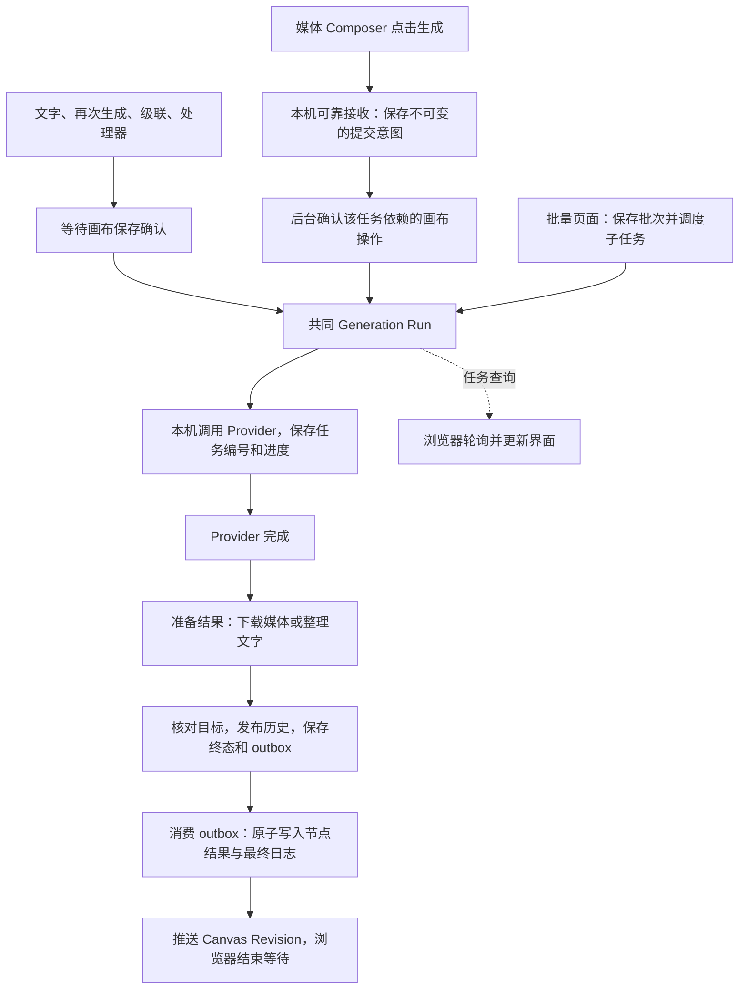

# 可选云端记录与 OneDrive 媒体：轮换设备模式

- **Status**：In Progress — 本机试用已接入并完成真实迁移，第二台设备与另一网络验收待完成，不晋升为通用 Current 功能。
- **Feature ID**：F03，关联 F02 / F04 / F05 / F07 / F09。
- **Last verified**：2026-09-11（连续生成的本机接收、恢复与隔离页面；第二设备与另一网络仍待验收）。
- **Related ADR**：[ADR-0014](../adr/0014-optional-cloud-sqlite-authority.md)（Proposed，已实现试用接缝）。
- **GitHub Issue**：[Issue #70](https://github.com/lazyq666/reroll-ai-canvas/issues/70)，Review；剩余设备与网络验收继续跟踪。
- **规格修订**：2026-09-11 连续生成的本地接收与后台提交已实现（第 3.1 节）；本地自动化与隔离页面验收见本节末，真实云端、Provider 和第二设备联合验收仍待完成。
- **链路盘点**：2026-09-14 完成源码核对与故障注入，见第 7 节。第 7.10 节记录 2026-09-15 分支修复；本次不更新上述真实云端与第二设备验收结论。

## 1. 用户目标与边界

两台可信设备在不同网络中轮换使用同一 Workspace。画布、生成记录和批量任务放在唯一 Turso libSQL 数据库；图片、视频及原有非 SQLite 文件继续留在 OneDrive。默认本地模式不变，不支持两台独立服务同时编辑，也不提供离线写入后合并。

用户先暂停真实迁移，随后明确要求继续，并允许丢弃冲突的历史记录。迁移只将两条“画布已有成功结果、后来恢复产生失败”的旧任务投递标记为 discarded；原始三库和完整冲突详情在 OneDrive 外备份。没有放宽相同 Operation ID 的内容一致性校验，也没有证明这些旧任务就是原始节点缺失的原因。

媒体同步与云端事务独立。记录已提交不代表另一设备的媒体已下载；现有相对媒体引用保持原状，不因文件暂缺删除节点。共享 JSON 仍受 OneDrive 同步限制。

## 2. 已实现的保存与权限合同

`storage-authority.json` 将 Canvas、Generation Run、Batch Generation 三类记录一起选择为 `turso`。云端数据库包含三份 SQLite 的业务表及绑定控制表。启动验证 Workspace ID、schema 和绑定；不初始化空表、不重新上传旧本地数据库，也不回退为本地写入。

数据库令牌仅在每台设备自己的 `turso-connection.json` 中，属于 Device State，不进入 Workspace、浏览器响应或仓库。范围限定为一座数据库。Account、Session、Provider 密钥留在原有安装/设备边界，所有者 ID 与现有权限判断保持不变。试用未实现两台安装的私有账号映射；当前迁移来源都是 Shared Canvas，不以相同用户名自动合并账号。私有 Canvas 的跨安装身份映射仍是后续 Gate。

每个进程取得远程编辑资格，服务器时间决定到期，期限 120 秒、每 20 秒续期，本机采用更早的保守截止时间。每个业务写事务开始和提交前都在同一远程写锁内检查资格。失败或未知续期立即撤销已发出的连接资格，并暂停业务读写。若属于暂时的连接错误，且尚未到达本机截止时间，则每 2 秒尝试核对并续期同一 `owner`、`epoch`、绑定和未过期资格；确认提交后只为新连接发出资格，旧连接继续失效。不重新获取编辑资格，不自动重试未知业务提交。过期、被其他进程接管、绑定改变或身份验证失败时继续停用，需要通过启动器重启。相同设备可恢复自己的未完成任务；若有未完成 Run、outbox、publication 或批次，其他设备不能接管恢复。Provider 继续在本机执行。

暂时断线显示重连状态，不表示账号失去画布权限。画布列表读取失败时显示失败原因，不显示无项目空状态；暂时的 503 会重试读取，资格已失效时提示恢复网络后重启。实时通道的云端错误使用 `1013` 和 `cloud_storage_*` 原因码，服务内部错误使用 `1011`；客户端保留待确认操作，在新快照后按原 Operation ID 核对。

本机文件锁阻止同一目录启动两个进程；云端模式不依赖 OneDrive 复制的占用元数据判断跨设备所有权。退出应用释放远端资格。意外退出或释放未确认时，下一次启动保持启动中，在 125 秒窗口内每 2 秒重试获取资格；原资格过期后自动继续。每次尝试仍按云端时间和原子占用检查决定是否允许启动，不按设备身份强行接管。窗口结束仍被占用则停止，提示退出已打开的 Reroll、等待 2 分钟后重启，不断言另一台设备正在运行。网络错误或无效绑定直接停止，不重试业务写入。云端模式暂时禁用永久媒体清理，避免本地旧库漏判引用。

## 3. 设置与切换

“数据存储位置”中的云端设置仅管理员可见，默认整块隐藏；本机配置允许显示或当前工作区已启用云端时显示。入口配置见[存储说明](../current/storage-layout-and-migration.md#可选-turso-云端记录试用)。显示后提供“将画布记录保存到云端”开关、连接状态、OneDrive 轮换要求和关闭后的导出行为。开关、等待状态及错误支持即时中英切换。

入口显示不代表已完成迁移准备。已启用云端的工作区在断线时仍显示入口；切换失败保留当前状态，成功回到本地并重启后重新按本机配置判断。非管理员不显示管理选项，受影响的用户仍能看到画布保存失败和重连提示。

画布编辑沿用自动提交与服务器确认机制。设置中的“已连接云端记录库”仅表示连接与编辑资格可用，不汇总各页面的待保存修改。智能画布目前没有持续可见的“已保存到云端”状态或退出前统一检查，也不检查 OneDrive 是否完成；这些反馈仍待补齐。

| 状态 | 行为 |
| --- | --- |
| 普通本地模式 | 不配置 Turso，不改变当前保存方式 |
| 尚无已核验迁移副本 | 默认隐藏；本机配置显示后开关仍禁用，提示先配置并核验；本轮没有提供自动建库向导 |
| 已准备迁移 | 管理员在运行服务的本机启用；重新比较源文件 SHA-256，变化则停止 |
| 云端模式 | 开关开启；从云端读写三类记录，媒体继续当前目录 |
| 另一设备占用 / 网络失败 | 拒绝启动或持久写入，显示可翻译原因；不打开旧本地写入者 |
| 关闭 | 暂停新请求、实时变更和后台消费者，导出最新云端数据并核验，受控重启 |
| 云端退休后本地发布失败 | 保留导出日志，阻止旧进程写入；停服后使用恢复命令完成发布 |
| 再次启用 | 需要按最新本地内容重新准备并核验新的云端导入，不能直接复用旧导入 |

接口：仅管理员可访问的 `GET /api/workspace-storage-settings` 返回无秘密的 `cloud_records`，其中 `visible` 表示入口是否显示，`enabled` 表示是否已启用云端，两者独立；本机管理员使用 `POST /api/workspace-storage-settings/cloud`，请求 `{ "enabled": true/false }`。失败使用 `cloud_storage_*` 错误码。发生已发布切换但自动重启失败时，旧 HTTP/实时写入持续被阻止，要求通过统一启动器重启。

关闭时在单一云端事务中按主键分页导出并核对每张表摘要，然后退休云端绑定，最后发布本地三库与 manifest。每份导出都携带同一个 `cloud_return_epoch`；另一设备若只同步到 manifest 或部分数据库，启动会拒绝混合副本。旧数据库留作备份。恢复入口：`python scripts/storage/finish_cloud_return.py`，必须先停服，仅完成已导出且远端已退休的日志，不重新激活旧云端。

### 3.1 连续生成：本地接收，后台提交

开启云端模式后，获授权的 Designer 应能连续提交图片或视频生成任务。生成按钮只等待当前点击的输入校验和本地可靠接收；任务完成本地接收后立即恢复可点击状态，不等待云端保存确认、Provider 接收、上一任务生成完成或结果写回。本次接入媒体 Composer 主提交入口；默认本地模式、文字、处理器、再次生成和循环入口沿用原流程。发布与合并进度由 Issue #70 及关联 PR 跟踪；当前工作区服务尚未重启。

一次点击对应一份独立任务记录和结果占位。本地接收必须先可靠保存 Operation ID、Workspace / Canvas / 账号身份、独立目标节点、提示词、参考输入及模型参数快照，以及恢复所需的画布变更依赖；只有持久写入成功才显示已接收并释放本次提交锁。后续修改输入或再次点击不能覆盖已接收任务。同一次点击尚未接收时防止重复触发；接收后的下一次点击创建新的 Operation ID。

本地记录仅用于恢复尚未确认的提交意图，不是第二份可写的云端数据库，不表示 Canvas Mutation 或 Generation Run 已在云端成立，也不提供两台设备离线编辑后合并。记录应在当前设备隔离保存，不随 OneDrive 同步，不携带 Provider 密钥；实现使用 Device State 下的 `local-generation-submissions.sqlite3`，采用 SQLite 原子提交；每份命令上限 8 MiB，本机最多 128 份活跃命令、4 个后台执行槽位。浏览器保存原 Canvas Operation ID 以恢复占位，同设备后台在页面关闭后继续推进。云端仍是正式记录的唯一权威。

后台按每项任务的依赖推进：

1. 确认该任务所需的节点、连接及输入快照已保存，再向 Provider 提交。保留编辑资格、权限、目标状态和 Operation ID 检查，不能通过直接删除保存等待来实现本节。
2. 多项任务可以同时处于本地待提交状态。独立任务在现有 Provider 和服务容量限制内并发推进，不以单一全局队列等待前一任务完成；同一画布有先后依赖的变更仍按 Canvas Revision 顺序提交。
3. 等待范围限定为任务自身的必要依赖。后续无关编辑、其他任务的云端确认或结果投递不应持续延后已具备条件的任务；仍需遵守同一画布版本顺序。
4. 每项任务独立更新占位、进度和失败状态，结果按各自 Operation ID 与目标节点投递，允许完成顺序与点击顺序不同。

| 状态 | 任务反馈与可用操作 |
| --- | --- |
| 本地接收中 | 仅防止本次点击重复触发；本地保存失败则明确报告未接收，允许再次提交 |
| 已在本地接收、等待同步或提交 | 显示独立占位及等待状态；生成按钮恢复，可继续创建任务；不显示云端保存成功 |
| Provider 已接收 / 生成中 | 在对应任务显示进度，其他独立任务继续推进 |
| 临时断线或编辑资格待核对 | 保留已接收任务，暂停远端提交；恢复后先核对资格、权限和原操作结果。沿用现有离线新任务限制，不新增离线创作承诺 |
| 提交结果未知 | 显示待核对状态，以原 Operation ID 查询回执或恢复已有任务；未确认结果前不得盲目重发可能已执行的生成请求 |
| 明确失败、目标删除或权限撤销 | 在对应任务显示原因；只阻断有依赖的任务，共享资格失效等工作区级故障则暂停全部远端提交 |

恢复与重试沿用同一提交意图的 Operation ID 和参数快照，不把重试变成一次新的付费生成。只有用户明确创建新任务才分配新 Operation ID。恢复时校验当前 Workspace、账号、权限和目标，不能将旧队列提交到切换后的工作区，也不能复活已删除或被替换的目标。所有新增任务状态与错误反馈提供中英文并支持即时切换。

关闭服务、切换存储或轮换设备时，未提交的本地意图也计入待处理工作。正常退出应完成这些任务的提交与收尾，或要求用户明确放弃尚未远端提交的任务；结果未知的任务必须先核对。异常退出后在原设备恢复，不因本地记录未到云端而宣称另一设备可继续全部任务。切换存储或交接设备前必须清空待处理项；不能只检查云端 Generation Run 是否结束。

验收要求（均待实现后执行）：

- 使用可控制的云端确认等待，保持第一次提交未确认；本地接收后按钮可再次点击，第二次生成产生独立持久记录与占位。图片和视频入口都覆盖，并验证上一任务结果写回未完成时仍能接收新任务。
- 两次点击间修改提示词、参考图和模型参数，分别提交原始快照；刷新及进程重启后仍恢复两项任务，不丢失、不重复提交。
- 在容量允许时，独立任务 B 可以在 A 尚未完成期间进入 Provider；有依赖的任务必须等待必要保存确认，不能将未保存的目标交给 Provider。持续无关编辑不能使就绪任务无限等待。
- 注入本地持久化失败、云端断线、提交已成功但响应丢失、权限撤销、目标删除和工作区切换，验证状态准确、身份隔离、原 Operation ID 核对及无重复生成；单任务失败不锁住其他独立任务。
- 反向完成两项任务，验证结果各归其位；正常退出、异常恢复和设备轮换检查都包含本地待处理项。
- 在真实页面验证连续点击、键盘提交、等待及失败期间中英文切换；分别记录本地接收、按钮恢复、云端确认和 Provider 接收时点，不能用整段生成耗时替代按钮响应证据。真实网络延迟验收仍属于剩余 Gate。

本地实现与验证（2026-09-11）：

- 本机日志先落盘再返回回执；后台重放原 Canvas Operation ID，并在调用现有图片、视频等入口前重新检查账号、画布权限及目标。响应未知只按原 Run key 查询，查不到时继续保留待核对状态，不自动重发。账号已切换的旧页面不能把重试归入新账号。
- 云端 `cloud_local_submissions_device` 标记纳入启动与安全退出；即使尚无正式 Run，非正常退出后仍要求原设备恢复。进行中的本机磁盘写入计入任务数，取消和关闭等待该次写入结束。已接收/取消的记录压缩为回执摘要。
- `tests.test_local_generation_submissions`、`tests.test_local_generation_http` 覆盖并发、落盘失败、原编号重启恢复、丢失回执、权限撤销、账号隔离、取消竞态及存储切换。图片和视频接口均验证本机回执早于实际 Canvas 提交；模拟目标事务确认后才允许调用 Provider 接缝。
- 核心链路、Canvas 协作、云端消融、i18n 与知识地图的组合回归 189 项通过；在补充账号切换保护后，本机队列、HTTP、任务查询恢复与存储切换组合 42 项通过。Run Store、Lifecycle、运行时及前端相关组合此前 98 项通过，部分测试在组合间重叠，不按总和计数。
- `node tests/local_generation_browser_fixture.cjs` 提供独立真实页面与合成接口。人工验证云端 0 次确认时连续两次点击均释放按钮、两份提示词与目标不同、刷新后原编号和两处占位恢复，释放延迟后无重复节点；中文/英文动态等待文字及暗色视觉检查通过。刷新丢失原操作编号与节点状态缓存问题均有专项自动回归。
- 新文件不构成真实 Provider / Turso 网络或第二设备验收。发布与合并进度由 Issue #70 跟踪，当前工作区服务尚未重启；上述实机 Gate 保持开放，云端整体功能不晋升为通用 Current。

## 4. 迁移证据

2026-09-08 已完成当前工作区迁移：三份源库先在停写锁下备份，迁移副本处理两条已确认的历史冲突；Canvas 源库字节不变。准备合并库后上传 Turso 暂存目标，再从云端按主键分页读取全部业务行，逐表 SHA-256 与源副本比较。

全量核验通过：24 张业务表、354,582 条记录、7 张 Canvas、934 个 Node、727 条 Connection。核验后再次比较原始三库与 authority 的摘要，才启用远端权威。备份、隔离的冲突详情、验证报告及激活记录在本机 Device State 的 `cloud-migrations/`，没有进入仓库。正常启动不会再打开 OneDrive 中的三份旧 SQLite 作为活动记录。

下载整库导出的探索性尝试因网络 EOF 失败，未作为证据使用；最终按只读分页核验全部行成功，耗时约 32 分钟。媒体未上传数据库。数据导入的核验时间不代表日常编辑耗时。

## 5. 验证与剩余 Gate

- [传输与事务测试](../../tests/test_turso_sqlite.py)、[远端资格测试](../../tests/test_turso_workspace_lease.py)、[三类 Store 测试](../../tests/test_turso_stores.py)：值类型、分块失败回滚、未知提交、过期与继任者拒写。
- [迁移检查](../../tests/test_turso_migration.py)：历史失败隔离后保留成功 Canvas、不同所有者拒绝自动处理、活动任务/内嵌媒体阻断。
- [运行时测试](../../tests/test_turso_runtime.py)：设备轮换、续期失败、原设备恢复、配置不匹配，以及续期响应丢失后同一资格的恢复、旧连接持续失效和越界恢复拒绝。
- [往返与恢复](../../tests/test_turso_switch.py)：本地→云端新增→本地，来源漂移、云端摘要变化、中断重试及 OneDrive 混合同步拒绝。
- [HTTP 验证](../../tests/test_cloud_storage_http.py)：管理员权限、活动任务阻断、切换失败恢复以及发布后旧进程拒绝读写；原有运行时、清理、占用测试继续通过。
- 2026-09-09 入口显示规则验证：HTTP 测试覆盖默认隐藏、配置值、显示不自动启用、断线仍显示及非管理员拒绝访问；结合设置页与文档测试共 19 项通过。文档与相关 i18n 回归 24 项通过，`validate-i18n.js` 通过。隔离预览使用真实 Studio 设置页与模拟数据，人工验证隐藏、准备门槛、断线提示、英文显示、键盘切换失败后保留开启状态及 390 px 窄屏布局；未连接真实 Turso。
- [浏览器验证](../../tests/cloud_storage_browser_smoke.cjs)：真实 Studio 设置页，四组桌面/窄屏/明暗/中英文布局、键盘开关、等待和失败时切换语言。使用合成 API 响应，无真实迁移副作用。
- 当前真实工作区已通过统一启动器启动，运行状态为 `ready`；启动后复核 7 张画布、934 个节点、727 条连线及 0 条待投递 effect，原始三库 SHA-256 未变化。独立真实 Turso 测试库通过完整应用启动、三 Store 接线与安全关闭，约 24 秒。此前真实 Store 探针包含一次超时，单项重试通过；不能宣称所有网络故障路径已稳定验收。
- 本地相关套件 89 项通过，新增占用路径单独 10 项通过。后续修订以当前测试结果为准。

仍需另一台物理设备接入同一数据库及媒体延迟验收；两处实际网络的编辑性能、批量任务异常恢复和私有账号映射未完成。直接 SQL 的往返较多，不承诺本地 SQLite 的响应速度。Issue #70 保持开放，合并与发布以关联 PR 的固定提交验收为准；本地试用不表示通用发布已完成。

### 5.1 云端交互消融（2026-09-09）

本地实现完成，状态为 Review。逐步移除节点写入前的单独查询、重复的状态读取和逐条远端写入后，单节点移动的网络往返依次为 **17 → 16 → 15 → 10 次**。复用现有事务中的有序批量写入，保持操作回执、撤销历史、事件与 Canvas 内容一起提交或回滚；大批量仍按语句数和大小分块。

仅用于权限检查或读取标题、类型、修订号的接口改用 Canvas 元数据读取，仍在每次请求中检查当前可见性及删除状态。浏览位置 GET/PUT 与抠图状态读取交由现有 HTTP 工作线程执行，云端等待不再占用处理其他请求的事件循环。空的生成结果队列只读一次；发现候选结果后，仍取得写锁并重新读取，避免两个消费者领取同一结果。存在候选时因此增加一次预读。

下表使用同一组 25 个合成节点、无连线的画布，每次远端请求注入 100 ms 延迟。基线来自本次修改前的本地源码快照，每种操作各测量一次；包括实际 Store 与浏览位置接口函数，不包含真实网络、浏览器渲染、自动保存防抖或 Provider 执行。

| 操作 | 改前 → 改后往返 | 改前 → 改后耗时 |
| --- | --- | --- |
| 移动单节点并确认保存 | 17 → 10 | 1.80 → 1.07 秒 |
| 同时移动 25 个节点并确认保存 | 65 → 10 | 6.93 → 1.08 秒 |
| 修改提示词并确认保存 | 17 → 10 | 1.81 → 1.09 秒 |
| 恢复浏览位置 | 2 → 1 | 221 → 118 ms |
| 保存浏览位置 | 2 → 1 | 224 → 110 ms |
| 查询空的生成结果队列 | 5 → 1 | 531 → 111 ms |

浏览位置两项中的服务事件循环定时器延后，从约 211 / 214 ms 降至 0.4 / 2.0 ms；独立 HTTP 回归也确认，权限读取等待期间账号请求可以完成。完整画布读取仍为 2 次往返，列表仍为 1 次。真实数据库另做 5 次只读 `SELECT 1`，首次 369 ms，后续 92–95 ms；这只支持模拟延迟的量级，不代表真实编辑路径已完成性能验收。

生成前保存确认的负对照实验中，强制跳过确认后，尚未确认保存的目标节点到达模拟 Provider 提交入口，触发已有保护断言。因此保留调用 Provider 前的确认流程，也保留提交前后的编辑资格校验、权限检查、操作回执及断线恢复边界。该实验不要求生成按钮在等待期间保持禁用；第 3.1 节新增的目标是将必要等待交给后台任务，并在本地可靠接收后恢复按钮。

复现与证据：

- [请求与耗时探针](../../scripts/performance/run_cloud_canvas_ablation.py)：`.venv/bin/python scripts/performance/run_cloud_canvas_ablation.py --delay-ms 100`；可用 `--source-root` 指定包含 `backend/` 的基线源码目录。
- [原始测量与源码指纹](2026-09-09-cloud-canvas-ablation.json)：逐步消融次数、相同条件的前后结果和测量限制。上述单次耗时不是 P95/P99 或性能承诺。
- [保存确认负对照](../../scripts/performance/ablate_generation_checkpoint.cjs)：`node scripts/performance/ablate_generation_checkpoint.cjs`；正常保护由 `node tests/smart_canvas_text_generation_sync_regression.cjs` 和 `node tests/smart_canvas_generation_focus_ack_regression.cjs` 验证，两项均通过。
- [云端消融回归](../../tests/test_cloud_canvas_ablation.py)：原实现的请求次数和并发进度断言失败；修复后 7 项通过，覆盖批量移动、权限撤销与删除、空队列、写入失败回滚、重复提交、资格撤销与领取竞争。
- Canvas Store、同步合同、实时变更、生成投递、Turso 事务及资格等相关回归 249 项通过；账号、生成运行时、文字恢复和 WebSocket 等补充验证 31 项通过。
- 文档与相关 i18n 回归 24 项通过，`validate-i18n.js` 的 3542 个键通过；Active 文档链接、测量源码指纹、UI 资源版本检查与 `git diff --check` 均通过。本轮没有修改界面文案或语言切换行为。

本轮未提交或推送，也未重启运行中的服务。后端修改需通过启动器重启后生效；重启前应结束当前生成与批量任务。第二设备、另一网络和媒体延迟 Gate 保持开放。

### 5.2 常用生成操作消融（2026-09-09）

在 5.1 的编辑优化之后，继续使用真实 Generation Run、生命周期保存、History 发布和 Canvas 投递组合测试一次单图生成。Provider、图片物化和 Turso 传输使用合成数据；每次数据库网络往返注入 100 ms 延迟。每阶段等待其排队的保存完成，各测量一次，不包含模型计算、图片下载、浏览器保存确认或渲染。

| 阶段 | 改前 → 改后往返 | 改前 → 改后耗时 |
| --- | --- | --- |
| 创建任务至远端任务编号完成保存 | 33 → 19 | 3.43 → 1.98 秒 |
| 查询正在执行的生成任务 | 13 → 1 | 1.35 → 0.106 秒 |
| 保存新的进度 | 11 → 6 | 1.15 → 0.63 秒 |
| 重复报告相同进度 | 11 → 0 | 1.14 秒 → 无数据库写入 |
| 完成并发布历史记录 | 64 → 48 | 6.66 → 4.89 秒 |
| 领取结果、写回画布并完成投递 | 37 → 30 | 3.87 → 3.13 秒 |

任务提交接口的响应约为 **207 → 106 ms**；首行还包含响应之后排队的任务状态保存，不能将其解释为「点击后等待这么久才开始调用模型」。运行中查询只读取目标节点与当前权限。目标检查移出服务事件循环后，提交、查询与完成阶段的定时器延后从约 198–201 ms 降至约 1 ms。

结果记录提交后会直接唤醒后台投递器，去掉等待下一轮云端 5 秒空闲检查的延迟；上表手动分阶段测量投递，因此没有把这段等待算进前后耗时。周期检查保留作为恢复与重试入口。已有执行者的任务查询不再重复保存，也不覆盖供应商排队状态；不同进度与关键生命周期状态仍然持久化。

画布主体读取仍为 2 次往返；Canvas 日志读取为 2 次、全局 History 读取为 1 次。当前进程中已加载的完成任务查询不读数据库；重启后首次查询可能需要加载 Run，不能将 0 次往返推广到所有查询。文字、视频和 Workflow 共享的生命周期合同有回归覆盖，上表时间只来自单图夹具。

证据和验收：

- [完整生成探针](../../scripts/performance/run_cloud_generation_ablation.py)：`.venv/bin/python scripts/performance/run_cloud_generation_ablation.py --delay-ms 100`，可用 `--source-root` 指定保留的基线源码目录。
- [原始测量、阶段消融与测试命令](2026-09-09-cloud-generation-ablation.json)：包含 11 个相关源码指纹及测量限制。
- [生成消融回归](../../tests/test_cloud_generation_ablation.py)：原实现出现 4 项往返预算失败，以及提交、查询、完成三个阶段的事件循环阻塞；修复后 8 项通过，另覆盖失败回滚、目标替换/删除/权限撤销，以及迟到的检查不能覆盖新完成状态。
- [自动投递测试](../../tests/test_generation_sqlite_runtime.py)：将空闲检查间隔设为 60 秒，要求结果提交后 0.5 秒内开始投递；原实现超时，修复后通过。完整 GenerationRuns → SQLite lifecycle → Canvas 自动投递也通过，关闭继续等待投递与收尾结束。
- 相关后端回归 343 项通过；后续追加的完整自动投递集成用例 1 项通过。持久行为同步到 [Generation Pipeline](../current/generation-pipeline.md#5-后端generation-run-生命周期)。
- 文档与相关 i18n 回归 24 项通过；3542 个 i18n 键、Current/Active 文档链接、测量源码指纹、UI 资源版本和 `git diff --check` 均通过。本次没有更改界面文案或布局。

本地实现处于 Review。未提交、推送或重启运行服务；实测模型耗时、两处真实网络与第二设备 Gate 保持开放，模拟结果不构成实际生成耗时承诺。

## 6. 运行说明与追踪

持久配置、凭据边界和停服恢复见[存储布局](../current/storage-layout-and-migration.md)。供应商免费档事实与官方来源见[调研](../archive/2026-09-07-hybrid-cloud-backend-free-tier-research.md)；额度以账户实际计划为准，本次没有开启超额计费。

第二台必须先部署支持本模式的代码，单独配置同一数据库的凭据，等待 OneDrive 同步到云端 authority 后再启动；不导入它的旧 SQLite，不复制整个 auth.db。每次换设备前结束生成/批量任务并退出 Reroll，再等待 OneDrive 文件同步。

## 7. Turso 生成链路盘点与可靠性验收

第 7.1–7.9 节保留 2026-09-14 的盘点基线；后续修复状态以第 7.10 节为准。盘点时状态为 **待修复、待联合验收**。源码基线为 `08bb8abfc23040eefe636f72761b0e42927c8bc9`，版本 `2026.09.14.1`。本次仅核对链路、运行隔离测试和记录偏差，没有修改运行代码或用户数据。

主要结论：生成执行已经汇入共同的 Generation Run（后台任务记录），但入口接收、保存确认和界面恢复尚未统一。开启 Turso 后，原本的本机数据库访问变成远程请求；这些请求出错时，部分分支会丢失完成记录、误判任务失效或停止刷新。媒体 Composer 的本机可靠接收解决了提交前等待的一部分问题，尚未覆盖结果回写的全部失败边界。

以下使用三种证据等级：**隔离复现**表示调用真实产品函数、替换网络或保存依赖后观察到了缺陷；**源码确认**表示分支存在但没有完成真实环境复现；**现场观察**表示此次排查已读到的状态，不能单独证明因果关系。隔离测试不调用付费 Provider，也不能代替真实 Turso 断网验收。

### 7.1 开关改变了什么

| 对象 | 开启 Turso 后的位置与责任 | 对生成的影响 |
| --- | --- | --- |
| Canvas、节点和画布版本 | Turso 中的 Canvas 表，由 Canvas Sync 管理 | 提交前的目标确认、输入保存和最后的结果写回都依赖远程读写 |
| Generation Run、全局生成历史、发布回执、outbox | Turso 中的生成记录表；outbox 是“等待写回画布的交付记录” | Provider 完成后还要保存阶段、准备结果、发布历史和交付画布 |
| Generation Batch、批次任务与 Run 关联 | Turso 中的批量任务表 | 批次调度、并发槽释放及详情查询也依赖远程读写 |
| 媒体 Composer 的本机提交意图 | Device State 中的 `local-generation-submissions.sqlite3` | 在正式云端 Run 创建前保留操作身份、参数和依赖；只有接入该入口的任务享有这一保护 |
| 图片、视频等媒体文件 | 原 Workspace 媒体目录及 OneDrive | 下载到本机与云端记录成功是两件事；另一设备还需要媒体同步完成 |
| Provider 执行、密钥、账号会话 | 原本机服务及安装/设备边界 | 开关没有把生成程序移到 Turso，也没有建立多台服务并发执行模式 |

数据权威与设备限制沿用第 2 节及 [ADR-0014](../adr/0014-optional-cloud-sqlite-authority.md)。实现依据：[Turso Store 适配](../../backend/infinite_canvas/turso_stores.py)、[生成存储运行时](../../backend/infinite_canvas/generation_sqlite_runtime.py)、[本机提交记录](../../backend/infinite_canvas/local_generation_submissions.py)。云端连接失败不会自动改写旧本地三库。

### 7.2 从点击到节点完成



图中主线表示有 Smart Canvas 目标的生成。Classic Canvas 的同步响应入口、无画布目标的批量任务不会经过相同的 Canvas 交付段；各入口见下一节。

需要分别判断以下五个时点，不能把它们合称为“生成完成”：

| 时点 | 当前可确认的事实 | 尚不能推出的结论 |
| --- | --- | --- |
| 本机接收成功 | 该点击的提交意图已写入本机日志 | 云端已建立 Run、Provider 已收到请求 |
| 返回 `task_id` | 后台已有任务身份；普通 `start()` 先创建内存任务、安排保存和执行 | 每个入口都已等待该身份写入 Turso |
| `provider_completed` | 供应商返回结果，后台记录其输出 | 媒体已全部准备好、画布已更新 |
| `output_prepared` | 后台已准备可交付结果 | 历史发布、终态和画布交付已经完成 |
| 内存 `succeeded` / `finished` | 完成编排已走到终态，安排保存终态及交付意图 | Turso 终态事务已确认、outbox 已消费、浏览器已收到新版本 |

依据：[Run 创建](../../backend/infinite_canvas/generation_runs.py#L1543)、[阶段推进](../../backend/infinite_canvas/generation_runs.py#L2246)、[终态安排保存](../../backend/infinite_canvas/generation_runs.py#L2471)、[异步保存](../../backend/infinite_canvas/generation_runs.py#L1477)。本机提交后台额外调用 `wait_for_lifecycle_projection(through_current=True)`，等待当时截取的保存队列尾部；它不是等待全部 Provider 生成结束，且仍受此前保存失败的全局错误状态影响，见 G1。[实现](../../backend/main.py#L11644)

### 7.3 生成入口矩阵

“本机接收”专指第 3.1 节的持久提交日志，和浏览器 `sessionStorage` 排队不同。下表中的等待时间是客户端门槛，不是 Turso 的服务保证。

| 入口 | 后台与提交方式 | 本机接收 | 同步、查询与刷新恢复 |
| --- | --- | --- | --- |
| Smart Canvas 媒体 Composer：API 图片、视频、RunningHub 模型 | `/api/canvas-image-tasks`、`/api/canvas-video-tasks`，后台 Run | 有；云端接收服务启用且传入 `onLocalAccepted` | 固定该任务所需画布操作，先接收再后台同步；查本机回执后转 task 查询，刷新时对账本机记录与 active Runs |
| Smart Canvas 再次生成、非 Composer 图片/视频调用 | 同上 | 无 | 保存并等待确认，通常最长 30 秒；部分失败转浏览器本地排队；已有 Run 复用统一恢复 |
| Prompt Generation Node 文字 | `/api/canvas-llm-tasks`，后台 TextRun | 无 | 先等待画布同步 30 秒；超时发生在 POST 之前；拿到 task 后统一查询，未知响应尝试 active Runs 对账 |
| ComfyUI | `/api/canvas-comfy-tasks`，后台 WorkflowRun | 云端本机接收服务启用时，Composer 有；其他调用无 | 仍使用专用前端查询器；临时查询错误处理与普通图片不同 |
| RunningHub 直接应用/工作流 | `/api/runninghub/submit`、`workflow-submit`，共同 WorkflowRun 的 Inline 入口 | 随 Composer 上下文 | 返回远端编号后使用专用查询；HTTP/业务错误直接退出该次前端等待。后端查询会寻找关联 Run 并恢复，不等于没有后台恢复 |
| ModelScope 专用生成 | `/api/ms/generate`、`/api/angle/generate`、`/generate`，共同 WorkflowRun 的 Inline 入口 | 随 Composer 上下文 | 每张可有独立 `request_index`，前端组合结果；不同于普通 API 的一次多输出 Run |
| Smart Cascade、画布 Batch Run Node、循环 | 浏览器编排，各子请求进入共同 Run | 无 | 已提交子任务可恢复；剩余级联图的执行状态是浏览器内存，刷新恢复子任务不等于自动继续整条流程 |
| 智能分层 | `/api/canvas-layer-decomposition-tasks`，专用后台任务与交付 | 无 | 30 秒生成同步门槛，专用查询与恢复 |
| Image Studio 本地深度图 | `/api/smart-canvas/depth-map`，确定性图片处理 Run | 无 | 仍为 5 秒同步门槛，未传 `forGeneration`；与其他生成入口不一致 |
| 批量生成页面 `/online` | 先保存 Generation Batch，再以固定批次/序号 key 调共同 ImageRun | 无 | 后台云端调度周期 5 秒，页面详情 1.8 秒；任务与 Run 的关联另存于批次表 |
| Classic Canvas API 图片 | `/api/canvas-image-tasks`，Run 身份保存在 `output._pending` | 无 | 先提交后保存 task 锚点；刷新依赖保存成功的 `canvasTaskId`，没有 Smart Canvas 的同等操作依赖封存 |
| Classic Canvas 视频、文字/聊天 | `/api/canvas-video`、`/api/canvas-llm`，共同 Run 的 Inline 入口 | 无 | 前端等待请求响应，再保存结果；文字调用不携带 Smart Canvas 的 canvas/node/operation 目标身份 |

源码入口：[Composer](../../static/js/smart-canvas.js#L5809)、[生成提交与再次生成](../../static/js/smart-canvas/generation-run.js)、[Provider 分流](../../static/js/smart-canvas/generation-provider.js)、[本机接收条件](../../static/js/smart-canvas/local-generation-submissions.js#L169)、[文字](../../static/js/smart-canvas.js#L15670)、[级联](../../static/js/smart-canvas/generation-cascade.js)、[深度图](../../static/js/smart-canvas/smart-depth-map.js#L137)、[Classic Canvas](../../static/js/canvas.js#L9889)、[后台批次](../../backend/main.py#L11699)。RunningHub、ModelScope 和 Classic 同步接口也经过 [`_run_generation_inline`](../../backend/main.py#L7371)，不能因前端等待同步响应就判定其没有 Generation Run。`canvas.js` 中还存在 `runGeneratorLegacy → /api/online-image` 兼容函数；本次未证明当前 UI 仍可到达，不计为已核实的在用入口。

### 7.4 失败与恢复责任

| 失败发生位置 | 当前恢复行为 | 边界 |
| --- | --- | --- |
| 本机意图已接收，画布依赖尚未同步 | 本机 worker 保留记录，周期重试准备阶段 | 仅覆盖已接入本机日志的入口；同设备恢复 |
| 提交响应未知 | 保留原 Operation ID，查询已有 Run，不盲目重发 Provider | `submitting` / `uncertain` 期间不能按普通排队任务取消；回执待核对不等于没有开始生成 |
| Run 有远端编号 | 恢复同一任务，以查询为主 | 付费任务没有远端编号和可恢复结果时，不保证自动重提交；确定性本地处理有自己的安全重跑规则 |
| 已保存 `provider_completed` | 可从保存的供应商结果重新准备输出 | 依赖该阶段确实写入权威库 |
| 已保存 `output_prepared` | 可复用准备好的结果，继续发布/交付 | 不能把未持久化的内存结果当作重启后仍然存在 |
| outbox 已持久化，写画布失败 | 派送器把异常转为延迟重试；正常提交触发唤醒 | 这是“交付记录已经存在”后的重试，补不了 G1 中尚未写入的交付记录 |
| 租约暂时失效 | 撤销旧连接资格，在安全期限内核对同一 owner/epoch 并续约 | 恢复写权限不代表遗漏的业务写入已补齐；未知业务事务不能直接重放 |
| 浏览器刷新或实时通道重连 | 按画布/节点/Operation ID 对账任务，接收新的 Canvas Revision | 任务所有者可轮询，其他协作者主要依赖推送；一次 active Runs 查询失败没有独立持续对账保障 |
| 正常退出应用 | 排空本机提交、停止批量调度、暂停当前进程任务，等待已领取的交付结束 | 不等待所有远端生成和所有 outbox 清空；仍有未完成记录时由原设备恢复 |
| 切换存储模式 | 检查 Run、本机提交、outbox、publication、batch/task 是否排空，再迁移/导出 | 关闭 Turso 会导出最新云端记录，不是切回旧本地数据库 |

依据：[本机提交 worker](../../backend/infinite_canvas/local_generation_submissions.py)、[Run 恢复](../../backend/infinite_canvas/generation_runs.py)、[交付重试](../../backend/infinite_canvas/generation_effect_dispatcher.py#L357)、[租约和设备恢复](../../backend/infinite_canvas/turso_runtime.py)、[启动/停机顺序](../../backend/main.py#L386)、[切换排空检查](../../backend/infinite_canvas/turso_switch.py#L47)。新设备启动检查批次汇总状态，存储切换还检查子任务状态，两者覆盖范围不同；这属于验收核查项，尚未证明存在因此绕过保护的真实数据。

### 7.5 已隔离复现的五个缺陷

下列编号是本节内的发现编号，不是 GitHub Issue 编号。它们均未在本次盘点中修复，也不能全部归因到最初两个节点。多数属于共用异常分支，Turso 增加了远程读写失败这一触发条件。

| 编号 | 触发条件与观察结果 | 影响及源码 |
| --- | --- | --- |
| G1：终态保存失败后缺少补写 | Provider 和结果准备成功，只让带 effect 的终态保存抛一次异常。内存为 `succeeded`，最后成功保存的阶段仍为 `output_prepared`，无画布交付记录；重复等待保存队列没有发起第二次终态保存 | 当前进程可能已认为完成，但没有可消费的交付记录。保存错误仅写入 `_lifecycle_projection_error`，成功的后续保存不会清除它，后续接收回执等待也可能受影响。后续保存任务本身并非全部停止；重启能否补齐取决于先前已保存的恢复阶段。[保存队列](../../backend/infinite_canvas/generation_runs.py#L1477) |
| G2：临时读错被判成目标失效 | 首次目标校验成功，结果完成后再次读 Canvas 时抛 `cloud_storage_unavailable`。健康对照为 `succeeded`；注入后为 `discarded`，结果为空，尽管节点和 Operation ID 未改变 | `validate()` 把读取异常统一包装，`is_current()` 再将其统一转为 false。完成路径把“暂时无法判断”当作“已经失效”；任务查询也调用这一判断。[目标检查](../../backend/infinite_canvas/generation_runs.py#L4115)、[完成前判断](../../backend/infinite_canvas/generation_runs.py#L2424) |
| G3：文字失败清理被旧文档覆盖 | 文字同步未完成，Provider 提交次数为 0。持久化状态正常时节点结束等待并保留失败标记；注入 `status=error` 后，finally 的 `schedule()` 从 confirmedDocument + inFlight 重建文档，重新出现 `running=true`、`textGenerationPending=true` | 必须检查当前 `nodes` 中的节点，而非已经被替换掉的旧对象。普通 `cloud_storage_*` 断线实际走 `reconnecting`，故该复现不能直接证明此次现场命中了 `error` 分支。[文字收尾](../../static/js/smart-canvas.js#L15778)、[schedule 重建](../../static/js/smart-canvas/canvas-persistence.js#L1075) |
| G4：批次保存失败丢失已提交 Run 的关联 | Run 已返回编号，只让第一次 `_finish_task` 保存关联失败；异常分支第二次保存成功。健康对照为 `running + pending-1`；故障后为 `failed + 空 run_id`，`resume_pending()` 后仍无法恢复关联 | 提交与保存共用一个 catch，保存失败被当作生成失败；第二次保存未传 run_id，默认空值覆盖关联。后续刷新仅查询非空 run_id 的任务。后台 Run 可继续，批次已无法正常展示其进度。[调度](../../backend/infinite_canvas/batch_generation.py#L517)、[保存](../../backend/infinite_canvas/batch_generation.py#L821)、[刷新](../../backend/infinite_canvas/batch_generation.py#L896) |
| G5：批量详情一次查询失败后停止刷新 | 成功查询调用详情 renderer，并由其安排下一轮；失败查询只输出 console.error，不安排下一轮 | 界面会停在上次状态，后台不一定停止。重新打开详情会重新查询；历史列表有独立重试，不能替代详情轮询。[详情轮询](../../static/js/batch-generation.js#L1142) |

故障注入使用现有测试夹具及真实产品函数：G1/G2 使用 [`GenerationRunsLifecycleProjectionTests`](../../tests/test_generation_run_lifecycle.py) 的完成执行器和结果准备器；G2 保留真实 `CanvasGenerationTargetGuard`。G3 使用 [文字同步回归夹具](../../tests/smart_canvas_text_generation_sync_regression.cjs)，保留真实 `runPromptLLMNode` 和 `canvas-persistence.js`，只控制同步结果与持久化状态。G4 使用真实 `BatchGeneration`、临时 SQLite 和 [`PendingGenerationRuns`](../../tests/test_batch_generation.py)，仅注入一次关联保存失败。G5 执行真实 `openBatch`，替换 fetch 与 renderer；“下一轮由成功 renderer 安排”另由源码核实，未运行真实浏览器的完整计时周期。这些是本次临时诊断探针，尚未成为防回归测试。

### 7.6 源码确认、仍需验证的问题

| 项目 | 代码事实与可能影响 | 待补验证 |
| --- | --- | --- |
| 长任务轮询的暂时错误预算 | [统一恢复](../../static/js/smart-canvas/generation-recovery.js#L474) 每轮至少等待 2 秒，`index < 45` 使用总轮次而非连续失败次数。约 90 秒后首次遇到暂时查询错误也会退出当前等待 | 长视频或排队任务运行超过该窗口后，注入单次 503，验证继续追踪同一个 Run |
| 刷新后的孤儿文字等待 | [加载清理](../../static/js/smart-canvas/canvas-persistence.js#L1933) 只在 `pending || queued` 时清理忙状态，可能遗漏仅有 `running/textGenerationPending` 且没有 task 锚点的文字节点；[active Runs 查询](../../static/js/smart-canvas/generation-run.js#L187) 失败返回 null，加载调用没有独立周期重试 | 无 Run 的旧文字等待能否确定收尾；存在 Run 时单次读取失败能否再次对账 |
| 各入口同步门槛与临时错误处理不同 | 深度图 5 秒、常规生成 30 秒、本机接收及 ComfyUI/RunningHub 专用查询分别实现 | 同样的云端延迟和断网分别覆盖文字、再次生成、处理器、工作流、级联 |
| 批量调度同步远程 SQL | [批次调度](../../backend/infinite_canvas/batch_generation.py#L504) 在 async 函数中执行同步数据库调用；远程等待会占用服务事件循环。一次刷新写失败可中止当前调度轮次，但 [scheduler](../../backend/infinite_canvas/batch_generation.py#L577) 会在下一周期重试 | 慢 Turso 下批次刷新对画布响应、其他任务和租约心跳的延迟影响；尚无现场定量结论 |
| 批次终态映射 | [批次刷新](../../backend/infinite_canvas/batch_generation.py#L916) 收束 succeeded/failed/cancelled，未收束 discarded | 先验证无 Canvas target 的批量 ImageRun 是否实际可达 discarded，不能直接报告成已发生故障 |
| 持久化共享等待队列 | [生成存储运行时](../../backend/infinite_canvas/generation_sqlite_runtime.py#L24) 默认为一个 worker、最多 64 个待处理调用，生命周期、发布与交付共用；本机提交回执还等待截取的全局保存队列 | 多任务并发时，单次慢请求是否使无关任务的确认明显延后；先测分阶段等待，再决定事务合并或调度调整 |

Turso HTTP 默认连接超时 5 秒、读取超时 15 秒；[传输层](../../backend/infinite_canvas/turso_sqlite.py#L208) 不自动重放结果未知的业务事务。云端 outbox 空闲检查为 5 秒、循环失败等待为 10 秒，已有任务交付失败默认延迟 5 秒；保存成功会主动唤醒派送，不能把每次回写固定算成额外等待 5 秒。[运行参数](../../backend/main.py#L11484)、[派送参数](../../backend/infinite_canvas/generation_sqlite_runtime.py#L24)

本规格第 5.2 节已有注入 100 ms 数据库往返的消融测量，说明完成与交付阶段包含多次串行访问。该实验使用模拟传输，不能当作当前真实网络的耗时、百分位或本次卡住的直接原因。

### 7.7 与本次两个节点的关系

为避免将用户内容写入公开仓库，本节只保留节点 ID 后缀及状态证据，不记录提示词、媒体链接、数据库地址或凭据。

| 节点 | 此次排查已观察到的事实 | 仍未证明的部分 |
| --- | --- | --- |
| 图片节点 `…09c0` | Provider 已完成，本机存在下载结果；Turso Run 最后阶段为 `provider_completed`，没有 prepared output，也没有 outbox；画布仍保存等待状态 | 缺口位于供应商完成之后、持久结果准备/交付之前。G1 复现的最后持久阶段是 `output_prepared`，与现场不同；不能直接断言 G1 就是唯一根因，也不能仅凭文件存在认定结果准备全部成功 |
| 文字节点 `…22n8` | 画布保留 `running/textGenerationPending`；对应尝试日志为“画布同步未完成”，没有找到相应持久 Run；当前文字函数的同步超时发生在生成 POST 之前 | 该文字尝试应先按“未完成提交却遗留等待状态”排查。G3 与孤儿状态清理缺口提供了可验证方向，但缺少当时浏览器持久化状态，尚未证明具体触发分支 |

因此不能用同一个“供应商已完成、前端未收到结果”概括这两个节点：图片有完成证据；文字有提交前同步失败证据。后续现场诊断应关联同一 Operation ID 的接收回执、Run 持久阶段、发布记录、outbox 和 Canvas Revision，定位最后一个确认成功的边界。

### 7.8 整改顺序与验收条件

以下是待评审目标，不是本次已实现行为。优先修复状态和结果丢失，再统一交互入口，最后依据测量优化网络往返。

| 顺序 | 工作范围 | 完成条件 |
| --- | --- | --- |
| 1 | G1/G2：可靠保存终态，区分目标失效与暂时无法读取 | 对已执行的同一 Run 补齐保存/交付，不再次调用付费生成；一次未知提交先查回执；单次 Canvas 读取异常不产生 discarded；恢复后节点结果与最终日志各交付一次 |
| 2 | G3/G4/G5：清理文字等待，保留批次 Run 关联，持续详情刷新 | 同步超时且未提交的文字显示失败并保留输入；断线、重连、刷新不复活旧等待；批次保存失败后能找回原 Run；单次详情 503 不停止追踪 |
| 3 | 统一同步、查询和刷新恢复边界 | 明确哪些入口使用可靠接收；长任务查询按暂时错误预算恢复；active Runs 查询失败后再对账；专用 Provider 路径保留必要差异但统一用户可理解的状态 |
| 4 | 分阶段测量及真实联合验收 | 覆盖慢网/断网、原设备重启、两设备轮换与媒体暂缺；分别测本机接收、云端身份确认、Provider 执行、结果保存和画布交付，确认无重复生成、无结果丢失，再评审推广 |

交互验收应至少区分“已接收，等待同步”“已提交，等待生成”“生成完成，等待保存/回写”“暂时无法确认，正在恢复”“明确失败”。具体文案仍需产品评审和中英 i18n；本次不向 UI 添加新状态文案。

与当前承诺的偏差： [Generation Pipeline](../current/generation-pipeline.md) 将 `succeeded` 描述为完成允许的写回/发布，但 SQLite/Turso 代码先安排异步终态保存，再消费 outbox；该状态不能独立证明 Canvas 已交付。G1/G2 进一步暴露失败时的收束缺口。F09 在 [项目地图](../PROJECT-MAP.md#功能规格注册表) 标记为 `drift`，范围限定为此处列明的持久化确认、交付和恢复语义，不能把“永久等待”改写成正常产品合同。默认本地存储的权威选择不变；Turso 仍为 Issue #70 跟踪的试用功能。

### 7.9 本次验证与覆盖缺口

使用项目 `.venv/bin/python`（Python 3.12），以下两组通过，重叠项目不重复计数。合计 104 个不同的 Python 测试，以及两项 JavaScript 回归脚本。测试使用临时库、模拟传输或固定执行器，未进行新的真实 Provider 生成和真实 Turso 故障注入。

```sh
.venv/bin/python -m unittest tests.test_turso_sqlite tests.test_turso_stores tests.test_turso_runtime tests.test_local_generation_submissions tests.test_generation_run_lifecycle tests.test_generation_effect_dispatcher tests.test_generation_runs_sqlite_authority tests.test_canvas_text_generation_recovery
# 76 tests: OK

.venv/bin/python -m unittest tests.test_batch_generation tests.test_turso_runtime tests.test_turso_stores tests.test_turso_switch
# 49 tests: OK；其中 21 个与上一组重叠

node tests/smart_canvas_local_submission_restore_regression.cjs
node tests/smart_canvas_text_generation_sync_regression.cjs
# 两项通过
```

系统 Python 3.9 曾在部分夹具构造中报告事件循环及快照错误；以项目 Python 3.12 重跑相关批次、runtime、store、switch 测试后全部通过，不将该环境差异归因于产品故障。

文档知识地图测试 `tests.test_documentation_knowledge_map` 的 7 项检查通过；本次变更的相对链接、源码行号范围及 `git diff --check` 检查通过。

现有测试通过不表示 G1–G5 已受防回归保护。例如已有 lifecycle 保存失败测试验证 JSON 兼容权威仍保留记录，并不验证 Turso 作为唯一权威时终态保存失败后的补写；已有文字超时测试检查旧节点引用，未覆盖整份文档被替换后的实际节点。后续修复应把第 7.5 节的故障注入变成相应模块的回归测试，并加入真实页面的断线/刷新验收。Issue #70 本次读取仍为 OPEN，其正文标记 Review；本次未修改 Issue 或关闭任何验收 Gate。


### 7.10 2026-09-15 分支修复与验证

状态：**已实现定向修复，真实云端断网与第二设备联合验收待完成**。分支 `codex/turso` 基于上述本地 `main` 基线，不改变存储开关、数据库 schema 或媒体路径。第 7.5 节 G1–G5 是修复前证据，不能再据其推断分支仍有相同实现。

| 范围 | 分支行为 | 回归入口 |
| --- | --- | --- |
| G1：生命周期保存 | Turso 暂时错误保留原快照，按 0.25 秒起、上限 5 秒间隔重试。先查回相同 Run 或终态 effect 的不可变回执；已提交则确认成功，未提交才补写。结果和 effect 在同一事务；已消费并压缩的回执也可确认。此处只恢复保存，不调用 Provider | `tests.test_turso_generation_reliability` 的提交前失败、提交后响应未知、唯一交付和下一次提交检查 |
| 提交与重启身份 | SQLite/Turso 唯一权威下，执行 Provider 前等待本次已排入的生命周期保存；同一 owner/key 在内存缺失时查询持久记录，重启后也复用已经完成的 Run | 同模块的 durable identity、completed Run restart 测试 |
| G2：目标读取 | 仅明确的删除、访问撤销或 operation 冲突返回失效；临时存储异常继续向上报告。准备好的结果保留为可恢复阶段，恢复不重新生成 | 同模块的目标读取及 prepared output 恢复测试 |
| G3：文字收尾 | 文字 finally 使用生成收尾保存；同步 error 状态下保留清理差异和浏览器本地记录，不用旧 inFlight 的 busy 状态覆盖。后续拒绝编辑也保留这份收尾差异；正常编辑仍执行原 error 回退 | `tests/smart_canvas_text_failure_settlement_regression.cjs`：当前节点、再次 schedule、保留输入及本地恢复 |
| G4：批次关联 | 生成提交失败与关联保存失败分开处理。已返回的 Run 回执留在当前进程，下一轮先补关联；取消前也先补关联。进程重启后依赖持久 Run 的固定 key 去重 | `tests.test_turso_generation_reliability` 及 `tests.test_batch_generation` |
| G5：详情刷新 | 已打开的批次详情遇到查询失败继续安排下一轮；离开该详情或切换批次后不再执行旧重试 | `tests/batch_generation_poll_recovery_regression.cjs`、`tests/turso_batch_detail_browser.cjs` |
| 长任务查询 | 暂时错误预算按连续失败次数计算，成功查询后归零；不再用任务总轮次判断是否可以恢复 | `tests/generation_long_poll_recovery_regression.cjs` |
| 停机 | 本机提交最多等待 30 秒排空，之后取消进程中的等待并保留原提交意图；生命周期运行时关闭会取消尚在重试的保存。正常联网时仍优先排空，断网时不会因无限保存重试卡住退出 | `tests.test_local_generation_submissions` 的 bounded drain；可靠性模块的 close retry 测试 |

租约恢复期间的 `cloud_storage_reconnecting`、旧连接的 `cloud_storage_lease_lost` 只允许重新尝试带资格校验的新连接，不允许绕过 fence。若资格永久丢失，仍需重启；离线关闭时，尚未确认的内存结果不能承诺已经保存，后续恢复以最后的持久阶段和本机提交意图为准。不可重试的 schema、身份、数据冲突等错误继续报错，不自动转成本地写入。

验证：一组涵盖生命周期、Turso Store/runtime/switch、SQLite authority、Run、批量 HTTP、Canvas persistence/recovery 的 218 项测试通过；随后补充的停机回归及相关 28 项测试通过。最终补充边界后的 98 项复核通过，命令如下：

```sh
.venv/bin/python -m unittest tests.test_turso_generation_reliability tests.test_local_generation_submissions tests.test_generation_run_lifecycle tests.test_generation_run_store tests.test_generation_sqlite_runtime tests.test_smart_canvas_canvas_persistence tests.test_smart_canvas_generation_recovery tests.test_documentation_knowledge_map tests.test_core_creation_i18n
# 98 tests: OK
```

新增浏览器脚本已纳入可靠性 Python 测试的子进程调用，完整页面脚本单独运行。

真实页面：以 `tests.batch_generation_browser_app` 的临时 Workspace 和固定数据运行 `tests/turso_batch_detail_browser.cjs`，验证第二次详情查询返回 503、第三次恢复完成，以及 English/中文动态状态切换，全部通过。未调用真实 Provider，未改用户原画布。已有 `batch_generation_ui_smoke.cjs` 在其旧 setup hierarchy 断言处失败，尚未到达本次详情恢复场景；本次不将该完整旧脚本称为通过，定向真实页面验收由上述新脚本完成。

文案未新增 i18n 键，`node static/js/i18n/validate-i18n.js` 验证 3617 个键通过。仍需验证第 7.6 节的孤儿文字状态与 active Runs 再对账、专用 Provider 入口差异、慢 SQL 对调度的影响，以及真实云端断网和设备轮换。此次不统一所有生成入口，不把这些待验收项标为完成；Issue #70 仍为 OPEN，本次没有发布、合并或修改公开 Issue。
