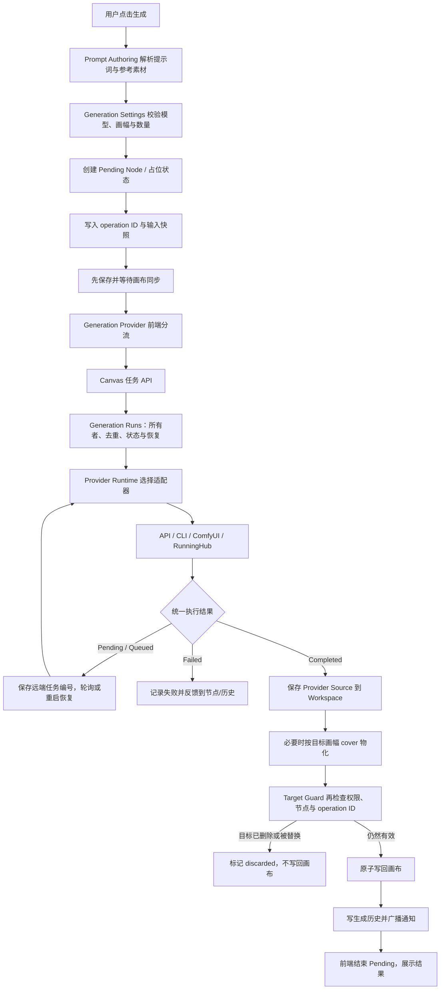

# 当前生成链路

> 状态：Current
>
> 最近核对：2026-09-04
>
> 范围：Smart Canvas 的图片、视频、文字、ComfyUI/RunningHub 工作流、批量生成与任务恢复

## 1. 这条链路解决什么问题

用户点击一次“生成”后，系统不只是调用一个模型接口。它还要确认输入、保存占位状态、
避免重复提交、跟踪远端任务、把结果保存进 Workspace、判断结果是否仍属于当前节点，最后
再更新画布和生成历史。

当前链路的核心原则是：

1. 一次用户提交对应一个可追踪的 **Generation Run（生成运行）**；一次多图提交也只有一个 Run。
2. 供应商差异收敛到 **Provider Adapter（供应商适配器）**，即把不同平台的“方言”翻译成统一结果。
3. 供应商返回的远程媒体必须先变成 Workspace 内的本地文件，画布才引用它。
4. 结果写回前必须再次检查用户权限、目标节点和本次 operation ID，迟到结果不能覆盖新运行。
5. Gemini/Antigravity CLI 用本次 `conversation_id + ImageName` 精确绑定结果，并使用独立临时目录，不从公共输出目录猜测“哪张图属于本任务”。

## 2. 一张图看懂主链路



## 3. 关键名词翻译

| 代码名 | 产品语言 | 作用 |
| --- | --- | --- |
| Generation Run | 生成运行 | 一次完整生命周期；可能包含多次子请求，不等于“一张图片” |
| Pending Node | 生成占位节点 | 用户等待时看到的骨架、计数和运行状态 |
| Provider Adapter | 供应商适配器 | 把 APIMART、Gemini、即梦、RunningHub 等不同返回格式翻译成统一格式 |
| Remote Checkpoint | 远端检查点 | 保存供应商任务编号，供轮询、断线或服务重启后继续查询 |
| Materialization | 结果物化 | 把远程 URL/Base64 下载或保存成 Workspace 内的真实文件，并兑现目标画幅 |
| Publication Receipt | 发布回执 | 记录全局 History 或通知是否已完成，重启时只重放未完成项 |
| Target Guard | 写回门卫 | 结果写回前再次核对权限、节点是否存在以及运行是否已被替换 |
| operation ID | 本次运行版本号 | 标记“节点当前认哪一次生成”；旧任务完成得再晚也不能覆盖新任务 |
| discarded | 已丢弃 | 生成可能完成了，但目标已删除或换成新运行，因此结果没有写回画布 |

## 4. 前端：从用户操作到任务提交

### 4.1 解析输入和设置

`runGeneration()` 是 Smart Canvas 的主要生成入口。它会：

1. 从当前节点、连接、Composer 和本地 TXT 快照中解析提示词与参考素材。Prompt 顺序固定为 Smart Group、上游 Prompt Node、本地 TXT、Composer 正文，各段以两个换行连接。
2. 对需要 Prompt 的运行做前置校验：空提示词时“运行”仍可点击，点击后提示“请输入提示词”；TXT 解码失败、单文件超过 1MB、合计超过 2MB，或引用媒体类型不被最终 Model Capability 支持时同样明确列出原因。校验失败不创建 Pending Node，也不提交 Provider 请求。
3. 通过 Generation Settings 生成不可变的运行快照，并冻结本次使用的 Model Operation、能力 Schema 版本和目录 Revision。
4. 根据同一 Model Capability Catalog 检查输入类型与数量、画幅、Resolution Tier、视频时长和输出数量；前端预检后，服务端在 Provider Adapter 前再次校验。
5. 按当前精确模型声明的输出上限创建一个或多个 Pending Node，并把本次总输出数量放进同一个 Generation Run；不使用跨模型固定数量，也不把超限输入或输出静默截断。
6. 如果浏览器离线或画布同步失败，把生成意图放回本地队列，不直接向供应商提交。

当前图片 Generation Run 的每个输出槽位对应一个独立 Pending Node，并在完成后成为一个独立 Generation Output Node；例如一次生成 4 张图片会向后端提交一个 `n=4` 的 Run，最终得到 4 个 Node，每个 Node 承载 1 张结果。Provider 若不支持一次返回多图，Generation Runs 可以在这个 Run 内拆成子请求并统一恢复，前端不会创建 4 个独立用户 Run。当前流程不会把这 4 张图片聚合为一个 Node 内的结果画廊；旧数据中的多结果画廊只作为迁移输入兼容，并在 Canvas 加载时拆分为独立 Node。

如果 Provider 实际返回的图片数多于提交时冻结的输出槽位数，前端也会在结果收尾时立即拆成独立 Generation Output Node，并为它们补上同一 Generation Batch 的身份与布局。每个拆分结果继承原节点的入向 Connection；已通过 `sourceOutputId` 指定某张结果的出向 Connection，则随对应结果迁移。旧结果画廊在加载迁移时遵循同一连接规则，避免刷新后只有保留在原节点的图片仍与上游相连。已经被旧迁移保存为独立节点、但只有一个节点保留上游连接的批次，会按同一运行快照和连续创建时间做一次受限修复；不满足唯一匹配条件时不猜测节点关系。

多个独立输出构成一个 Generation Batch。Canvas Settings 保存该 Canvas 的批次方向，默认横向；它不属于跨 Canvas 的个人“最近一次 Generation Settings”。创建 Pending Node 时，每个批次同时冻结 `generationBatchLayout` 与 `generationBatchSourceNodeId`：横向批次同批成行、同来源后续批次在下方起新行；纵向批次同批成列、后续批次在右侧起新列。两种方向的批次内部相邻间距均为 48 世界单位。恢复、Undo/Redo 和 stale Revision 并发重试从批次已持久化的方向与来源读取，不按当前 Canvas Settings 重推；没有该字段的旧批次按历史纵向语义兼容，旧 Canvas 坐标不迁移。完整空间合同见[节点自动避让](smart-canvas-node-auto-placement.md#47-generation-batch)。

Smart Canvas 用 Node 角色判断 Prompt Authoring 与 Generation Run 的基础资格。单选 Smart Group 或具有明确生成身份的 Generation Node 时 Composer 自动打开；这里包括生成中、生成失败和已完成的 Generation Output Node。普通 Image Node 不具备该资格，无论它是尚未上传的空媒体槽、图片、视频还是音频，也无论媒体来自上传、粘贴、拖入或导入。上传进行中和上传完成后的重绘可以保持当前 Selection，但不得因此打开 Composer 或启用 Generation Run。Frame、Text Annotation 等其他不支持角色、多选普通 Node 或清空 Selection 时 Composer 同样关闭。

Generation Node 尚未承载实际媒体结果时保留图片 / 视频模式切换能力：通过 Quick Add 选择“视频”只决定初始 Generation Settings，不锁定后续模式；用户切回图片时，空闲空节点同步更新自身的生成类型。只有已经承载视频或音频、且没有图片媒体的 Generation Node 固定为视频生成。Generation Output 在创建、批量拆分和结果收尾时都必须保存与输出模式一致的明确生成身份；旧 Canvas 中已有可靠 Generation Output 证据但缺失该身份的节点，在加载规范化时按 `outputKind` 等结果证据补齐。普通媒体 Node 即使保存过旧 Prompt 草稿或 Generation Settings，也不会仅凭这些兼容数据恢复 Composer 资格；数据不迁移、不删除。Composer 可见性、运行按钮的基础资格和 `runGeneration()` 最终门禁消费同一角色资格，其他参考输入、Model Capability、Provider、权限和同步校验继续叠加。

节点已有单次 Generation Run 正在运行或排队时，生成按钮仍保持可用；再次提交会创建新的并列 Pending Node，并复制原节点的入向输入关系，不覆盖正在执行的目标节点。Prompt Generation Node 同样允许在文字任务生成中修改指令、切换文字模型并再次点击“运行”；每次点击冻结当下的指令、模型和引用内容，创建独立的文字 Pending Node。源节点用并行任务计数维持运行状态，只有最后一项文字任务结束后才退出运行中状态。运行中的循环仍保持单实例，不能重复启动。

选中正在运行或排队的可生成节点时，节点悬浮菜单提供“创建副本”和“再次生成”。“再次生成”从 `generationInputSnapshot` 读取冻结的提示词、参考素材和 Generation Settings；Prompt Authoring 中之后发生的编辑不改变这份运行快照。

已完成的 Generation Output 把可展示和可复用的运行信息保存在输出 Node 上，而不是另建一份“生成信息弹窗记录”：`runPrompt` / `runModelPrompt` 保存展示与模型提示词，`runInputRefs` / `runPromptRefs` 和 `generationInputSnapshot.refs` 保存参考素材快照，`runSettings` 保存设置，`runAt`、`runStartedAt`、`runFinishedAt` 和 `runElapsedMs` 保存运行时间。打开 Canvas 时，这些字段随 Node 一起读取并经过旧数据规范化；用户触发“查看生成信息”时，前端直接读取内存中的 Node，不再单独请求 Generation History。弹窗展示生成时间、生成时长、引擎、模型、提示词、与当前 Generation Output 类型相关的设置摘要，以及输入图片；视频时长只为视频 Generation Output 展示。输入图片优先读取冻结的 `generationInputSnapshot.refs`，旧数据回退到 `runInputRefs` / `runPromptRefs`，并保留具有不同 `inputInstanceId` 的重复引用实例。

画布级“日志”面板读取的是独立持久化的 Generation History，不依赖 Canvas 公共快照中的 `logs` 字段。图片、视频和文本生成都通过 `POST /api/canvases/{canvas_id}/logs` 写最终记录；用户打开日志 Modal 时，前端才通过 `GET /api/canvases/{canvas_id}/logs` 按需读取最近 50 条完整日志，单条完整记录也可通过 `GET /api/canvases/{canvas_id}/logs/{log_id}` 读取。Modal 把每条记录映射为一个对应 Node 的任务，左侧按真实日期分组并以“任务状态 · Prompt 第一句”识别记录，右侧展示该任务的完整信息。右侧标题所需的 Node 自定义名称由 `nodeId` 在当前 Canvas 中解析，缺失时只用保存的 Prompt 第一句回退，不新增 AI 标题字段。Reference Input Instance 直接读取日志 `refs` 快照并支持预览，技术详情默认收起，安全诊断不复制 Prompt、素材内容、凭据或图片二进制。浏览器不判断 Workspace 的存储类型，也不把页面内刚产生的日志加入 Canvas Snapshot、Canvas Mutation、Revision 或撤销历史；实时对账因此不能清空日志。SQLite 权威 Workspace 将记录写入 `canvas_logs`、`generation_log_payloads` 和 `generation_log_outputs`，并按稳定 Generation Run ID 幂等对账。尚未完成受控切换的旧 Workspace 只在服务端通过同一接口使用临时 JSON 适配，供迁移前保留数据；旧 `logs` 仍是迁移输入和回滚导出内容，不是第二套浏览器合同。

输入媒体快照稳定保存 `url`、`name`、`media_id`、`assetLibraryEntryId`、`sourceNodeTitle`、`nodeId`、`imageIndex`、`outputId`、`inputInstanceId`、`kind` 和 `role`。其中资产库只提供不泄露来源 Project / Canvas / Node 的公开标识；原始像素尺寸、文件大小、上传时间与原始本地路径不属于这份运行快照，不能作为“查看生成信息”的稳定数据源。TXT 不作为 Provider 媒体引用发送，其不可变内容已经合并进 `generationInputSnapshot.prompt`。

“查看生成信息”的“填入提示词输入框”读取独立保存的 `runPrompt` / `runModelPrompt`，而不是读取包含时间、模型和设置摘要的展示文本；该动作只写入提示词文本，不修改输入图片或其他引用。它以点击时当前选中的可生成 Node 为目标；成功后更新该 Node 的 Prompt Authoring 草稿、安排 Canvas 持久化并关闭弹窗。弹窗记录的旧目标仅用于当前选择不支持 Prompt Authoring 时的兼容回退。

对应代码：

- [`static/js/smart-canvas/generation-run.js`](../../static/js/smart-canvas/generation-run.js)
- [`static/js/smart-canvas/prompt-authoring.js`](../../static/js/smart-canvas/prompt-authoring.js)
- [`static/js/smart-canvas/generation-settings.js`](../../static/js/smart-canvas/generation-settings.js)
- [`static/js/smart-canvas/generation-output.js`](../../static/js/smart-canvas/generation-output.js)

### 4.2 先同步“这次运行是谁”

提交供应商前，前端会给目标节点写入：

- `generationOperationId`：本次运行的唯一版本号；
- `generationInputSnapshot`：提示词、参考素材和设置快照；
- `generationBatchLayout` / `generationBatchSourceNodeId`：多输出批次实际采用的方向与来源身份；
- Pending、running、开始时间等表现状态。

这些状态会先保存到服务端，并等待实时协作同步完成。只有服务端已经知道“这个节点现在
认这次 operation”之后，才会真正提交生成请求。这样可避免供应商很快返回，而服务端还
不知道结果应该属于哪次运行。

### 4.3 当前前端分流

`generation-provider.js` 当前仍保留多种入口，尚未做到所有类型完全同路：

| 场景 | 当前提交方式 | 返回形态 |
| --- | --- | --- |
| 普通 API 图片，包括 APIMART、Gemini CLI、即梦等 | `POST /api/canvas-image-tasks` | 后台任务，前端按 task ID 轮询 |
| APIMart Seedream 5.0 Pro 智能分层 | `POST /api/canvas-layer-decomposition-tasks` | 一个付费 Generation Run；前端按同一 task ID 恢复，并交付底图、Manifest 与 1–16 个独立图层 |
| ComfyUI | `POST /api/canvas-comfy-tasks` | 后台任务，前端轮询 |
| API 视频 | `POST /api/canvas-video-tasks` | 后台任务，先返回 task ID；前端通过 `GET /api/canvas-video-tasks/{task_id}` 轮询 |
| Prompt/LLM 节点 | `POST /api/canvas-llm-tasks` | 后台任务，前端轮询 |
| Image Studio 本地深度图 | `POST /api/smart-canvas/depth-map` | 后台 Generation Run，前端按图片 task ID 轮询 |
| RunningHub 直接工作流 | 前端提交并轮询 RunningHub 路由 | 完成后由前端统一成 completed |
| ModelScope 专用前端模式 | 前端调用对应 ModelScope 路由 | 完成后由前端统一成 completed |
| 批量生成 | Batch Generation 服务调用 Generation Runs | 后台任务 |

API 视频提交只有在后台任务路由明确返回 HTTP 404（浏览器静态资源已更新、但本地后端尚未
重载该路由）时，才会用同一请求体回退到兼容入口 `POST /api/canvas-video`。鉴权失败、限流、
Provider 业务错误和其他 HTTP 错误不会触发回退，避免重复提交或重复计费。后端重载后，
所有新视频提交继续使用可跨刷新恢复的后台任务入口。

无论前端收到 `completed`、`pending` 还是 `queued`，都会交给
`generation-recovery.js` 和 `generation-output.js` 统一收尾。

### 4.4 智能分层的专用交付

Designer 在恰好一个 Image Node 上选择“智能分层”后，界面固定使用 APIMart 的
`seedream-5-0-pro + image.layer_decomposition` 能力。设置只包含可选拆分提示词和
`auto / 1K / 1.5K / 2K` Resolution Tier；默认 `2K`，不提供画幅、精确尺寸、4K、
普通图片质量、透明背景或拆层开关。

确认付费提示后，前端先创建 Pending Node 并保存 operation ID，再提交一个 Generation Run。
Provider Adapter 将冻结请求翻译成 `POST /v1/images/generations`：单张上游图片 URL、
`layer_decomposition: true`、`n: 1`、`output_format: png` 与选定档位；空提示词不发送。
本地图片先上传到 API 设置中保存的 APIMart 请求地址；仅当该地址是
`api.apimart.ai` 或 `apib.ai` 且发生 TLS/网络传输故障时，上传可以切换到另一个官方入口
重试。自定义兼容地址不得携带凭证自动切换域名，上游已经返回 HTTP 业务错误时也不得回退。
两个官方入口均无法连接时，Generation Run 记录可重试的连接中断，不得报告为参数错误。
刷新页面、浏览器轮询失败或服务重启后，只使用原 Generation Run 和已保存的上游 task ID
继续查询，不把“恢复”翻译成新的付费请求。

上游完成后，后端先验证并保存底图和全部图层到 Workspace Managed Media。每个图层必须是
实际像素尺寸与上游尺寸字段匹配、含 Alpha 且非全透明的 PNG；图层图片尺寸和它在底图中的
包围框是两个独立字段，不要求彼此相等。响应数组错位、重复媒体、非法坐标、重复或异常
`z_index`、超过 16 层，以及任一图层下载或校验失败，都不能发布成功。已经物化的材料保留，
恢复时继续查询同一 task ID 并重放未完成交付。

成功结果包含版本化 Layer Decomposition Manifest，并原位完成为一个 Layer Decomposition Node。
该 Node 自身拥有底图、透明图层、绝对坐标、`z_index` 与可见状态，不创建成员 Image Node，
也不是 Smart Group。画布上的合成预览作为一个整体响应点击，不把任一图层矩形作为独立点击
热区，透明区域不绘制缩略图底色。单选它不会打开 Composer；节点工具栏与右键菜单不提供
编组运行、添加成员、整理、解组、批量下载或宫格拼接。

双击 Layer Decomposition Node 会打开 Image Studio 的专用变体：顶部不显示图片编辑模式栏，
中间保持当前全部可见图层的合成效果，右侧图层面板按从上到下的视觉层级列出缩略图和名称。
每行在 Pointer Hover 或 Keyboard Focus 时显示预览与删除动作；预览动作切换该层显隐，删除
动作从该 Node 移除该层。两者随 Canvas Save、Reload、Undo/Redo 和 Realtime 协作保存。
底部只显示“下载 PSD”，在 [Issue #36](https://github.com/lazyq666/reroll-ai-canvas/issues/36)
完成前保持禁用，不提供伪下载。旧版本保存的专用分层 Smart Group 在打开画布时迁移为这一
单 Node 结构。Guest Account 和 Anonymous Share Visitor 没有提交入口，服务端也只允许
Administrator 或 Designer 创建与查询任务。

专用实现与验证入口：

- [`backend/infinite_canvas/layer_decomposition.py`](../../backend/infinite_canvas/layer_decomposition.py)
- [`static/js/smart-canvas/layer-decomposition.js`](../../static/js/smart-canvas/layer-decomposition.js)
- [`tests/test_layer_decomposition.py`](../../tests/test_layer_decomposition.py)
- [`tests/test_apimart_layer_decomposition.py`](../../tests/test_apimart_layer_decomposition.py)
- [`tests/test_layer_decomposition_publication.py`](../../tests/test_layer_decomposition_publication.py)
- [`tests/test_smart_canvas_layer_decomposition.py`](../../tests/test_smart_canvas_layer_decomposition.py)
- [`tests/issue_31_layer_decomposition_browser_smoke.cjs`](../../tests/issue_31_layer_decomposition_browser_smoke.cjs)

## 5. 后端：Generation Run 生命周期

Canvas 任务 API 会把请求转换为 `ImageRun`、`VideoRun`、`TextRun`、`WorkflowRun`
或 `RecoveryRun`，然后交给 `GenerationRuns.start()`。`ImageRun.count` 保存一次用户意图的总输出数；执行层可按 Provider 能力拆成多个子尝试，但这些尝试共享同一 Run 生命周期。

创建运行时会保存：

- `run_id`；
- 当前用户 `owner`；
- 请求内容的 SHA-256 指纹 `request_hash`；
- Canvas、Node、operation ID、输出总数和前端批次身份；
- Provider ID、公开诊断元数据和远端任务编号；
- 当前阶段、状态、结果或错误。

`owner + operation key` 是幂等边界：同一次 operation 因网络重试再次提交时，内容一致
则复用原任务；内容不一致则返回冲突，不会悄悄产生第二次计费请求。

运行记录由 Workspace 当前 storage authority 决定：JSON 兼容 Workspace 使用
`data/generation-runs.json`，SQLite authority 使用 `data/generation-runs.sqlite3`。SQLite 模式
不会把 legacy JSON 路径交给运行时。凭证字段在持久化前会脱敏，API Key、token、密码和
Authorization 不应进入可恢复记录。

核心代码：

- [`backend/infinite_canvas/generation_runs.py`](../../backend/infinite_canvas/generation_runs.py)
- [`backend/main.py`](../../backend/main.py)

## 6. Provider Runtime：选择真正的执行器

Provider Runtime 根据 Provider 配置、协议和模型能力选择适配器，调用方不需要知道平台的
具体请求格式。图片适配器当前优先级大致为：

1. ModelScope；
2. Codex CLI / GPT Image helper；
3. Gemini/Antigravity CLI；
4. 即梦 CLI；
5. RunningHub；
6. Gemini 原生 API；
7. 火山引擎；
8. 通用 HTTP 图片适配器，覆盖 OpenAI-compatible、异步 API 和 APIMART 等。

视频适配器包括即梦 CLI、RunningHub 和通用 HTTP；文字适配器包括 Codex CLI、
Gemini CLI 和通用 HTTP/流式 HTTP；ComfyUI 与专用工作流进入 Workflow Registry。

所有适配器最终返回四种统一结果之一：

| 结果 | 含义 | 下一步 |
| --- | --- | --- |
| `Completed` | 已得到可用输出 | 保存和物化 |
| `Pending` | 供应商已创建远端任务 | 保存 task ID，继续查询 |
| `Queued` | 仍在供应商队列，例如即梦排队 | 保存 queue ID，稍后恢复 |
| `Failed` | 已确定失败 | 记录错误并结束 |

图片的可选输出设置也在 Generation Run 中冻结并由适配器翻译。`transparent_png` 只有精确 Image Model Capability 明确支持时才允许进入执行层：APIMART `gpt-image-2-official` 转为 `background=transparent` 与 `output_format=png`；Codex `gpt-image-2` 的文生图或参考图编辑先以 `images generate/edit` 生成受控纯色底 PNG，再以 `transparent extract --method chroma --matte-color auto --profile generic --strict` 本地提取 Alpha 并执行质量门，不把 Codex 原生 `background=transparent` 当成稳定合同；OpenAI-compatible CLI 才使用 `images generate/edit --background transparent --format png`。后端在选择适配器前再次校验能力，未确认模型不能借由手写请求启用该参数。

核心代码：

- [`backend/infinite_canvas/providers/runtime.py`](../../backend/infinite_canvas/providers/runtime.py)
- [`backend/infinite_canvas/providers/cli_impl.py`](../../backend/infinite_canvas/providers/cli_impl.py)
- [`backend/infinite_canvas/providers/http_impl.py`](../../backend/infinite_canvas/providers/http_impl.py)
- [`backend/infinite_canvas/providers/comfyui_impl.py`](../../backend/infinite_canvas/providers/comfyui_impl.py)
- [`backend/infinite_canvas/providers/runninghub_impl.py`](../../backend/infinite_canvas/providers/runninghub_impl.py)

### 6.1 确定性的本地图片处理

本地图片处理不是新的 Provider 或独立任务领域。`LocalImageProcessorGenerationExecutor`
只接管 `publication=image-processor` 且处理器为
`depth-anything-v2-small` 的 `ImageRun`，其他请求继续委托给 Provider Runtime。它把
模型下载、校验、ONNX 推理和派生结果写入投射为同一 Generation Run 的进度；因此前端
仍使用既有 Pending Node、Recovery、Target Guard、Generation History 和失败反馈。

当前固定合同是 Depth Anything V2 Small FP32 ONNX：revision
`4472b7362082ad9968fee890ca0f1e5aca36b93d`，文件大小 `99,060,839` bytes，SHA-256
`afb6a5c28f3b6bf1618c6e43f02073ef9dfdc70e937502d51603e57b0a1df10c`，Apache-2.0。
首用时下载到 Device Cache，大小和摘要同时匹配后才原子发布；多个任务共享下载锁和
CPU ONNX Session。输出是来源尺寸的 8-bit PNG 相对深度图，每图 min-max 归一化，
近处白、远处黑，不表示真实米制距离。

本地确定性 Run 可以在没有远端 task ID 时从冻结请求重跑。服务重启后，模型已缓存则
重新推理；下载未完成则只清理本次未发布的临时文件后重下。结果先进入受控派生结果缓存，
再由 `publication=image-processor` 的 Effects 物化为 Workspace Managed Media；写回仍须
通过目标 Node、operation ID 和权限校验。模型、临时文件和 Device Cache 绝对路径不进入
Workspace 或公开任务响应。

核心代码：

- [`backend/infinite_canvas/local_image_processor.py`](../../backend/infinite_canvas/local_image_processor.py)
- [`backend/infinite_canvas/depth_processor.py`](../../backend/infinite_canvas/depth_processor.py)
- [`static/js/smart-canvas/smart-depth-map.js`](../../static/js/smart-canvas/smart-depth-map.js)

## 7. 图片结果：保存、画幅兑现和发布

图片成功后，`WorkspaceGenerationEffects.prepare()` 会先处理文件，再处理画布：

1. 从供应商响应中提取 URL、Base64 或文件结果。
2. 以 `run_id + 输出序号` 作为稳定标识保存到 Workspace `assets/output/`。
3. 记录 Provider Source Image，即供应商原始返回文件。
4. 如果声明了目标画幅，读取真实图片尺寸并按居中 `cover` 生成 Materialized Output。
5. 画布、下载和后续生成引用 Materialized Output；原始源图用于诊断和未来重处理。
6. 把 History 与通知交给当前 authority 的发布适配器。

这里的文件落盘与发布是两个独立职责。`WorkspaceGenerationEffects` 只负责把远程结果变成
Managed Media，再调用发布接口；SQLite 路径不会复用会写 JSON 的旧实现。JSON authority 的
兼容适配器继续维护 `generation-history.json` 与 `generation-effects.json`；SQLite authority
把 Global Generation History 和 History / Notification Publication Receipt 写入
`generation-runs.sqlite3`。History 写入与回执完成在同一个事务中，通知可以使用稳定 effect ID
领取、完成和重放，避免服务重启后重复通知。

跨 Canvas History 的读取合同是：`GET /api/history` 保留兼容列表，`GET /api/history/page`
提供稳定游标分页和媒体类型过滤，`GET /api/history/{history_id}` 读取单条，
`POST /api/history/delete` 按稳定 ID 删除。删除不改 Canvas 内的最终日志或 Generation Run
lifecycle；为保持旧合同，图片 History 删除仍清理其图片文件，但不会把级联范围扩大到视频、
文字或其他 Managed Media。

`cover` 表示保持原图比例、放大到覆盖目标矩形后裁掉溢出部分；不会拉伸，也不会补白。
更完整的模型能力与画幅规则见
[`smart-canvas-image-output-capabilities.md`](smart-canvas-image-output-capabilities.md)。

## 8. 画布写回：权限和迟到结果防护

结果写回不是“拿到 URL 就修改前端节点”。服务端的 Target Guard 会再次执行：

1. 用 Generation Run 的 `owner` 找到当前用户。
2. 确认用户仍对目标 Smart Canvas 有写权限。
3. 确认目标 Node 仍然存在。
4. 确认 Node 当前的 `generationOperationId` 仍等于本任务的 operation ID。
5. 在该 Canvas 的操作锁内合并多输出、减少 Pending 数量并递增 Canvas Revision。
6. 记录 `run_id + operation ID + request index`，保证重复回放不会重复写入。

如果节点被删除或已开始另一轮生成，运行进入 `discarded`。这不一定表示供应商生成失败，
只表示结果不再允许写回当前画布。

对应代码：

- [`backend/infinite_canvas/canvas_sync.py`](../../backend/infinite_canvas/canvas_sync.py)
- `CanvasGenerationTargetGuard`：[`backend/infinite_canvas/generation_runs.py`](../../backend/infinite_canvas/generation_runs.py)

## 9. Gemini/Antigravity CLI 的结果归属与独立输出目录

Gemini CLI 链路曾按“任务开始时间”扫描整个 `assets/output/`。如果其他用户或 APIMART、
即梦等任务恰好同时落盘，Gemini 任务可能把别人的新文件误认为自己的结果。

Antigravity CLI 的内置 `generate_image` 工具不会保证把图片直接写进应用指定的目录；它会把
结果物保存在 CLI 自己的会话目录。因此当前流程使用两个由本次调用产生的标识做“双重绑定”：

- `conversation_id`：Antigravity 为本次 CLI 会话返回的 UUID；
- `ImageName`：Reroll 在本次生成前创建的随机安全名称。

当前 Antigravity 流程是：

```text
创建随机 ImageName 和 /tmp/infinite_canvas_gemini_cli_<随机值>/
    → 明确要求调用内置 generate_image，并把参考图作为 ImagePaths 传入
    → 使用 stream-json 读取结构化事件
    → 从 init/result 取得本次 conversation_id 和真实工具错误
    → 只查看 ~/.gemini/antigravity-cli/brain/<conversation_id>/ 顶层
    → 文件名还必须匹配本次 ImageName
    → 把匹配结果复制进本次临时目录，保留 CLI 自己的会话原件
    → 校验确实是可读图片
    → 必要时执行尺寸/画幅处理
    → 用唯一文件名移动到 Workspace assets/output/
    → finally 删除本次临时目录
```

路径读取还有两层防护：`conversation_id` 必须是标准 UUID，解析后的会话路径必须仍在
Antigravity 的 `brain/` 根目录内。系统不会扫描整个 `brain/`，也不会相信 CLI 文字回复中的
任意文件路径。非 Antigravity 的 Gemini CLI 仍只允许把结果写进本次临时目录，并且只扫描该目录。

`stream-json` 也用于保留工具层错误。例如图片额度耗尽时，Antigravity 进程可能以退出码 0
结束，但结果事件实际是 `429 RESOURCE_EXHAUSTED / QUOTA_EXHAUSTED`。适配器会把它作为
HTTP 429 和“额度不足”返回，不再压成笼统的 502“无法生成图片文件”。

隔离单位是“每次生成”，不是“每个用户”。它同时解决不同用户、同一用户并发、多画布并发
和不同供应商并发的问题。临时目录在成功、失败和异常路径都会删除，只增加一次目录创建和
删除的文件系统操作，相比模型调用耗时可以忽略，也不会形成长期磁盘负担。

最终 `assets/output/` 仍然是 Workspace 级目录，不是每用户目录。目录名本身不是权限模型；
真正的归属由 Generation Run、Canvas 权限、operation ID 和画布中的结果引用共同决定。

## 10. 轮询、断线与重启恢复

前端对图片、视频、ComfyUI 和文字后台任务按 task ID 查询。视频提交先创建后台
Generation Run 并把 task ID 返回前端，不再让一个等待供应商的 inline HTTP 请求承担唯一恢复
锚点。服务端在收到远端 task ID 时会立即写入 Generation Run，因此浏览器刷新或服务受控
重启后可以继续恢复，而不是重新提交生成。

Smart Canvas 完整文档加载后还会读取
`GET /api/canvases/{canvas_id}/generation-runs/active`。若节点的本地 `pendingTasks` 曾因提交响应
中断或旧版本刷新而缺失，页面按 Canvas、Node 和 generation operation ID 把仍活跃的 Run
重新投影为 Pending Node；空结果节点只存在一个活跃 operation 时，也允许恢复被失败重提覆盖
的旧 operation。已有可展示结果的 Node 不做这种回退，避免把旧 Run 错认成当前生成。

恢复顺序为：

1. 已有 `output_prepared`：直接重放未完成的写回和发布效果；
2. 已有 `provider_completed`：不再调用供应商，继续本地物化；
3. 已有远端 task ID：只查询远端任务状态；
4. 没有远端编号也没有已保存输出：不能安全恢复，不自动重新计费提交。

SQLite authority 启动时还会领取未完成的 Publication Receipt：History 通过事务幂等发布，
Notification 以稳定 effect ID 发送并标记完成。已完成回执不会再次领取；没有 durable Run 或
无法重建输出的 pending 项不会由迁移工具静默导入。

前端只允许任务所有者主动轮询自己的 Pending/Queued 任务；其他协作者可以从活跃 Run 投影
看到等待状态，但仍只通过 Canvas Revision 和实时同步接收最终结果。

## 11. 状态表

| 状态 | 类型 | 说明 |
| --- | --- | --- |
| `queued` | 进行中 | 本地任务已建立，等待执行 |
| `running` | 进行中 | 正在调用供应商或处理结果 |
| `pending` / `processing` / `in_progress` | 进行中、可恢复 | 供应商已有远端任务编号 |
| `jimeng_pending` | 进行中、可恢复 | 即梦仍在队列中 |
| `succeeded` | 终态 | 结果已物化并完成允许的写回/发布 |
| `failed` | 终态 | 已确定失败 |
| `cancelled` | 终态 | 用户或受控重启取消 |
| `discarded` | 终态 | 目标节点已删除或运行已被替换，结果未写回 |

## 12. Workspace 中的持久化位置

| 路径 | 内容 |
| --- | --- |
| `assets/output/` | 图片、视频、音频、文字等最终生成文件与必要的源文件 |
| `data/canvas-content.sqlite3` | SQLite 权威 Canvas 内容，以及每张 Canvas 的最终 Generation Log |
| `data/generation-runs.sqlite3` | SQLite 权威 Generation Run lifecycle、跨 Canvas Global History 与 History / Notification Publication Receipt |
| `data/storage-authority.json` | 将 Canvas 与 Generation Run 一次性切换到 SQLite 的权威声明 |
| `data/generation-runs.json` | Generation Run 状态、去重键、远端编号和恢复阶段 |
| `data/generation-effects.json` | 历史与通知等副作用是否完成，防止重放时重复执行 |
| `data/generation-history.json` | 可展示的生成历史 |
| `data/canvases/` | Smart Canvas 节点、operation ID、Pending 状态和结果引用 |
| `data/batch-generation.sqlite3` | 批量生成计划和任务状态 |

其中三个 Generation JSON 路径只属于尚未完成受控 SQLite 切换的旧 Workspace。正式 SQLite
权威由 `storage-authority.json` 一次性声明，不能混合选择 Canvas 与 Generation Run 写入者；
发布后这三个文件精确归档，不再是运行时输入。Canvas 内最终日志、Global History、Run
lifecycle 和 Publication Receipt 各自只有一个权威。这些都是用户选择的 Workspace 内容。
账号、会话和设备配置不属于生成链路，边界说明见
[`storage-layout-and-migration.md`](storage-layout-and-migration.md)。

本地图片处理模型与可重新生成的中间结果不在上表：它们分别位于 Device Cache 的
`models/image-processors/` 和 `image-processor-results/`。最终深度图仍物化到 Workspace
Managed Media，删除 Device Cache 只会导致下次使用时重新下载或推理。

## 13. 当前边界与维护注意事项

- 当前协作和 Generation Runs 按单个 Uvicorn Worker 设计，不支持多 Worker 共同消费任务。
- 图片和文字主要使用后台任务；视频与部分专用工作流仍保留 inline 或前端轮询路径。
- RunningHub、ModelScope 和部分旧工作流入口还没有完全收敛到同一个 Canvas task API。
- Target Guard 在 Provider Output 已保存为本地文件后再判断是否写回；被替换任务可能留下未被画布引用的文件，当前没有自动垃圾回收。
- 不应重新引入“按时间扫描公共输出目录”或“从 CLI 文本中接受任意绝对图片路径”的逻辑。
- 新增供应商时，应优先新增 Provider Adapter，并返回 `Completed / Pending / Queued / Failed`，不要在 Canvas 页面复制一套供应商状态机。
- 涉及画幅时必须读取真实输出尺寸，不能只相信请求参数或供应商元数据。

## 14. 回归测试入口

| 关注点 | 测试入口 |
| --- | --- |
| Generation Run 生命周期、去重、恢复和迟到结果 | `tests/test_generation_runs.py` |
| Depth Anything 模型清单、下载校验、推理合同、本地执行器、HTTP Target Guard 与真实页面生命周期 | `tests/test_depth_processor.py`、`tests/test_local_image_processor.py`、`tests/test_issue_152_depth_map.py`、`tests/issue_152_depth_map_browser_smoke.cjs` |
| SQLite 图片/视频/文字 Run、重启、History 分页/删除与通知重放，且 legacy JSON 不变 | `tests/test_generation_runs_sqlite_authority.py`、`tests/test_main_sqlite_authority_integration.py` |
| 历史 Workspace 停服迁移、故障恢复、幂等、归档与回滚 | `tests/test_offline_sqlite_migration.py`、`tests/test_sqlite_migration.py` |
| Provider 选择和统一返回合同 | `tests/test_provider_registry.py`、`tests/test_provider_fake_matrix.py` |
| 远端检查点和查询恢复 | `tests/test_remote_generation_contracts.py`、`tests/test_generation_recovery_routes.py` |
| Gemini CLI 会话/图片名隔离、429 透传、独立目录、并发和清理 | `tests/test_antigravity_cli.py` |
| Smart Canvas 批量输出、方向快照与真实页面设置 | `tests/test_smart_canvas_generation_batch.py`、`tests/test_smart_canvas_node_placement.py`、`tests/issue_148_layout_browser_smoke.cjs` |
| 生成中节点再次提交与悬浮菜单（含 Prompt Generation Node 并行文字输出） | `tests/test_issue_115_inflight_generation.py`、`tests/issue_115_inflight_generation_browser_smoke.cjs`、`tests/issue_115_prompt_generation_inflight_browser_smoke.cjs` |
| Image Node 禁止触发、Smart Group / Generation Node（含旧 Generation Output 身份修复）的 Composer 资格与三层门禁一致性，以及 Quick Add 视频初始模式可切回图片 | `tests/test_issue_161_media_composer_eligibility.py`、`tests/issue_161_media_composer_browser_smoke.cjs`、`tests/test_smart_canvas_generation_output.py`、`tests/composer_quick_add_kind_toggle_browser_smoke.cjs` |
| 画幅能力与结果物化 | `tests/test_image_capabilities.py`、`tests/test_issue_71_generation_output.py` |
