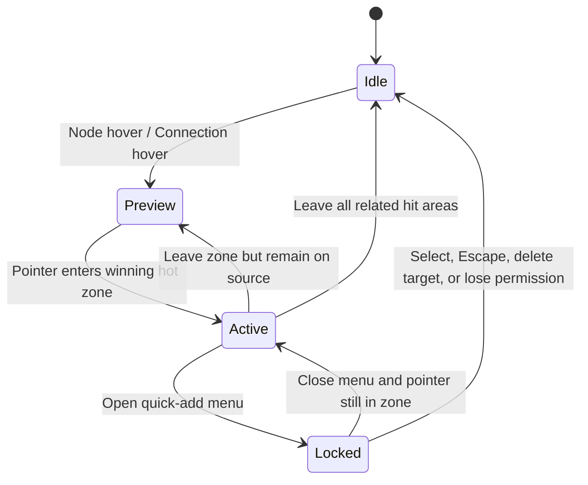

# Smart Canvas 连线、快速添加与 Frame 命中优先级

> Status: Current  
> Last verified: 2026-08-28

## 目标

当 Connection、快速添加热区、Node、Frame 和 Canvas 空白重叠时，用户看到的反馈与最终接收点击/拖动的对象必须一致，不能依赖 DOM 顺序或偶然的 `z-index`。

## 命中优先级

从高到低：

1. 已打开的 Dialog、Menu、Popover 与其遮罩；
2. 正在拖动的连接端点、连接目标和锁定中的快速添加菜单；
3. 当前激活的快速添加热区与按钮；
4. Node 的可交互控件、端口和 Node 本体；
5. 被命中的 Connection Stroke；
6. Frame 标题、边界与 Frame 本体；
7. Canvas 空白。

命中结果必须由统一仲裁逻辑决定；视觉 hover、光标、Tooltip 和点击处理使用同一个结果。

## 快速添加状态

- 热区只在它赢得仲裁时激活；重叠热区按距指针最近的有效锚点决定，相同距离使用稳定 DOM/Node ID 次序。
- 从 Connection 进入热区时，Connection hover 可以保留为来源提示，但快速添加按钮成为主反馈。
- 离开热区回到 Connection 时恢复 Connection 预览；离开关联范围后全部清除。
- Menu 打开后状态锁定，Pointer 离开不能让按钮或菜单突然消失；Escape、选择动作、目标删除或权限失效解除锁定。
- 拖线期间只允许合法目标端口和拖线快速添加接管命中，普通 hover 不得抢占。

## Connection 与 Frame

- 普通（`flow`）与输入（`input`）Connection 共用基础视觉：1.5 线宽、中性连线色、82% 不透明度；关系类型的数据语义保留，运行、选中等状态可覆盖基础表现。
- 从端口拖出的临时连线使用 `--ui-palette-blue-400`、2.5 线宽，保留现有流动虚线反馈。
- 生成中的连线使用蓝色完整实线，叠加 2.8 秒循环的宽幅流光。流光始终沿 `Connection.from` → `Connection.to`（父 → 子）运行，不随选中端或节点左右位置反转；普通 Pending 和级联 active 使用同一表现，wait 不播放流光。
- 选中 Node 后，其直接父子连线在非运行、非等待状态下复用 Connection hover 的焦点色和 2.5 线宽。多选取直接关联的并集，不递归追踪整条链路；取消选择恢复原样，不额外选中 Connection 或显示剪刀。生成结束时移除流光，再根据当前选择显示静态关联高亮。
- 系统或应用启用减少动态效果时隐藏流光，保留静态生成线；级联活跃连线或 Pending 节点数量超过 24 时同样停用流光，避免大量动画叠加。擦除标记优先于流光。
- Connection 的可见 Stroke 与命中 Stroke 可以不同宽，但用户点击视觉上明显远离线条的空白不能选中 Connection。
- 选中 Connection 后才显示剪刀/删除 affordance；触发后只删除该 Connection，不改变两端 Node。
- Connection 层的透明空白必须穿透，不能阻止 Node、Frame 或 Canvas 接收事件。
- Frame 内部空白属于 Frame；其上的 Node 和 Connection 按更高优先级接收命中。
- Frame 标题和边界可用于选择/拖动 Frame；不能因扩大命中区遮住邻近 Node 端口。
- 远景模式的 Frame 与 Smart Group 导航 Badge 属于对应容器 Node 的命中区域，而不是独立屏幕 Overlay；按下未选中的 Badge 必须先选中容器，再复用同一个 Node 移动手势，拖动期间 Badge 与容器不得出现逐帧位置差。

## 验收

- Light/Dark 下普通与输入连线的基础透明度一致；端口拖拽预览显示蓝色、2.5 线宽，取消拖拽后临时线消失。
- 父节点放在子节点右侧时，生成流光仍沿父 → 子运行；选择任一端、移动节点和局部刷新不反转方向。
- 连续滚动和缩放时，仍在视口中挂载的生成连线保留动画实例及播放进度，刷新不得让流光反复从头播放。
- 普通 Pending 与级联 active 显示流光，wait、done 和空闲状态不显示；停止或结束生成后不残留动画。
- 单选、多选、切换和取消选择正确更新直接关联高亮，样式与真实 hover 相同；关联高亮不显示剪刀，单独选中 Connection 仍可断开。
- Light/Dark、系统及应用减少动态效果、擦除和大量并发下，连线保持可见且可操作。
- hover 反馈、光标和最终动作始终指向同一个命中对象。
- 快速进出热区没有闪烁、残留按钮或错误菜单。
- 两个热区重叠时结果稳定，不随渲染顺序随机变化。
- Menu、Keyboard 和拖线锁定期间不会被普通 Canvas hover 打断。
- Connection 空白穿透，Frame、Node、端口和 Canvas 的操作保持可用。
- Zoom、Pan、虚拟化、远端 Mutation 与重渲染后规则不变。
- 详细模式不渲染 Frame 或 Smart Group 导航 Badge；远景模式的两类 Badge 均可在首次按下时直接拖动对应容器。

代表性测试：`tests/smart_canvas_connection_states_browser_smoke.cjs`、`tests/test_smart_canvas_canvas_interaction.py`、`tests/smart_canvas_hit_priority_browser_smoke.cjs`、`tests/test_issue_172_container_navigation_badge.py`、`tests/issue_172_container_navigation_badge_browser_smoke.cjs`。
