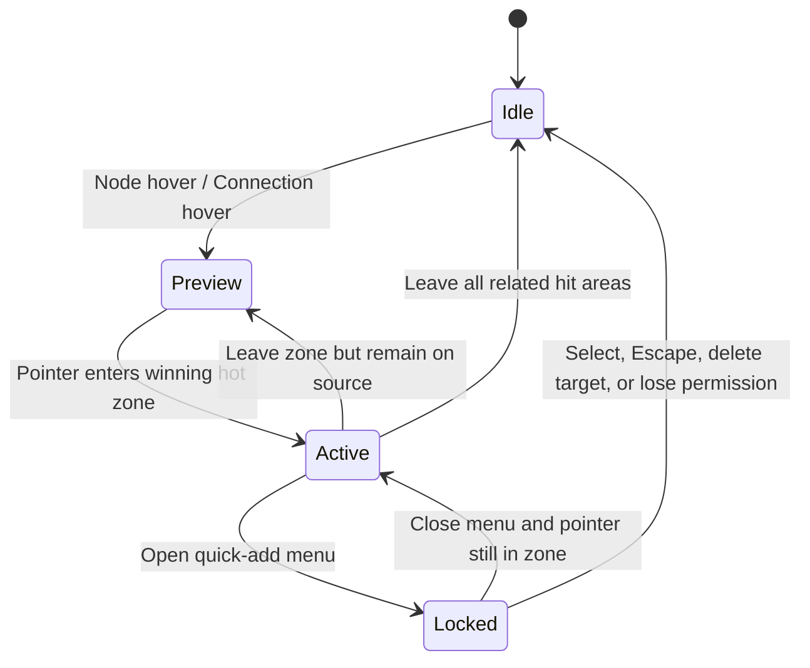

# Smart Canvas 连线、快速添加与 Frame 命中优先级

> Status: Current  
> Last verified: 2026-08-28

## 目标

当 Connection、快速添加热区、Node、Frame 和 Canvas 空白重叠时，用户看到的反馈与最终接收点击/拖动的对象必须一致，不能依赖 DOM 顺序或偶然的 `z-index`。

## 命中优先级

从高到低：

1. 已打开的 Dialog、Menu、Popover 与其遮罩；
2. 正在拖动的连接端点、连接目标和锁定中的快速添加菜单；
3. 当前激活的快速添加热区与按钮；
4. Node 的可交互控件、端口和 Node 本体；
5. 被命中的 Connection Stroke；
6. Frame 标题、边界与 Frame 本体；
7. Canvas 空白。

命中结果必须由统一仲裁逻辑决定；视觉 hover、光标、Tooltip 和点击处理使用同一个结果。

## 快速添加状态

- 热区只在它赢得仲裁时激活；重叠热区按距指针最近的有效锚点决定，相同距离使用稳定 DOM/Node ID 次序。
- 从 Connection 进入热区时，Connection hover 可以保留为来源提示，但快速添加按钮成为主反馈。
- 离开热区回到 Connection 时恢复 Connection 预览；离开关联范围后全部清除。
- Menu 打开后状态锁定，Pointer 离开不能让按钮或菜单突然消失；Escape、选择动作、目标删除或权限失效解除锁定。
- 拖线期间只允许合法目标端口和拖线快速添加接管命中，普通 hover 不得抢占。

## Connection 与 Frame

- Connection 的可见 Stroke 与命中 Stroke 可以不同宽，但用户点击视觉上明显远离线条的空白不能选中 Connection。
- 选中 Connection 后才显示剪刀/删除 affordance；触发后只删除该 Connection，不改变两端 Node。
- Connection 层的透明空白必须穿透，不能阻止 Node、Frame 或 Canvas 接收事件。
- Frame 内部空白属于 Frame；其上的 Node 和 Connection 按更高优先级接收命中。
- Frame 标题和边界可用于选择/拖动 Frame；不能因扩大命中区遮住邻近 Node 端口。
- 远景模式的 Frame 与 Smart Group 导航 Badge 属于对应容器 Node 的命中区域，而不是独立屏幕 Overlay；按下未选中的 Badge 必须先选中容器，再复用同一个 Node 移动手势，拖动期间 Badge 与容器不得出现逐帧位置差。

## 验收

- hover 反馈、光标和最终动作始终指向同一个命中对象。
- 快速进出热区没有闪烁、残留按钮或错误菜单。
- 两个热区重叠时结果稳定，不随渲染顺序随机变化。
- Menu、Keyboard 和拖线锁定期间不会被普通 Canvas hover 打断。
- Connection 空白穿透，Frame、Node、端口和 Canvas 的操作保持可用。
- Zoom、Pan、虚拟化、远端 Mutation 与重渲染后规则不变。
- 详细模式不渲染 Frame 或 Smart Group 导航 Badge；远景模式的两类 Badge 均可在首次按下时直接拖动对应容器。

代表性测试：`tests/test_smart_canvas_canvas_interaction.py`、`tests/smart_canvas_hit_priority_browser_smoke.cjs`、`tests/test_issue_172_container_navigation_badge.py`、`tests/issue_172_container_navigation_badge_browser_smoke.cjs`。
