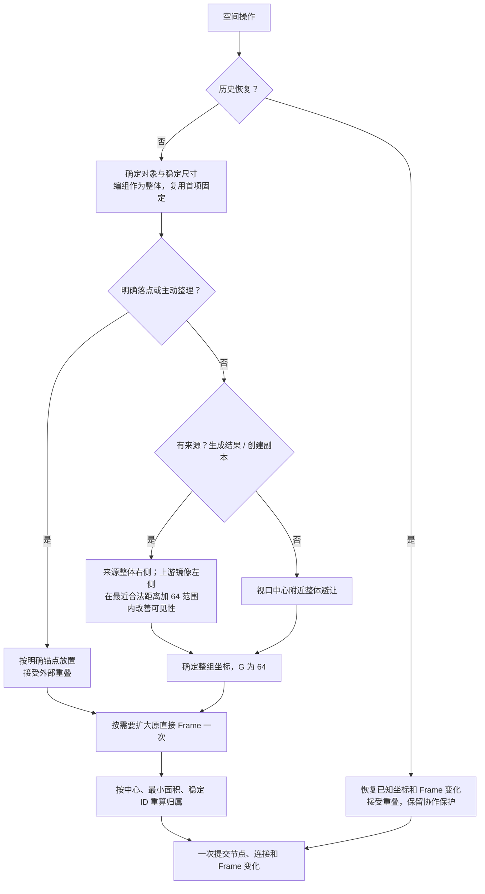

# Smart Canvas 节点定位与自动避让

- 状态：Current；本地实现已更新，产品体验复核与合并由 [Issue #40](https://github.com/lazyq666/reroll-ai-canvas/issues/40) 跟踪
- 最近验证：2026-09-05
- 范围：节点创建、生成结果、刚性集合、Frame 扩容及协作恢复
- 完整产品决定与验收：[统一空间布局 Spec](../active/2026-09-05-smart-canvas-unified-spatial-layout-spec.md)

## 1. 一次操作的规则

先识别真实位置意图，再规划整组位置。只有系统决定的初始位置执行避让；既有节点不会被新节点挤走。

## 2. 明确位置

位置由世界坐标与附件锚点共同定义。整体左上角等于世界点减去锚点在整体内的偏移。

| 入口 | 锚点与行为 |
| --- | --- |
| 输出 Quick Add 拖线 | 松手点是新节点左边缘中点 |
| 输入 Quick Add 拖线 | 松手点是新节点右边缘中点 |
| 菜单创建、外部素材拖入 | 世界落点是节点中心 |
| 明确位置粘贴、导入 | 刚性集合中心，保持内部相对位置及重叠 |
| 手动移动、Resize | 保持抓取偏移或手柄表达的几何 |
| 宫格、水平、垂直整理 | 保留原选区左上锚点，按 G 重排内部槽位 |
| Undo/Redo | 恢复历史已经确定的坐标 |

以上入口允许与外部节点重叠；明确落点不强制回到来源右侧，也不会被 Frame 拉回。命中已有合法端口或可追加素材目标时继续沿用连接、追加语义，不强制创建。

后续自动创建仍把这些功能节点的实际几何作为障碍。明确位置是本次操作意图，不是节点永久的空间属性。

## 3. 自动位置与唯一间距

没有明确点时，有来源则使用来源整体外框；没有来源才从操作发起时的视口中心寻找最近合法位置。按钮屏幕坐标、初始化占位坐标不视为用户指定落点。异步上传在上传前冻结视口上下文。

- 下游理想左上角：`来源右边缘 + G, 来源上边缘`；指定居中偏好时，初始 y 为 `来源上边缘 + (来源高度 − 新集合高度) / 2`。两者共用相同的候选搜索与视口评分。
- 上游理想左上角：`来源左边缘 − G − 整组宽度, 来源上边缘`。
- 多来源先去重，并把编组成员投影为外部编组整体。
- G 为 **4rem（64 世界单位）**。4rem 按画布 16px 基准换算为固定 64 世界单位，不随视口缩放或浏览器根字号变化。代码权威为 `static/js/smart-canvas/layout-constants.json`；后端直接读取，浏览器值由 `scripts/sync_smart_canvas_layout_constants.py` 生成并检查。
- 节点可见边缘的矩形间隔只计一次 G：每侧安全区各 G/2。横纵自动避让、同次结果内部、跨次结果外部、主动整理及共享基础的树状整理使用同一值。
- G 不属于 Canvas Settings、个人偏好或环境配置，不增加 UI。不重排旧画布或已经创建的 Pending Node。
- Frame 标题与容器留白、节点内部控件、编组缩略图和宫格识别容差不属于节点间距。

### 3.1 视口取舍

来源方向和不重叠为硬约束。先在确定性候选集合中求相对理想左上角的最短欧氏位移 dmin；只在 `d ≤ dmin + G` 内优先选择整组外框可见比例最大的位置。再比较位移、跨次对齐、来源对齐和稳定坐标。

候选来自理想位置、障碍外边界、视口边界、历史对齐，以及距离预算圆与这些坐标线的交点。有限障碍的外边界提供向外扩展的合法位置，没有固定次数后允许重叠的兜底。评分针对候选集合，不宣称求解整个连续平面的全局最优可见面积。

整组大于视口时允许超出，不缩小节点、不拆组。Pan/Zoom、异步完成和远端视口不会重排节点。本地直接创建的 reveal 继续由 Viewport 模块完成；远端及后台结果不移动相机。

## 4. 生成结果与刚性集合

### 4.1 同次多个结果

生成新增结果以执行节点的**实际输入父节点整体**为来源，无外部父节点才用执行节点自身。不会只取第一条输入或用旧批次锚点代替实际父节点。

Canvas 的方向设置默认横向，在创建时冻结：新增结果横向成行或纵向成列，内部间距 G，先排出完整形状再整体选位。历史字段 `generationBatch*` 表达这组输出的布局标识；不改变 CONTEXT 中 Generation Batch 的持久任务集合定义。

同来源下一次结果可以候选续行或续列，但父节点距离与视口优先；允许打破跨次起点对齐，旧结果不移动。

空生成节点首次多图复用为第一项时保留 ID 和原坐标，只安置新增结果。复用首项的稳定占地作为障碍，因此整个运行的全部结果可以不连续，新增集合内部仍保持完整。

### 4.2 复制、粘贴与导入

保持内部 Node 身份映射、Connection、相对坐标和已有重叠，只整体平移。Frame 与内容共同移动。编组整体对外计占地，内部成员的 Node Rest Geometry 随整体平移，不重复扩大外部搜索边界。

明确目标使用精确位置；没有有效指针点的粘贴或导入使用视口中心自动避让。创建副本（菜单或 Cmd/Ctrl+D）复用生成图片 / 视频的相对来源自动放置：来源为被复制的原节点，多选时使用整体外框；默认在右侧 G 处并以垂直居中为初始偏好。右侧拥挤时自动避让，在最近合法距离加 G 范围内改善视口可见性，因此最终位置不保证恰好 G 或中心对齐。复制保留内部相对位置；生成多结果继续使用横纵批次形状。原直接 Frame 按最终布局扩大一次，并发竞争复用相同的自动重试。已确认坐标的历史恢复仍精确执行。Connection 继承遵守[专用合同](smart-canvas-duplicate-connection-inheritance.md)。

## 5. Frame 与障碍

- 单来源继承操作开始时的直接 Frame；多来源仅在直接 Frame 相同时继承。共同祖先不代替直接归属。
- 明确落点选取命中的 Frame；手动移出 Frame 时原 Frame 不追随扩大。
- 先忽略旧 Frame 边界完成布局，再将原直接 Frame 与本次结果外框及既有内容留白取并集，只扩大一次。
- 不向祖先级联、不因新圈入节点再次扩容。子 Frame 可以超出祖先边框。
- 扩容后按节点中心重算空间归属：最小面积 Frame 优先，同面积按稳定字符 ID。Frame 的父 Frame 必须面积严格更大；编组成员不独立参与 Frame 投影。
- 新圈入节点可以成为成员，但其坐标不变。Frame 几何及成员变化与创建或整理共用一次事务及 Undo。
- 自动障碍包含普通功能节点和编组整体，忽略 Frame 本身、Connection、文本标注和画笔标注。

## 6. 失败、协作与恢复

无效几何、来源失效、身份或权限冲突取消或拒绝完整操作。新节点、新连接和 Frame 更新不能分批落盘。重叠本身不是明确创建的错误。

创建 Mutation 的 `node_creates` 可以提交 `{node, placement}`，其中 placement 包含 `mode: exact|auto`、G、集合身份及冻结的来源、视口、Frame 上下文。它随本地待同步操作保存，重载后不重新猜测模式；公共 Node 快照与广播只包含最终节点数据，不共享相机。

- 自动初始创建与较新节点冲突：服务端返回 `placement_conflict`，后提交的新集合基于最新障碍整体重算；复用首项不动。
- 明确创建接受几何重叠。若直接 Frame 已被并发更新，`frame_placement_conflict` 只要求刷新上下文；重试保持明确坐标，合并已扩大的 Frame 并重算成员。
- Undo/Redo 从服务端可信历史精确恢复，忽略旧的 `placement_overrides`，保留既有 lineage、身份、权限与保护他人修改的检查。
- WebSocket 连接携带 `layout_gap`；缺失或与当前常量不符关闭为 4410，提示刷新。创建元数据中的 G 不一致拒绝为 `layout_contract_mismatch`，防止新旧客户端混用旧布局规则。
- 已有 Pending、成功、失败、重试及刷新保留既定位置；缺失节点的补建沿用 [Generation Pipeline](generation-pipeline.md)，不把所有恢复降级为新建。

## 7. 责任与验证入口

Node Geometry 拥有数据几何、共同间距、线性偏移、Frame 并集与纯归属计算；Node Placement 拥有锚点换算及整体选位；Selection Arrangement 拥有视觉行列与树拓扑；Mutation 负责一次应用与 Undo；Smart Container 负责触发空间投影和编组权威；Persistence 负责操作意图、重连与竞争重试。

代表性回归：`tests/smart_canvas_unified_layout.test.cjs`、`tests/test_smart_canvas_node_placement.py`、`tests/test_smart_canvas_selection_arrangement.py`、`tests/test_canvas_realtime.py`、`tests/test_canvas_realtime_websocket.py`。真实页面入口：`tests/smart_canvas_unified_layout_browser_smoke.cjs`，在隔离 Workspace 验证双向 Quick Add、Pointer/Keyboard 整理、Frame 扩容、双端与刷新、Light/Dark、中英文及窄屏。

完整 27 条规则、25 项验收及未完成 Gate 保留于关联 Spec，不把自动化通过冒称产品人工签收。
